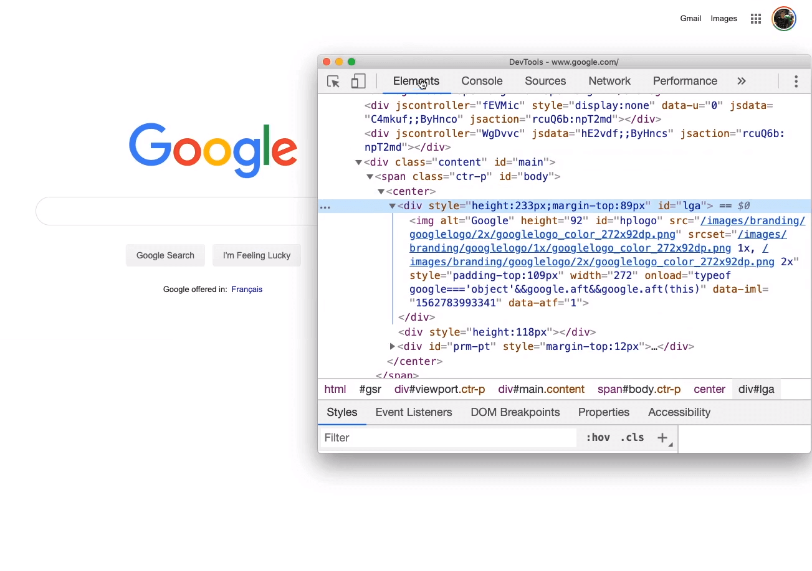
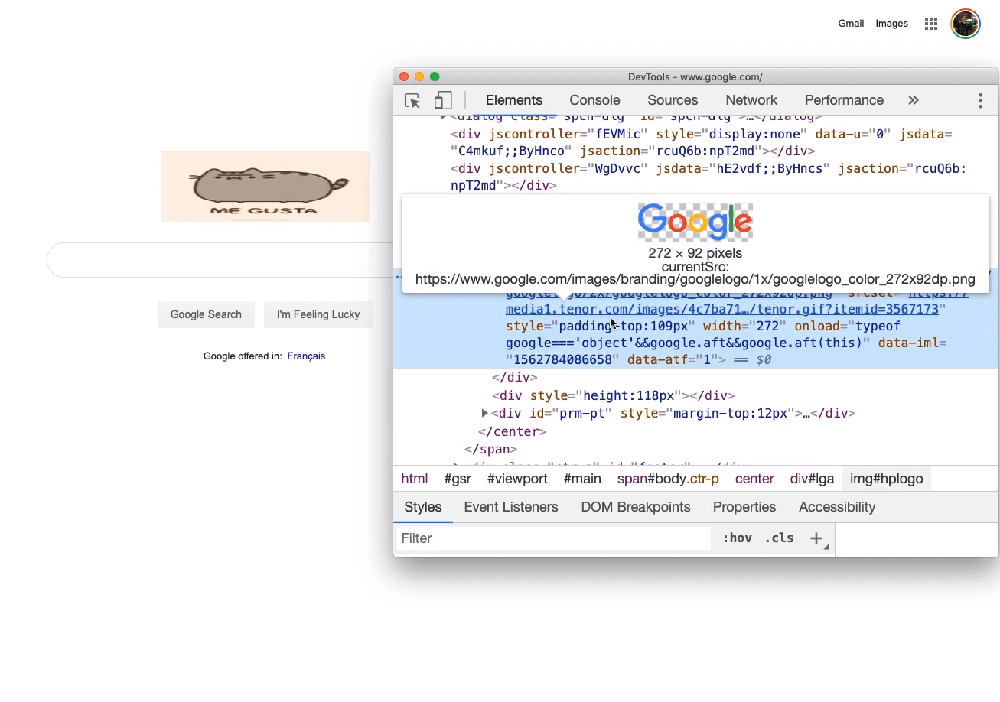
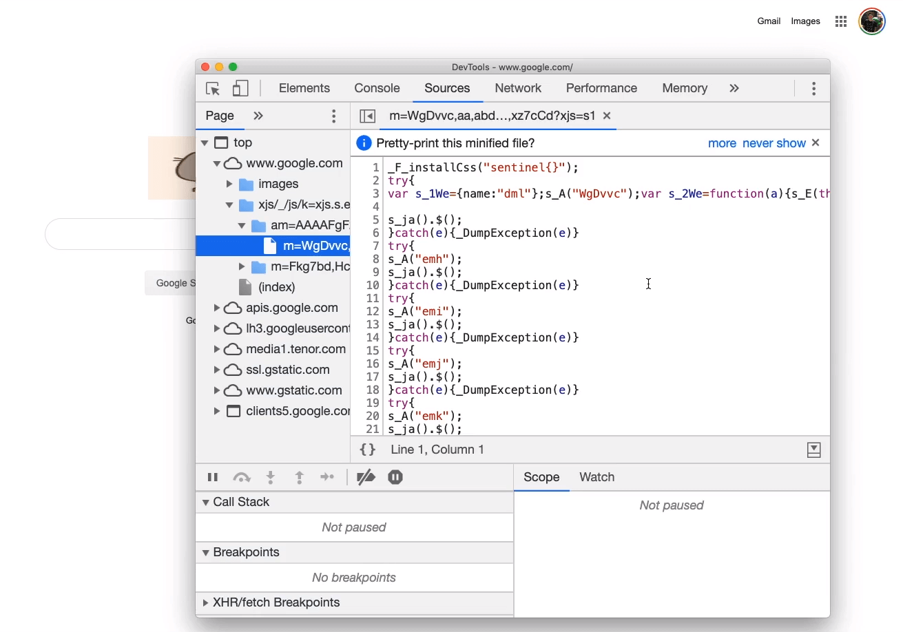
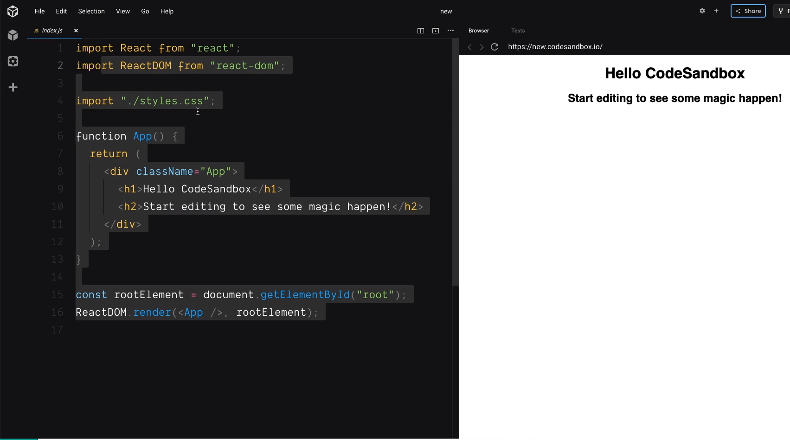

import CoursePost from '../../../../../new-components/CoursePost'
import CourseVideoLink from '../../../../../new-components/CourseVideoLink'
export default CoursePost

# Overview

What you'll learn:

- Structure of how a website's user-interface works
- Inspect element to see behind-the-scenes of websites
- What does source code look like?

<CourseVideoLink to={props.pageContext.frontmatter.video} />

# Websites

When we visit websites such as Google, Instagram, and countless others we see an aesthetic user interface.

But how do they work?

## How websites work

Take Google for example, this is the HTML code that makes up the page. The browser, in conjunction with other code, creates the appealing design we see.

Since web design is all about what the users see, a local copy of the code is downloaded by every user viewing the site. As a result, we can change the code around! Fortunately, this won't affect the millions of other users or else the internet as we know it would be terrible!

## Inspect Element

### Right click and choose inspect element

We can also see the JavaScript code on this page.

This is what makes the page interactive. By typing in the search box, I'll get a list of suggestions. This is powered by JavaScript.

However, if that JavaScript code is what the developers write and read, they would be superhuman! In reality, the messy code above is prepared and optimized for web browsers — not for people. The code developers use is far more legible and useable.

# CodeSandbox.io

We will be using codesandbox.io, an online code editor.

The code that developers use is called **source code** and looks more like this.

It's the literal source code, with formating for readability, that the browser sees and interprets. We are going to write this kind of code to instruct the browser for our purposes.
