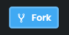

import CoursePost from '../../../../../new-components/CoursePost'
import CourseVideoLink from '../../../../../new-components/CourseVideoLink'
export default CoursePost

# Overview

What you'll learn:

- Setting up and customizing CodeSandbox.io
- Forking and Github

<CourseVideoLink to={props.pageContext.frontmatter.video} />

# CodeSandbox.io

CodeSandbox is a popular online code editor, so we don't have to download anything! In the past, we’d have to do a lot of complicated setup on our computers to get things going, but with CodeSandbox, all we need is a browser!

## Set Up

1.  Click create Sandbox on the top right

    > CodeSandbox gives us a list of templates to choose from.

2.  Press React since we are going to create a React application

    > In this interface on the left, we have a list of directories and files that this project consists of.

    

3.  Done!

## Customization

### Folding the Pane

We can click this icon to fold the left pane.

Or this icon eventually to fold the pane.

## Code Preferences

Now I have the source code on the left, and a preview of the code on the right.

1. Colour theme

   > File --> preferences --> settings --> type theme in the search bar --> choose any you like!
   >
   > If you would like the classic theme from framer, go to this website https://github.com/framer/syntax --> click themes --> click the JSON file --> click raw --> copy all of the text --> go back to codesandbox --> file --> preferences --> **CodeSandbox settings** --> paste the text in the available box --> refresh the page --> go to the theme area --> find **"Custom Theme"**

2. Font size

   > File --> preferences --> settings --> type font --> change the font size to fit you!

3. Automatic Formatter Plugin

   > If you mess up your formatting, just save the file (CTR + S or CMD + S) to reformat everything!

4. **Remove semicolons from the end of lines**
   > File --> preferences --> **Codesandbox Settings** --> prettier settings --> turn off Semicolons --> go back to main page --> save file
   >
   > This should save you some headache dealing with semicolons. In particular, saving me some headaches from explaining whether to use semicolons. :)

We now have the source code on the left and the resulting web page on the right.

When I make a change, the preview shows it immediately.

## Forking

Forking is the action of copying a project which allows you to freely experiment and change it without impacting the original project — in a sense, it is like inspecting an element and changing things around!

There are two ways to "fork" a project that isn't yours.

1. When you get the URL of a sandbox created by other people click the "Fork" button on the top right.
2. Make changes and then save the file.

There will be a notification on the bottom right stating "Forked Sandbox!", and you are now working on a copy of your own.

# Github

Github is an extension of an open-source version control system called **Git**. Without getting into too many details, Git is an incredibly powerful system that helps solve the problem of having multiple versions of a working project.

Github is the place where developers store their projects and allow you to use Git in a user-friendly way.

## CodeSandbox.io and Github

To save your projects and forks, you will want to create a GitHub account and sign in. There is a sign-in button located on the very top right.

This way you’ll be able to save your sandboxes.

You can click a button on the left panel to get a list of sandboxes saved under your account.

# Conclusion

Now that you can maneuver around codesandbox, we'll take a look at our code!
