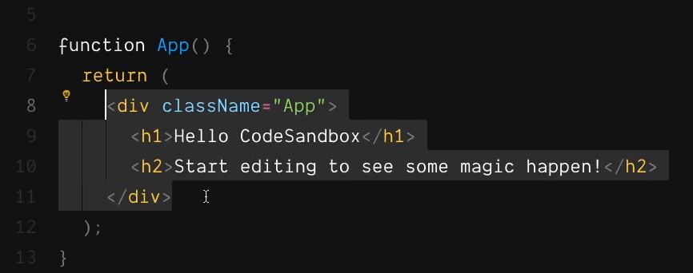
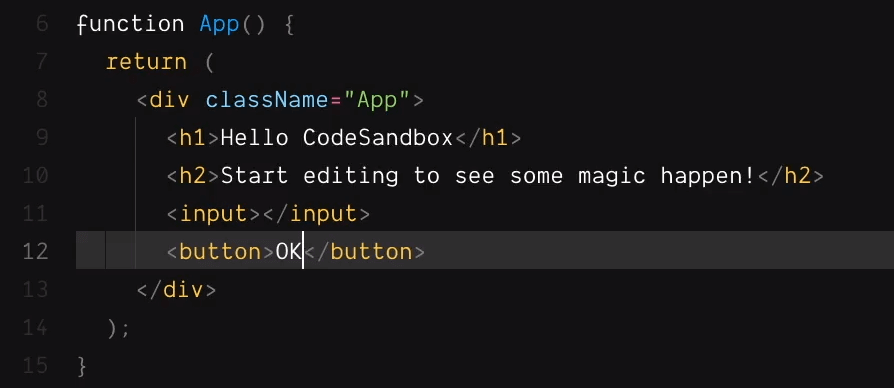
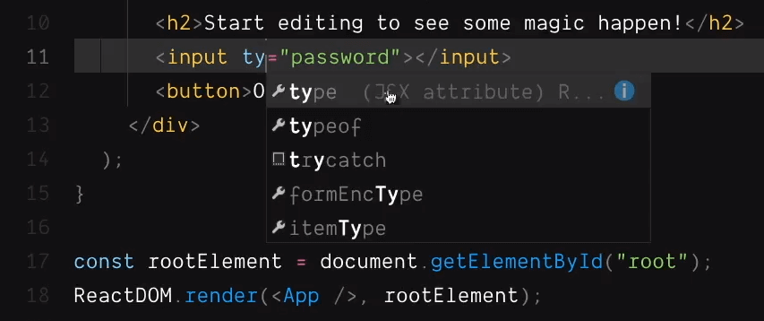
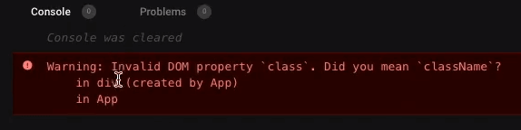

import CoursePost from '../../../../../new-components/CoursePost'
import CourseVideoLink from '../../../../../new-components/CourseVideoLink'
export default CoursePost

# Overview

What you'll learn:

- **Similarities** between the JSX and HTML
- Intelligent Code Editor Help
- **Differences** between the JSX and HTML
- camelCase

<CourseVideoLink to={props.pageContext.frontmatter.video} />

# **Similarities** Between JSX and HTML

Now let’s focus on one particular part of the code here.



You should recognize this highlighted area as HTML!

We’ve got a `div` (block element) here, a `h1` and `h2` (headings). We can keep adding other HTML tags such as an `<input>` and a `<button>`.



Which would correspond to...


Like HTML, we can also add attributes to a tag such as putting a type to the input.

```jsx
<input type="password"></input>
```

## Intelligent Help

In CodeSandbox, when I entered `type`, I didn’t have to enter the whole thing, the editor gave me a list to choose from. You can also press CTR+SPACE or CMD+SPACE to show that list of suggestions.



You can select the suggestion by pressing TAB or clicking with your mouse.

Many of these features help us write code. There are many names for this property, for example, content assist or intellisense. Certain code editors may have specialized features as well.

# **Differences** Between JSX and HTML

## `class` vs `className`

```jsx
<div className="App">...</div>
```

On this div tag, there’s an attribute called className. But is that what we have in HTML?

It’s supposed to be `class`, right? However, when we change `className` to `class` we get this error in the console (bottom right of the preview page).



This is one of the many things that confuse beginners learning React. Although there are similarities to HTML, we aren't coding in it. Rather, we are coding in something called JSX which stands for **JavaScript eXtension**.

Like HTML, we use the same formats, angle brackets, attribute names, equal signs, values, open tags, and close tags. We’ve also got the same tags such as `<div>`, `<h1>`, `<input>`, and so on.


But there are quite a few places where JSX is different.

For example, instead of `class`, we must use `className`. Notice the name of `className`, it follows a certain format.

## camelCase

We have a word that starts with a **lowercase letter** followed by another word which starts with an **uppercase letter**. This is called **camel case**. Every word after the first should start with an uppercase letter such as `classNameDivApp` and so on.

# Conclusion

JSX is a special format in React code. It stands for **JavaScript extension** that pretends to be HTML. We’ll go over a few other differences between JSX and HTML in the next post!
