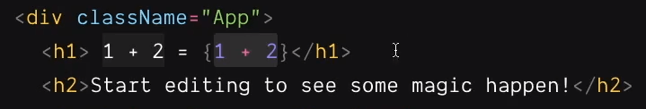
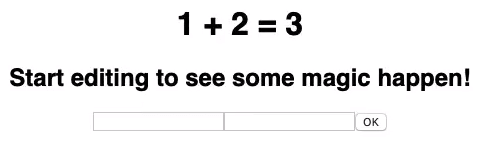

import CoursePost from '../../../../../new-components/CoursePost'
import CourseVideoLink from '../../../../../new-components/CourseVideoLink'
export default CoursePost

# Overview

What you'll learn:

- Closing tags
- Literal Text
- Curly brackets in JSX
- Concatenation

<CourseVideoLink to={props.pageContext.frontmatter.video} />

# JSX vs HTML

## Closing Tags

Let’s check out a couple of other places where JSX is different from HTML.

in HTML, we can have a stand-alone input tag like this

```jsx
<input>
```

and the browser will happily accept it.

But if we are writing React code in JSX, we’ll get a `SyntaxError`.

JSX requires us to always close a tag. Therefore we can close it with a **self-closed tag** if it doesn’t have any children.

```jsx
<input />
```

Or use a closing tag it has some children.

```jsx
<input></input>
```

**Overall, JSX is stricter than HTML**.

## Literal Text and Curly Brackets

Furthermore, when we put some text in-between tags, we get the literal text we type.

Replacing text between a tag with `1+2 = 1+2` we will get `1+2 = 1+2` and not what you may have wanted.


Results in ...


However, if we put a pair of curly brackets around some text
`1 + 2 = { 1+2 }` it will compute and put the result there instead.



Results in ...



Therefore, we can use the curly brackets as a calculator, not limited to integers.

The pair of curly brackets can also be used in the value of attributes. For example, we can set the size of the input to 50 this way.

```jsx
<input size={50}> </input>
```

or

```jsx
<input size={25 * 2}> </input>
```

Moreover, the attribute `"password"` including the quotation marks have invisible curly brackets around it.

```jsx
<input type={'password'} size={25 * 2}>
  {' '}
</input>
```

The value inside is not a number but some text. In JavaScript, when we put quotes around some text, we want the literal text inside.

## String Concatenation

We can do calculations on the text too.

```jsx
<input type={'pass' + 'word'} size={25 * 2}>
  {' '}
</input>
```

this joins the two words together in something called a **concatenation** to re-create `"password"` and give the same result. **Careful! You need the curly brackets to concatenate the strings or else you will get a `SyntaxError`!**

When the value of an attribute is a single-quoted text, we can ignore adding the curly brackets as they are technically already there!

The curly bracket is what makes JSX powerful. What we are writing here is not just a static HTML document. It’s a template that we can fill dynamic values in to produce new HTML documents, one after another.

# Conclusion

Before moving on, I highly recommend you two read my following two blog posts!

[What is React?](https://learnreact.design/2017/06/08/what-is-react/) and [Curly Braces in JSX](https://learnreact.design/2019/05/10/those-curly-braces-in-jsx)

They will help obtain a deeper understanding of terminology and React.

All in all, JSX is very similar and different to HTML but is certainly more powerful. JSX is stricter since it requires us to always close a tag. Lastly, the curly brackets turn JSX into a template where we can insert dynamic values.
