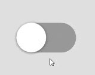

import CoursePost from '../../../../../new-components/CoursePost'
import CourseVideoLink from '../../../../../new-components/CourseVideoLink'
export default CoursePost

# Overview

What you'll learn:

- `background` attribute
- Animating different attributes
- What are Variants and how to use them

<CourseVideoLink to={props.pageContext.frontmatter.video} />

# Expected Result

Our final toggle will utilize **variants** to improve on our `animate` attributes. We can animate different attributes such as `backgroundColor`, `position`, and `scale`.



# `background` Attribute

Let’s add some final touches to the toggle so when we press the toggle the background color will change. We can use the `background` attribute to set the color.

Here is the [starter code](https://codesandbox.io/s/github/lintonye/prototyping-with-react-framer/tree/2.10-variants-starter/app) on CodeSandbox.

Here is the raw code — with the background attribute — added we have been working on from the last posts:

```jsx{21}
import React from "react"
import ReactDOM from "react-dom"
import { Frame, useCycle } from "framer"
import "./styles.css"

function App() {
  let [knobX, cycleKnobX] = useCycle(0, 60)
  return (
    <div className="App">
      <Frame
        width={120}
        height={60}
        borderRadius={30}
        center
        onTap={function handleTap() {
          // change the value of knobX
          console.log("tapped")
          // knobX = 60 // won't work in React!
          cycleKnobX()
        }}
        background="#999"
      >
        <Frame
          size={60}
          borderRadius={30}
          animate={{ x: knobX }}
          transition={{ duration: 0.2 }}
          background="white"
          shadow="0 1px 5px rgba(0,0,0,0.5)"
        />
      </Frame>
    </div>
  )
}

const rootElement = document.getElementById("root")
ReactDOM.render(<App />, rootElement)

```

`background="#999"` changes the background color to a gray, but we want the colors to nicely blend and change on a click instead of an immediate change.

## Animation

To start, you can either add the `animate` attribute underneath `background` or add the `animate` attribute and remove the `background` attribute.

```jsx
background="#999"
animate={{background: "#999"}}
```

Since the animate attribute works for colors as well, not just numbers, we can follow the same pattern for dynamically changing variables such as for the knob x location.

1. `background` animate object should use a variable
2. Initialize variable using `useCycle`
3. Input parameters of `useCycle`
4. Call cycle function in the `onTap` function

```jsx{3,14,18}
function App() {
  let [knobX, cycleKnobX] = useCycle(0, 60)
  let [trackBg, cycleTrackBg] = useCycle("#999", "orange")
  return (
    <div className="App">
      <Frame
        width={120}
        height={60}
        borderRadius={30}
        center
        onTap={function handleTap() {
          console.log("tapped")
          cycleKnobX()
          cycleTrackBg()
        }}
        //you can remove background="#999" or not
        background="#999"
        animate={{background: trackBg}}
      >
        <Frame
          size={60}
          borderRadius={30}
          animate={{ x: knobX }}
          transition={{ duration: 0.2 }}
          background="white"
          shadow="0 1px 5px rgba(0,0,0,0.5)"
        />
      </Frame>
    </div>
  )
}
```

Great! This works! However, if there are many things that we want to animate, we’d have to use `useCycle` and call all the cycle functions multiple times.

Our code would quickly become long and messy. As a result, there is a better way.

# Variants

Our toggle has two states, off and on. When it’s off, `knobX is 0` and the track is gray. When it’s on, `knobX is 60` and the track is orange.

## Background

We can use a new attribute on the frame called **variants**. Let's add this underneath our background animate.

```jsx
animate={{background: trackBg}}
variants={{
  off:{background: "#999"},
  on: {background: "orange"}
}}
```

Why did I use double curly brackets here again? It’s an object! Moreover, the `off` and `on` states also have objects as their properties! Therefore, objects can be embedded!

Now, since we are now using the `variants` attribute, we have to change our `animate` attribute. Instead of an object in its value, we can use a string!.

```jsx
animate={"on"}
// can be "on" or "off"
variants={{
  off:{background: "#999"},
  on: {background: "orange"}
}}
```

However, again we don't want a static value. We can replace the animate value with a variable that holds a string such as `mode`. Furthermore, on top, when we call `useCycle` we can use the `"on"` and `"off"` states instead of fixed numbers and values.

```jsx{3,13,15-19}
function App() {
  let [knobX, cycleKnobX] = useCycle(0, 60)
  let [mode, cycleMode] = useCycle("off", "on")
  return (
    <div className="App">
      <Frame
        width={120}
        height={60}
        borderRadius={30}
        center
        onTap={function handleTap() {
          cycleKnobX()
          cycleMode()
        }}
        animate={mode}
        variants={{
          off:{background: "#999"},
          on: {background: "orange"}
        }}
      >
        <Frame
          size={60}
          borderRadius={30}
          animate={{ x: knobX }}
          transition={{ duration: 0.2 }}
          background="white"
          shadow="0 1px 5px rgba(0,0,0,0.5)"
        />
      </Frame>
    </div>
  )
}
```

## Knob

Now, let’s make our knob match our mode method. If we do so, we can remove all the knobX references and make our code much clearer!

### Final working code:

```jsx{2,22-25}
function App() {
  let [mode, cycleMode] = useCycle("off", "on")
  return (
    <div className="App">
      <Frame
        width={120}
        height={60}
        borderRadius={30}
        center
        onTap={function handleTap() {
          cycleMode()
        }}
        animate={mode}
        variants={{
          off:{background: "#999"},
          on: {background: "orange"}
        }}
      >
        <Frame
          size={60}
          borderRadius={30}
          animate={mode}
          variants={{
            off:{x:0},
            on:{x:60}
          }}
          transition={{ duration: 0.2 }}
          background="white"
          shadow="0 1px 5px rgba(0,0,0,0.5)"
        />
      </Frame>
    </div>
  )
}
```

Awesome! Now our code works perfectly!


# Conclusion

Can you see the beauty of variants? It puts animations into nice, clear groups and we can activate many animations by a single group name. Therefore, it’s very easy to add new animations.

For example, if we want the knob to grow bigger when the toggle is on we can these attributes to the variants attribute

```jsx
animate={mode}
variants={{
  off:{x:0, scale:1},
  on: {x:60, scale:1.2}
}}
```

Imagine how much code we would need without the variants attribute!


One more thing, we can actually remove the animate attribute in our toggle/child frame. It's called a **child** frame because it is inside the outer, **parent** frame.

```jsx
<Frame animate={mode} ...>
  <Frame
    //animate={mode}
    ...
  />
</Frame>
```

We can just set the animate attribute on the parent Frame and it’ll propagate into all its descendants, saving you work! Pretty neat, right?

Now that we are done with our toggle, we'll begin our next module, creating sliders!
