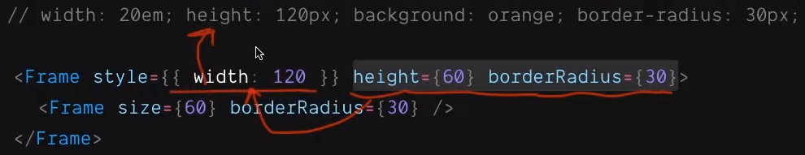
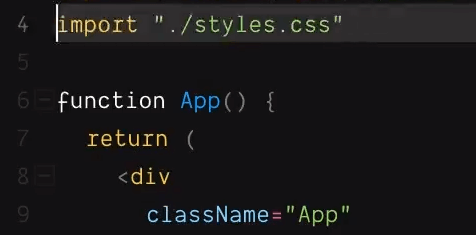
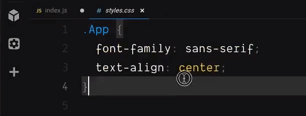

import CoursePost from '../../../../../new-components/CoursePost'
import CourseVideoLink from '../../../../../new-components/CourseVideoLink'
export default CoursePost

# Overview

What you'll learn:

- Differences between the `style` attribute and CSS rules
- `<Frame>`'s convenient attributes (only works on `<Frame>`)
- Using an external CSS file to style React code

<CourseVideoLink to={props.pageContext.frontmatter.video} />

# Styling Options

## The `style` attribute, CSS rules, and `<Frame>`'s convenient attributes

As we discussed previously, we can use this `style` attribute to set the inline style of an HTML element, such as a `<div>`, and the value of the `style` attribute must be an object.

```jsx
<div style={{ width: 120, height: 120, background: 'orange' }} />
```

What we can set here is very similar to CSS. Except that the format is different. For width and height, we can just put a number. It’ll mean "px". If we want to use other units, we have to make a string.

```jsx
<div style={{ width: 20em }} />
//  error ⤴︎
```

Because `20em` is technically not a valid number in JavaScript we get a `SyntaxError`. Therefore, we have to wrap the `20em` with quotes to make a string `"20em"`.

```jsx
<div style={{ width: '20em' }} />
```

If we convert this object to its corresponding CSS, it’ll be

```css
width: 20em;
height: 120px;
background: orange;
```

If a property has multiple words, such as

```css
border-radius: 30px;
```

we can't directly use it in JSX. We'll get an error.

```jsx
<div style={{ border-radius: 30 }} />
         //  error ⤴︎
```

This is because the dash between `border` and `radius` is not a valid name for a JavaScript object key. This is why we use **Camel Case**!

```jsx
<div style={{ borderRadius: 30 }} />
```

Under the hood, all the properties in this object get converted into CSS rules, but since we are writing JavaScript code instead of CSS, we have to follow the rules of JavaScript.

If a value is not a number, we have to add quotes around it to make it a string such as

```jsx
<div style={{ width: '20em', height: '10em', background: 'orange' }} />
```

Alright, as a reminder, we have seen two ways to style a Frame.

1. The `style` attribute

2. Convenient attributes such as `width`, `height` and `borderRadius`.

   > These attributes work behind the scenes. Frame converts them into a style attribute internally and merges them with any previously set attributes on the style tag. All of these attributes are then are converted to CSS.

   

Both, however, set the inline style of the resulting div.

Eventually, the style attribute gets converted into CSS.

## Style React code with an external CSS file

Not to confuse you, but there’s a third way to style things in React code.

The `className` on the div is equivalent to `class` in HTML. As a result, we can reference that in the `styles.css` file which is imported near the top of the js file.



We can edit the `styles.css` file to style the div here by going to the file system on the left and clicking on "styles.css".



If we want to change the background color, we first have to remove `background: "orange"` from the `style` attribute in our JavaScript file.

Then in our CSS file

```css
.App {
  font-family: sans-serif;
  text-align: center;
  background: palegreen;
}
```

Since we are now writing real CSS, we must follow CSS format.

Unlike JavaScript, we don’t quote colors, and we need to add a semicolon after each rule.

## Tips

I know this can be error-prone if we have to switch back and forth between different ways of writing the style. Make sure to check the extensions of your files! If it’s CSS, we’ll use CSS format. If it’s JS or TSX as we'll later use, we are writing JavaScript code, we are gonna need to use camel case, quote strings, and so on.

# Conclusion

Remember that CSS is the final destination. The style attribute will be eventually converted into CSS. The attributes on Frames such as `width`, `height`, and `borderRadius` are just shortcuts to set the `style` attribute. Moreover, these shortcuts only work for **Framer specific tags**.

In the next post, we'll learn about functions!
