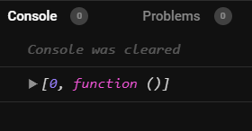
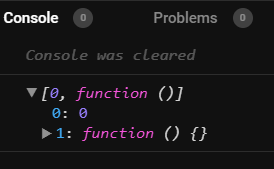
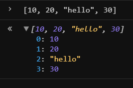
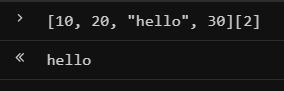
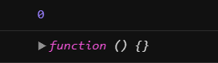
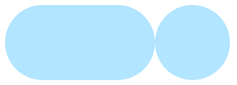

import CoursePost from '../../../../../new-components/CoursePost'
import CourseVideoLink from '../../../../../new-components/CourseVideoLink'
export default CoursePost

# Overview

What you'll learn:

- What are arrays
- Array indices
- Accessing arrays
- Defining arrays
- Array destructuring
- How the `useCycle` function works

<CourseVideoLink to={props.pageContext.frontmatter.video} />

# Arrays

OK, so what’s this?

```jsx
let [knobX, cycleKnobX] = useCycle(0, 60)
```

Let's re-write the code and use `console.log` to find out.
As we know, `useCycle` is a function, and we call it with two parameters.

We can get its output this way

```jsx{2-4}
function App(){
  let [knobX, cycleKnobX] = useCycle(0, 60)
  let result = useCycle(0, 60)
  console.log(result)
  return(
    <div className="App">
      <div>{sandwichMaker("🥓")}</div>
      <Frame width={120} height={60} borderRadius={30} onTap={function handleTap(){
        cycleKnobX()
      }}>
        <Frame size={60} borderRadius={30} x={knobX}/>
      </Frame>
    </div>
  )
}
```

We get a pair of square brackets, a number 0, a comma, and function here.



The outputted square brackets and content inside is yet another important concept in JavaScript. It’s called an **array**.

## Visualizing Arrays

An array is simply a fancy term for a list of things. We can expand this array by clicking on the **arrow** beside the array.



We can see two elements inside. In this array, we’ve got the number 0 and a function inside.

We can type into the console an array of our own. Let's type this `[10, 20, "hello", 30]` into the console text field at the bottom. We can then expand this and see four elements inside.



The number in the front of our elements, before the colon, is the slot our item is stored in the array. It’s often called the **index**.

## Array Indices

Computers count from 0. So the index of the first item is `0` instead of 1. Index `1` for the second item, index `2` for the third item, and so on.

As you can see, an array can contain many different things. We can put some numbers in there, some strings, some functions, and actual objects, or even other arrays.

Now, when we have an array, how would we get an item out of it?

Retype our original array into the **console** but this time with an extra pair of square brackets with the index of the value we want inside.

Say we want to get the `"hello"` from our array.

```jsx
;[10, 20, 'hello', 30][2]
```

Pressing enter gives us exactly what we want.



Note that this doesn't remove the element from the array. We are merely accessing the element from it.

Similarly, when we have a variable whose value is an array, we can get the items inside this way.

Since the value of `result` is an array, we can access the elements by putting square brackets and the index beside `result`.

```jsx{4}
function App(){
  let [knobX, cycleKnobX] = useCycle(0, 60)
  let result = useCycle(0, 60)
  console.log(result[0])
  ...
}
```

This gives us `0` as the first element of the `result` array. Changing the index to `1` — which is the **second element** — gives us `function()`.

```jsx{4-5}
function App(){
  let [knobX, cycleKnobX] = useCycle(0, 60)
  let result = useCycle(0, 60)
  console.log(result[0])
  console.log(result[1])
  ...
}
```

In our console,



## Defining Arrays

An equivalent method, without an array, would go like this,

```jsx
function App(){
  //let [knobX, cycleKnobX] = useCycle(0, 60)
  let result = useCycle(0, 60)
  let knobX = result[0]
  let cycleKnobX = result[1]
  ...
}
```

Therefore, the following three lines can be written more efficiently by using an array.

```jsx
let result = useCycle(0, 60)
let knobX = result[0]
let cycleKnobX = result[1]
```

The array version allows us to not define the variable `result` as well, is clear, and efficient.

```jsx
let [knobX, cycleKnobX] = useCycle(0, 60)
```

You’ll see many occurrences of arrays in other people's code as well.

## Array Destructuring

The syntax makes sense. If we know that something is an array, like the return value of `useCycle`, we write a pair of square brackets. By putting in variables into the square brackets, we can get the first item, second item, third item, etc.

Here `result` is a traditional array value. However, in our `let` statement, we used a different method.

```jsx
let result = useCycle(0, 60)
```

vs

```jsx
let [knobX, cycleKnobX] = useCycle(0, 60)
```

The technical term for defining variables inside our array is called **array destructuring**, some people like to call it **cherry-picking** since we know our result is an array, and we are picking out what we want.

Just as when we define a variable, it doesn’t have to be `knobX`.

It’ll work fine as long as we update all references of the variable. However, remember that you want to choose names that correspond to what they do in your code.

# `useCycle`

We can see how this toggle works now by adding a `console.log` of `knobX`.

```jsx
function App(){
  let [knobX, cycleKnobX] = useCycle(0, 60)
  console.log(knobX)
  ...
}
```

Now when we tap our toggle we see the numbers in the console cycle between `0` and `60`

We can add more numbers in our `useCycle` function as well.

```jsx
function App(){
  let [knobX, cycleKnobX] = useCycle(0, 60, 120)
  console.log(knobX)
  ...
}
```

When we click the third time, instead of `x` going back to `0` we have it at `120`.



That’s why this function is called useCycle. It cycles through the numbers we put in as the input.

# Conclusion

The `useCycle` function returns two things in an array, the current value and a function that can be used as a controller. When the cycle function is called, we’ll get the next value in the cycle. That’s how our toggle works.

In the next post, you'll learn how to animate the change.
