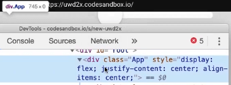

import CoursePost from '../../../../../new-components/CoursePost'
import CourseVideoLink from '../../../../../new-components/CourseVideoLink'
export default CoursePost

# Overview

What you'll learn:

- `backgroundColor` and `shadow` attributes
- Replacing `center` with CSS flexbox properties
- Positioning flexbox with CSS vs using `center`

<CourseVideoLink to={props.pageContext.frontmatter.video} />

## Background CSS colour

Now let’s make the slider a bit prettier. First, we’ll change the background color of the entire page. Do you remember how to do it?

Well, we can just update the CSS file!

```css
body {
  background-color: #e0e0e0;
}
```

Remember, we are editing a real CSS file, as you can see, the file extension is CSS. Therefore, we have to follow the format of CSS. No camelCase, no quotations around the color, the semicolon at the end, etc.

Make sure your CSS file is imported as well.

```jsx
import './styles.css'
```

## Slider colors

Next, we’ll make the slider white and add a shadow effect on our slider.

```jsx{6,12-13}
<Frame
  width={280}
  height={15}
  borderRadius={30}
  center
  backgroundColor="white"
>
  <Frame
  size={60}
  borderRadius={30}
  center="y"
  backgroundColor="white"
  shadow="0 1px 5px 0 rgba(0, 0, 0, 0.25)"
  />
</Frame>
```

## CSS vs `center`

We can also use a style attribute to do the same thing, but it would take some more typing and the format would be different. You generally want to keep a consistent formatting style for readability.

The `center` attribute we used works pretty well and is quite convenient, but there is actually a lot going on in the background. It’s mostly OK for prototyping purposes.

However, what if we want to layout our UI with the usual ways? We can center the slider with flexbox instead!

Let's remove the `center` from the parent `<Frame>`.

## Flexbox

We could update the css file again to add flexbox to the `div` because our `div` has identifier `className` here.

But let’s do it with the style attribute as a review. Remember, there is an object inside of `style` and that's why there are two curly brackets. Moreover, we are now updating our **tsx** file so we have to follow JavaScript rules.

```jsx
<div
  className="App"
  style={{
    display: 'flex',
    justifyContent: 'center',
    alignItems: 'center',
  }}
>
  ...
</div>
```

This makes the slider horizontally centered, but not vertically. Let's inspect our slider to see what's going on.


Inspecting



We see that the height of the div is 0 (745 x 0). This is because, by default, frames are positioned **absolutely**.

## Positioning Flexbox

Therefore, we can change the position to **relative** so that it’ll follow the usual box model of web layout.

```jsx{8}
<div className="App" ...>
  <Frame
    width={280}
    height={15}
    borderRadius={30}
    // removed center
    backgroundColor="white"
    position="relative"
  >
    <Frame ... />
  </Frame>
</div>
```

Inspecting again shows us that the height is now 15px (745 x 15). The `<div>` wraps around our slider content, so if we want to move our whole slider, we can adjust the height of our `<div>` to 100% of our viewport height.

```jsx{5}
<div className="App" style={{
  display: "flex",
  justifyContent: "center",
  alignItems: "center",
  height:"100vh"
}}>
  <Frame
    width={280}
    height={15}
    borderRadius={30}
    // removed center
    backgroundColor="white"
    position="relative"
  >
    <Frame
      size={60}
      borderRadius={30}
      center="y"
      backgroundColor="white"
      shadow="0 1px 5px 0 rgba(0, 0, 0, 0.25)"
      />
  </Frame>
</div>
```

# Conclusion

Now the slider is in the center, we can move on to making the slider "draggable".


