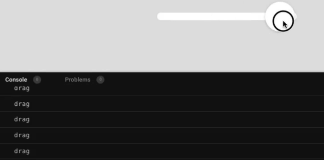

import CoursePost from '../../../../../new-components/CoursePost'
import CourseVideoLink from '../../../../../new-components/CourseVideoLink'
export default CoursePost

# Overview

What you'll learn:

- How to initialize `onDrag`
- Two methods of inputting Functions into attributes
- Common function mistake
- Output with `handleDrag`

<CourseVideoLink to={props.pageContext.frontmatter.video} />

# Setting up `onDrag`

We now have a slider that we can drag around its knob, but how do we use it to control something in the UI?

## Skinny

If you have watched some of my early videos, this is Skinny and he wants to lose weight badly. Now let’s use the slider to make him happy.


Insert this piece code underneath your `<div>` to embed Skinny in your codesandbox.

```jsx
{
  /* Skinny */
}
;<Frame width={290} height={320} position="relative" background="transparent">
  <Frame
    background="url(https://cdn.glitch.com/071e5391-90f7-476b-b96c-1f51f7106b0c%2Fskinny-portrait.png)"
    width={290}
    height={290}
    borderRadius={150}
  />
  {/* Cheek */}
  <Frame
    background="url(https://cdn.glitch.com/071e5391-90f7-476b-b96c-1f51f7106b0c%2Fcheek.png)"
    width={79}
    height={67}
    left={155}
    top={135}
  />
</Frame>
```

Your preview should look like this


Let's move Skinny above the slider. To do that, we add
`flexDirection: "column"` to the parent `<div>`'s properties since by default `flexDirection` is row. Skinny should now be on top of our slider.


We have another frame that is Skinny's cheek. By adding the `scale` attribute and changing its values, we can change the size of Skinny's cheek. The `onDrag` attribute can then allow us to use the slider to control the scale of Skinny's cheek.

On the frame for the knob, we can add a new attribute called `onDrag`.

```jsx{12}
<Frame ...>
  <Frame
    size={60}
    borderRadius={30}
    center="y"
    backgroundColor="white"
    shadow="0 1px 5px 0 rgba(0, 0, 0, 0.25)"
    drag="x"
    dragConstraints={{ left: 0, right:220 }}
    dragElastic={false}
    dragMomentum={false}
    onDrag={}
  />
</Frame>
```

## Function inside attribute

The value inside `onDrag` is a special because it is a function.
If you forgot how to write a function, no worries! I'll get you caught up in no time.

Remember, a function is defined like this

```jsx
function handleDrag() {}
```

These parentheses and curly brackets are parts of the function format.

We put the input of the function inside this pair of parentheses. The input is called the **parameter**. The detailed instructions of what this function is supposed to do are inside the pair of curly brackets, often called the body of the function. The whole thing is called the definition of a function. It’s similar to creating a machine.

```jsx
<Frame ...>
  <Frame
    size={60}
    borderRadius={30}
    center="y"
    backgroundColor="white"
    shadow="0 1px 5px 0 rgba(0, 0, 0, 0.25)"
    drag="x"
    dragConstraints={{ left: 0, right:220 }}
    dragElastic={false}
    dragMomentum={false}
    onDrag={function handleDrag(){
      // change the scale of Skinny’s cheek
    }}
  />
</Frame>
```

Note we are just creating the function here, we are not running it yet.

We are passing the function definition to Frame as a value of the onDrag attribute. It’s like shipping a machine to a different place to have it run by someone else.

## Alternative function inside attribute

There is another way to write our function, and we will continue with this method. We can move our entire `handleDrag` function to right underneath our function `App`.

```jsx
function App(){
  function handleDrag() {
    // change the scale of Skinny’s cheek
  }
  return (
    ...
  )
}
```

Then simply put `handleDrag` the name and not calling `handleDrag()` inside our `onDrag` attribute.

```jsx{12}
<Frame ...>
  <Frame
    size={60}
    borderRadius={30}
    center="y"
    backgroundColor="white"
    shadow="0 1px 5px 0 rgba(0, 0, 0, 0.25)"
    drag="x"
    dragConstraints={{ left: 0, right:220 }}
    dragElastic={false}
    dragMomentum={false}
    onDrag={handleDrag}
  />
</Frame>
```

## Common function mistake

We can just get the function by its name and use it as the value of the onDrag attribute since we don't want to do this

```jsx
<Frame>... onDrag={handleDrag()}</Frame>
```

The reason why is because `handleDrag()` means to call the function right away and pass its output to the Frame.

However, that's not what we want! We only want to run the function when the user drags the slider. That’s why we "ship" our function inside the code of Frame and let Frame determine when to run it.

This is one of the **common errors** I’ve seen so far among beginners. When you want to use a function, think about it, do you want to run it right away and get its output, or do you want to pass around the function itself to run it later by other code?

Meanwhile, Skinny is a bit disappointed since the slider still doesn’t do anything. This is because there's nothing inside the handleDrag function, only a comment.

Let’s add something to make sure `handleDrag` is indeed called when we drag the slider.

Remember `console.log`? Let’s put that in our `handleDrag` function right underneath `App`.

```jsx{3,17}
function App(){
  function handleDrag() {
    console.log("dragged!")
  }
  return (
    ...
    <Frame
      size={60}
      borderRadius={30}
      center="y"
      backgroundColor="white"
      shadow="0 1px 5px 0 rgba(0, 0, 0, 0.25)"
      drag="x"
      dragConstraints={{ left: 0, right:220 }}
      dragElastic={false}
      dragMomentum={false}
      onDrag={handleDrag}
    />
  )
}
```

# Conclusion

We'll now get a flood of console logs when we drag the slider!



This means the function `handleDrag` is working. In the next post, we'll learn how to access the slider's position to make changes based on that.
