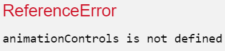

import CoursePost from '../../../../../new-components/CoursePost'
import CourseVideoLink from '../../../../../new-components/CourseVideoLink'
export default CoursePost

# Overview

What you'll learn:

- Defined variables scope
- Function variables cope
- Function parameter scope

<CourseVideoLink to={props.pageContext.frontmatter.video} />

# Scope

Let’s look at an important concept in JavaScript, scope.

In our code, we defined a variable `animationControls`, and we used it in various places such as in our `handleDrag` function and Skinny's cheek `<Frame>`.

However, if we try to use `animationControls` outside of function App, we get a `ReferenceError` since `animationControls` is not defined.

You may say that’s because we were trying to use the variable before it’s created since it’s above the definition, but that's not the case. If we move `animationControls` outside of `App` and at the very bottom of our file, we still get the same error.



The reason is that the variable `animationControls` is defined inside the function App. You can imagine `App`'s pair of curly brackets as the walls of a room without windows. If we are not in the room, we cannot see what’s inside. Therefore, we got errors because we were outside the room.

Now, why can we use `animationControls` inside `handleDrag`? Isn’t this another room? Why don’t the walls block us from seeing this variable?

Yes, that is another room, inside a bigger room, but the walls here are one-way mirrors. We can see outside — `App`— but those who are outside cannot see what’s inside — `handleDrag`.

That’s why we can use `animationControls` even though it’s not defined inside `handleDrag`.

This works for multiple embedded curly brackets as well.

For example, if we define a variable outside of the function App,

```jsx
let sliderWidth = 280

function App(){
  ...
}
```

We can use it inside function `App`, such as in our frames.

```jsx{7}
let sliderWidth = 280

function App(){
  ...
  // slider bar
  <Frame
    width={sliderWidth}
    height={15}
    borderRadius={30}
    backgroundColor="white"
    position="relative"
  >
    ...
  <Frame>
}
```

We can also use `sliderWidth` in our `handleDrag` function due to our "one-way windows".

```jsx{8}
let sliderWidth = 280

function App(){
  let animationControls = useAnimation()
  function handleDrag(event, info) {
    let newScale = transform(info.point.x, [0, 220],[0.4, 1.5])
    animationControls.start({scale: newScale})
    console.log(sliderWidth)
  }
  ...
}
```

The technical term for the range where a variable is visible is **scope**.

The scope of `sliderWidth` is most of this file below its definition because it was defined outside of `App`.

## Function variables scope

The scope of `newScale` is just inside the handleDrag function.

That’s why we’ll get an error if we try to use `newScale` outside `handleDrag`.

## Function parameters Scope

Function parameters are like variables as well, even though we don’t define them with `let`. **Their scope is inside the function.**

# Conclusion

Now we know what the scope of variables is. You can think of the pair of curly brackets like the walls of a room. The walls are one-way mirrors. We can see the outside from within a room, but those who are outside won’t see anything inside.

In the next post, we'll fix some bugs in our slider!
