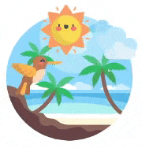

import CoursePost from '../../../../../new-components/CoursePost'
import CourseVideoLink from '../../../../../new-components/CourseVideoLink'
export default CoursePost

# Overview

What you'll learn:

- Parallax Effect
- Calculating offset values
- Animating multiple images with different speeds

<CourseVideoLink to={props.pageContext.frontmatter.video} />

# Parallax

Let’s take a closer look at what we plan to create.


Check it out for yourself! [Parallax Effect](https://pt866.codesandbox.io/)

## What is the parallax effect?

When we move the mouse around, we get this parallax effect as if this is a 3D scene. The bird, cloud, sun, and background follow the mouse at different speeds. Therefore, creating the feel of a layered scene at different distances from the viewer.

The offset of the images is relative to the center of the scene. If the mouse is at the center, the offset is zero. If we move the mouse to the left, everything will move to the left as well.

## Offset values

To create this effect, the very first step is to calculate the offset of the mouse from the center of the scene. Then, we can use those values to create animations.

Let’s look at our first step.

As we’ve seen in the last post, `clientX` and `clientY` are the offset from the top left corner of the container.

How then do we convert them into the offsets from the **center**? There’s a bit of math involved!

## Visualization

If our cursor is where this red arrow is, the red lines represent what `clientX` and `clientY` are.


If the red circle represents the center of the scene, the smaller red lines are the offsets we want to calculate.


We can then use these offset values to create our animations.

Since we are centering everything, the X position of the center is the **half of the window width** and the Y position is **half of the window height**.


Therefore, to get our offsets we just have to subtract half of the window width from `clientX` and subtract half of the window height from `clientY`

## Calculating our offset values

After calculating our values let's print them out to see if we are getting what we want!

```jsx
<Frame
  size={600}
  background={null}
  center
  onMouseMove={function (event) {
    let offsetX = event.clientX - window.innerWidth / 2
    let offsetY = event.clientY - window.innerHeight / 2
    // 1. Find mouse position
    console.log(offsetX, offsetY)
    // 2. Create animations
  }}
>
  ...
</Frame>
```

If we move closer to the center of our scene, and in our console we get values closer to "0 0" then we have what we need!

With these offset values, we are ready to create animations!

## Creating the parallax effect

Do you remember how to control the animations of other parts in the app with an event handler function? Well, it’s the same as the `handleDrag` function we used in our slider.

### 1. We’ll use the `useAnimation` function to create `animationControls`.

> We have to import `useAnimation` and then define `animationControls`.

```jsx
import { Frame, useAnimation } from "framer"
...
function App() {
  let animationControls = useAnimation()
  ...
}
```

> However, since we have more than one part to animate. We have to call `useAnimation` multiple times. Each call of the function will create an "animationControl" that’s independent from the others. Therefore, lets give better names to our animation controllers.

### 2. Calling `useAnimation` multiple times

```jsx
function App() {
  let bgAnim = useAnimation()
  let sunAnim = useAnimation()
  let cloudsAnim = useAnimation()
  let birdAnim = useAnimation()
  ...
}
```

### 3. Using our animation controllers in each animated part

```jsx
<Frame ...>
  <Frame
    // bg
    ...
    animate={bgAnim}
  />
  <Frame
    // sun
    ...
    animate={sunAnim}
  />
  <Frame
    // cloud
    ...
    animate={cloudsAnim}
  />
  <Frame
    // bird
    ...
    animate={birdAnim}
  />
</Frame>
```

### 4. Starting the animation!

```jsx{12}
<Frame
  size={600}
  background={null}
  center
  onMouseMove={
    function (event){
      let offsetX = event.clientX - window.innerWidth/2
      let offsetY = event.clientY - window.innerHeight/2
      // 1. Find mouse position
      console.log(offsetX, offsetY)
      // 2. Create animations
      birdAnim.start({x:offsetX, y:offsetY})
    }
  }
>
  ...
</Frame>
```

> You should get something like this.


> Furthermore, since framer animates x and y with a spring by default, we get this nice bouncy effect. However, it's a little fast, so let's divide the values by 6.

### 5. Adjusting Parallax Speed

```jsx{12}
<Frame
  size={600}
  background={null}
  center
  onMouseMove={
    function (event){
      let offsetX = event.clientX - window.innerWidth/2
      let offsetY = event.clientY - window.innerHeight/2
      // 1. Find mouse position
      console.log(offsetX, offsetY)
      // 2. Create animations
      birdAnim.start({x:offsetX/6, y:offsetY/6})
    }
  }
>
  ...
</Frame>
```

### 6. Animating the rest of the images

> Because we want the other images to move at different speeds, we can divide the values differently.

```jsx{13-15}
<Frame
  size={600}
  background={null}
  center
  onMouseMove={
    function (event){
      let offsetX = event.clientX - window.innerWidth/2
      let offsetY = event.clientY - window.innerHeight/2
      // 1. Find mouse position
      console.log(offsetX, offsetY)
      // 2. Create animations
      birdAnim.start({x:offsetX/6, y:offsetY/6})
      cloudsAnim.start({x:offsetX/8, y:offsetY/8})
      sunAnim.start({x:offsetX/10, y:offsetY/10})
      bgAnim.start({x:offsetX/14, y:offsetY/14})
    }
  }
>
  ...
</Frame>
```

## Final Result



# Conclusion

We've learned how to create a parallax effect with multiple images! In the next post, we'll learn about object destructuring!
