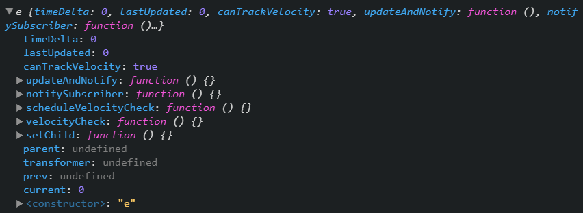
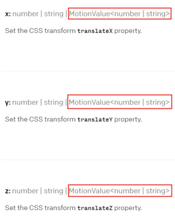

import CoursePost from '../../../../../new-components/CoursePost'
import CourseVideoLink from '../../../../../new-components/CourseVideoLink'
export default CoursePost

# Overview

What you'll learn:

- `useMotionValue`
- `MotionValue` and its dynamic link

<CourseVideoLink to={props.pageContext.frontmatter.video} />

# Final Result


See for yourself! [Tinder Swipe](https://xwu1q.csb.app/).

# Tinder Swipe

Welcome to the Tinder Swipe module! We’ll build a swipe gesture and learn a new way to animate things.

You’ll learn about important hooks from the Framer library such as `useMotionValue`, `useTransform`, and `useSpring`. These hooks are incredibly helpful building blocks for your next prototype.

Furthermore, you’ll learn more JavaScript involving arrow functions, ternary operators, and the array **map** function: an extremely useful way of displaying a list of data.

Before we work with multiple cards, we'll start off with a single card swipe.

# One Card Swipe

Let’s get started! Here is the [starter code](https://github.com/lintonye/prototyping-with-react-framer/tree/5.1-tinder-swipe-starter/app).

Here we’ve got a Frame with some styling and a couple of drag attributes so we can drag the card horizontally.


We also want our card to rotate a little bit when we drag the card.

We could do this with the `useAnimation` hook and start a rotation animation in `onDrag`, but we are gonna do it differently!

## `useMotionValue`

We are gonna use a new hook called `useMotionValue`.

```jsx{3}
import * as React from "react"
import ReactDOM from "react-dom"
import { Frame, useMotionValue } from "framer"
import "./styles.css"
```

Similar to `useAnimation`, we’ll call `useMotionValue` inside the `App` component with a parameter of `0` for now.

```jsx
function App(){
  let mv = useMotionValue(0)
  return (
    ...
  )
}
```

I hope you have already developed a curiosity to question what `mv` is. Let's figure it out using `console.log`!

```jsx
function App(){
  let mv = useMotionValue(0)
  console.log(mv)
  return (
    ...
  )
}
```

It looks like we get a large object in our console. Expanding our object, we see a property near the bottom called `current` set to `0`.



If we change our `useMotionValue` parameter to `10`, our current value will be equal to `10`.

If we think about how `useMotionValue` is named, we can deduce that it should hold a value with motion. In fact, the `current` property is the object's value at a particular moment that will most likely change over time.

## `MotionValue`

The `useMotionValue` object is called `MotionValue`, and it is similar to a container of a numeric value. The parameter when we call the `useMotionValue` hook is `MotionValue`'s initial value.

However, how do we use this function? If we check the Framer's [**transform** documentation](https://www.framer.com/api/frame/#csstransformproperties.x), we’ll see that many attributes of the `Frame` accept `MotionValue`.



Let’s set `MotionValue` to the `x` attribute and see what happens.

```jsx{4}
<Frame
  center
  drag="x"
  x={mv}
  dragConstraints={{ left: -200, right: 200 }}
  style={style}
/>
```

If you noticed, the card moved slightly to the right. If we change the parameter of `useMotionValue` — the initial value of `MotionValue` — to `100`, the card location changes to the far right.

This isn't too surprising. If `mv` is a container of a number, we simply took the number out of the container.

However, what’s cool about `MotionValue` is that it also tracks the changes. Therefore, when we drag the card, the value inside `MotionValue` is automatically updated.

We can’t tell what the new values are yet, but we can if we add this statement.

```jsx{5}
<Frame
  center
  drag="x"
  x={mv}
  y={mv}
  dragConstraints={{ left: -200, right: 200 }}
  style={style}
/>
```

## `MotionValue` link

Can you see how this works? When we drag the card, its `x` offset changes. Because we set the `x` attribute to `mv`, we established a link between the `x` attribute and the `MotionValue` `mv`.

The `current` value inside `MotionValue` is automatically kept in sync with the `x` offset of the card. Therefore, we didn’t have to add an `onDrag `function to update `x`.

Now since we set the `y` attribute to `mv` as well, the `y` offset will be updated as the `current` value of `mv` changes. That’s why the card moves diagonally!


# Conclusion

That’s pretty cool! Next, we’ll make the card rotate as we drag.
