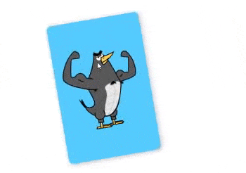
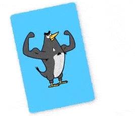
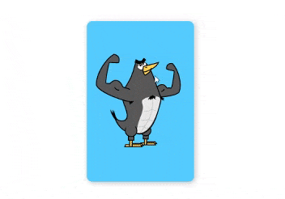
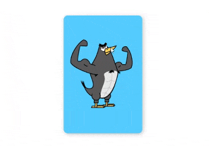
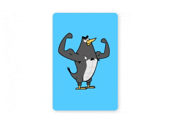
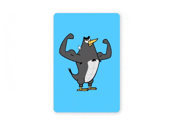

import CoursePost from '../../../../../new-components/CoursePost'
import CourseVideoLink from '../../../../../new-components/CourseVideoLink'
export default CoursePost

# Overview

What you'll learn:

- `useTransform` for rotation
- Understanding when and why to use `useAnimation` or `useMotionValue`

<CourseVideoLink to={props.pageContext.frontmatter.video} />

# `useAnimation` and `useMotionValue`

We’ve used two different hooks to create animations: `useAnimation` and `useMotionValue`. What’s the difference between them? When do we use one over the other?

These are good questions. As designers, it’s important to understand the pros and cons of the tools we have and choose them wisely.

In general, `useAnimation` offers a lot of flexibility. We can customize the animation with the `transition` configuration. We can also easily make a sequence of animations, as you’ll see in a later module.

On the other hand, `useMotionValue` combined with `useTransform` is extremely useful when there’s a **logic link** between different values, such as the `x` offset of the card and its rotation angle.

It’s interesting and common to combine the two approaches in real world cases.

We’ll explore these questions by making our Tinder swipe card even better.

## Spring effect

Currently, when we swipe in either direction and release our mouse, the card stays there.



In contrast, the final result should bounce when released.



Furthermore, if we swipe more to either direction, the card should disappear.



Back in our code, we currently use `MotionValue` and `useTransform` to animate the rotation of the card as we drag it.

```jsx
function App() {
  let mv = useMotionValue(0)
  let rotateMv = useTransform(mv, [-200, 200], [-50, 50])
  let opacityMv = useTransform(mv, [-200, -150, 0, 150, 200], [0, 1, 1, 1, 0])
  ...
}
```

## `useMotionValue` or `useAnimation`?

`useMotionValue` is a great fit for this scenario since for each `x` location of the card, we can compute the corresponding rotation value. We can use math to work out the rotation value no matter what the `x` offset is.

Now when we drag the card a little bit and release the mouse, we want the card to bounce back to its original position.

What do you think we can use?

`onDragEnd`!

```jsx{3}
<Frame
  ...
  onDragEnd={function() {}}
/>
```

## `useMotionValue` or `useAnimation`?

Do we use `useAnimation` or `MotionValue` here?

To me, it feels very intuitive to use `useAnimation` here since we can directly transform our mental model to code. That is, when we release the mouse, we want the card to move back.

Therefore, let's import `useAnimation`.

```jsx{3,9,24-27}
import * as React from "react"
import ReactDOM from "react-dom"
import { Frame, useMotionValue, useTransform, useAnimation} from "framer"
import "./styles.css"

...

function App(){
  let animControls = useAnimation()
  let mv = useMotionValue(0)
  let rotateMv = useTransform(mv, [-200, 200], [-50, 50])
  let opacityMv = useTransform(mv, [-200, -150, 0, 150, 200], [0, 1, 1, 1, 0])

  return (
    <div className="App">
      <Frame
        center
        drag="x"
        x={mv}
        rotate={rotateMv}
        opacity={opacityMv}
        dragConstraints={{ left: -200, right: 200 }}
        style={style}
        animate={animControls}
        onDragEnd={function(){
          animControls.start({x:0})
        }}
      />
    </div>
  )
}
```



## Trying `MotionValue`

We could also try directly setting the `MotionValue` for `x`.

```jsx{5}
<Frame
  ...
  animate={animControls}
  onDragEnd={function(){
    mv.set(0)
  }}
/>
```

But this jagged animation is not what we want.



## Customization of `useAnimation`

Let's switch back to `useAnimation`.

Because we are using `useAnimation`, we easily customize due to its flexibility. Moreover, by default, it uses a spring, so we get this nice, natural movement without much effort.

We can customize our animation by adding a transition property.

```jsx{5}
<Frame
  ...
  animate={animControls}
  onDragEnd={function(){
    animControls.start({x:0, transition:{duration:1}})
  }}
/>
```



Now, if we release our mouse, we'll get a tween animation instead of a spring, but we would like a spring, so let's change it back.

Interestingly, we didn’t have to do anything regarding the rotation of the card. Everything just seems to work "automagically"! When `animControls`starts an animation that changes the `x` offset, `rotateMv` simply follows along as it should.

All this occurs because we created `rotateMv` with `useTransform`, which links `rotateMv` to `mv` and, since `mv` is linked to our cursor `x` value, everything connects!

That’s pretty cool!

# Conclusion

Alright, as a recap, `useMotionValue` and `useAnimation` are both helpful tools for creating animations.

## When to use `MotionValue` or `useAnimation`

When we need to link two values together, we use `MotionValue`, and when we want a lot of animation customization we use `useAnimation`.

In the next post, we'll finish our "Tinder" card swipe!
