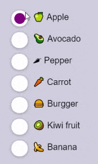
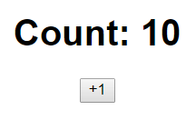
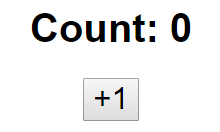
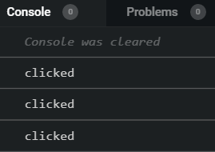
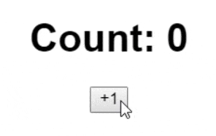
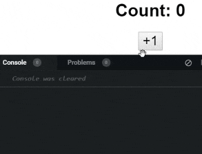
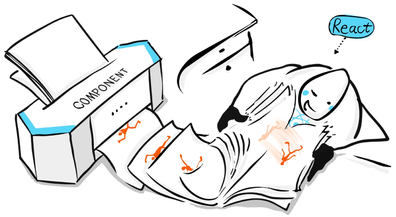
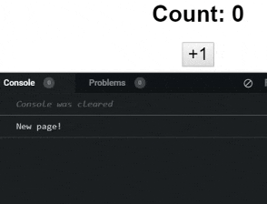

import CoursePost from '../../../../../new-components/CoursePost'
import CourseVideoLink from '../../../../../new-components/CourseVideoLink'
export default CoursePost

# Overview

What you'll learn:

- Creating a simple counter
- `onClick`
- Live UI vs snapshot
- React snapshots
- React vs JavaScript

<CourseVideoLink to={props.pageContext.frontmatter.video} />

# Intro to Radio Group

Welcome to the Radio Group module! We will build this radio group:



See for yourself! [Radio Group](https://mgd7g.csb.app/).

Note, this is **not** an HTML select element. This was built from scratch with Frames, and you'll soon learn how! The major advantage of building a radio group from scratch is the freedom to customize the appearance and animations.

More importantly, this will be a great opportunity to learn about **React state.** We’ll dive into how **React state** works, how to use it, and when to use it in your prototypes.

Before building the Radio Group, we'll start with a basic example.

# Simple Counter

First, create a new React+TS Sandbox and replace the `Hello CodeSandbox` with `Count: 10` and the `<h1>` with `<button>+1</button>`.

```jsx{4-5}
function App(){
  return(
    <div className="App">
      <h1> Count: 10</h1>
      <button>+1</button>
    </div>
  )
}
```



Our button is a little small, so let's change that in our `styles.css` file.

```css
button {
  font-size: 25px;
}
```

Our current goal is that when the button is clicked we want to increase the count displayed.



We know that when we put a pair of curly brackets around something in JSX, it’ll treat what’s inside as JavaScript code and try to run it. Furthermore, since we want to change the Count value, we’ll use a variable there.

```jsx{2,5}
function App(){
  let count = 0
  return(
    <div className="App">
      <h1>Count: {count}</h1>
      <button>+1</button>
    </div>
  )
}
```

## `onClick`

We can now use the `onClick` button attribute because we want `count` to update after a button click. For now, we'll put a `console.log` inside `onClick` to see if it is running.

```jsx{2-4}
<button
  onClick={function(){
    console.log("clicked")
  }}
>
  +1
</button>
```

If we press the button, our console will display `clicked`.



If we were coding in regular JavaScript, we can do the following to change the value of the variable `count`.

```jsx{2-4}
<button
  onClick={function(){
    count = count + 1
    // or shorthand: count +=1
  }}
>
  +1
</button>
```

In order of execution, the current value inside `count` is taken out, `1` is added, and reassigned back to `count`.

However, this does **not** update our browser preview.



Why does this not work? Is JavaScript broken, or is React broken?

## Counter update bug

Let’s take a deeper look by printing out the value of `count`.

```jsx{2-4}
<button
  onClick={function(){
    count = count + 1
    // or shorthand: count +=1
    console.log(count)
  }}
>
  +1
</button>
```

We see in our console that `count` is being updated. Therefore, we can rule out any problems with our code.



## What React is doing

We know that React is in charge of converting our code into HTML so that the browser can display it. As a result, we can probably conclude that, in this case, React is not aware of the variable change for some reason.

In fact, this is the reason why we can't see the new value on the web page.

Remember this doodle? Although it looks simple from our perspective, many secrets are hiding behind it.



A React component is a function, and I’ve told you that a function is like a machine. Similarly, a React component is simply a special machine.

Our component works like a printer that prints out the snapshots of our desired user interface, one page after another.

Afterward, React grabs the pages, assembles them into a flipbook, and flips through the book in our browser. At that point, we’ll see a live UI.

I’ll repeat this:

**A React component prints out a snapshot and not the real UI.**

Although our code looks like HTML, it’s just a snapshot of how we want the UI to look like at a given moment.

If we want to change anything real in the browser, one snapshot is not enough. We need to print out more snapshots to make a proper flipbook. Essentially, you can think of what we are doing in terms of a camera. Once we take one photo, first snapshot, we can fiddle around with the settings and look out of the viewfinder but we'll never get anything new until we take a new photo, a new snapshot. Once we have enough photos, we can make animated picture or video.

## Printing a new snapshot

How do we print a new snapshot? The **only way** is to call the `App` function.

Currently, clicking our button does not cause the `App` function to be called. This is why we don’t see any change. We only have **one page** in our flipbook.

We can verify this by adding a `console.log` in our `App` function.

```jsx{3}
function App(){
  let count = 0
  console.log("New page!")
  ...
}
```

Checking our console, we see there is an initial new page, which is what we see this in the browser. However, if we click on our button, there are no new pages, no new snapshots.



# Conclusion

In the previous posts, everything we could do in React could have been replaced by JavaScript. However, we have now stumbled upon an important difference.

In the next post, we'll learn about **React State** and implementing it to solve our problem!
