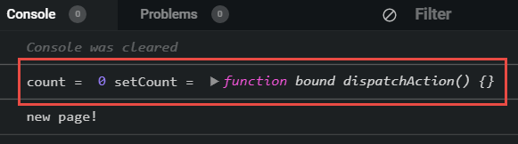
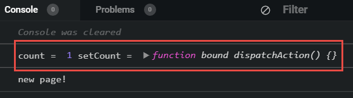
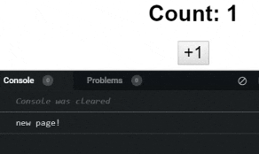
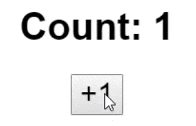
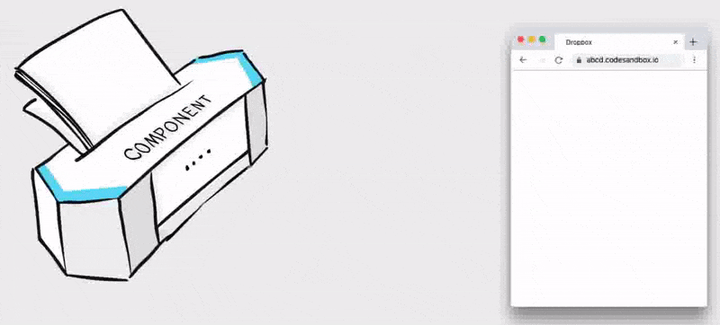
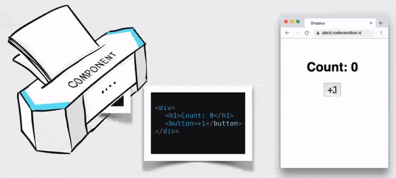
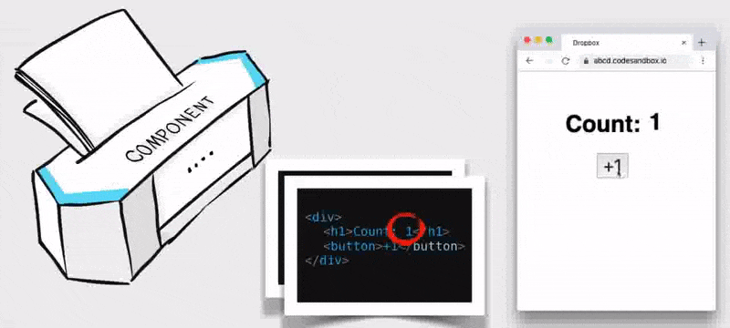

import CoursePost from '../../../../../new-components/CoursePost'
import CourseVideoLink from '../../../../../new-components/CourseVideoLink'
export default CoursePost

# Overview

What you'll learn:

- React states
- `useState`
- React rendering
- React snapshots

<CourseVideoLink to={props.pageContext.frontmatter.video} />

# React States

We only have one page in our flipbook and clicking our button does not produce any new pages, though it does change the value of the `count` variable. Still, the number on the browser preview does not change.

In order to make new pages, we need a special way to tell React to call the `App` function.

**React state** is how we do this.

## `useState`

In `App`, we can write this:

```jsx{2}
function App() {
  let [count, setCount] = React.useState(0)
  console.log("new page!")
  ...
}
```

What is `useState` and why does the name of this function start with `use`?

It’s a React hook! By calling the `useState` hook, our `App` component gains a "special ability" from React.

Why do we have this pair of square brackets?

```jsx
let [count, setCount] = React.useState(0)
```

The return value of `useState` is an array, and we are placing the first and second element of the array into a variable count.

If you remember, this process of defining a variable inside square brackets is called **array destructuring** or **cherry-picking**.

Let’s print out our variables to see what they are.

```jsx{3}
function App() {
  let [count, setCount] = React.useState(0)
  console.log("count =", count, "setCount =", setCount)
  console.log("new page!")
  ...
}
```



We see that `count` and `setCount` have a value of `0` and a function respectively.

## Understanding `useState`

If we change the `useState` parameter from `0` to `1`,

```jsx{2}
function App() {
  let [count, setCount] = React.useState(0)
  ...
}
```

We see that the `count` value has also changed to `1`.



Therefore, the parameter of `useState` acts like its initial value.

Because the second element in the array, `setCount`, is a function. Let’s call it in `onClick` and see what happens.

```jsx{3}
<button
  onClick={function() {
    setCount(10)
  }}
>
  +1
</button>
```

Not only is our Count updated, but we also have a new page.



This is exactly what we want. Like other hooks, `useState` gives our component a special ability. In our case, `useState` gives our component a way to actively update the result in the browser.

## React rendering

`useState` gives us a function. When we call it, `setCount`, it informs React to call the component function. As a result, we get a new snapshot in our flipbook, and the browser content is updated accordingly.

The technical term for this process is **rendering**.

When React calls our component function and puts the result in the browser, we the process **"React renders that component"**. Next time, hopefully, you won’t be surprised when you see these terms in error messages and documents of React.

## Finishing the counter

Instead of a fixed value in `setCount` we can replace it with `count +1`.

```jsx{3}
<button
  onClick={function() {
    setCount(count +1)
  }}
>
  +1
</button>
```



## React snapshot illustrated

As a recap, let’s see what kind of flipbook we’ll get after clicking the button twice.

Initially, we get a new page in our flipbook which is our starting page.



When we click the button once, we get a new page with the only difference being the count is 1 more than the previous.



Pressing the button once more, we'll get a new page and the browser counter updates again.



I hope these illustrations help!

# Conclusion

Now that you know about React States, we can begin creating our Radio Group.
