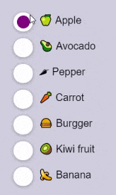
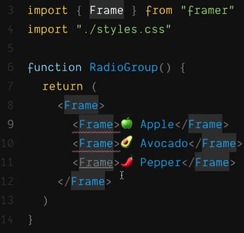
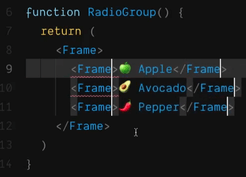
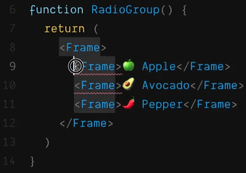
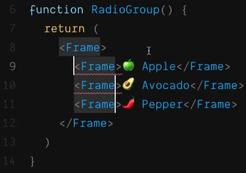
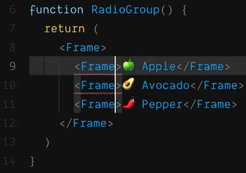
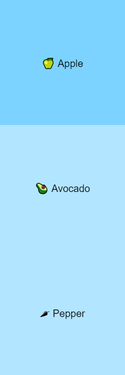

import CoursePost from '../../../../../new-components/CoursePost'
import CourseVideoLink from '../../../../../new-components/CourseVideoLink'
export default CoursePost

# Overview

What you'll learn:

- Coding habit: "Begin with the end in mind"
- Text Editor tip: Multi-line editing

<CourseVideoLink to={props.pageContext.frontmatter.video} />

# Creating the Radio Group

It’s time to build this radio group, now that we have the tools!



As I previously mentioned, this is not an HTML select element. We’ll build this radio group from scratch with only Frames.

This way we can easily add customizations and apply what we have just learned about React state.

In a **new codesandbox**, we’ll start by replacing `<h1>` and `<h2>` with a `<RadioGroup>` tag.

```jsx{4}
function App() {
  return (
    <div className="App">
      <RadioGroup />
    </div>
  )
}
```

Since we haven't defined what a `<RadioGroup>` is yet, let's create the component.

```jsx{1-5,10}
function RadioGroup(){
  return(
    <Frame></Frame>
  )
}

function App() {
  return (
    <div className="App">
      <RadioGroup />
    </div>
  )
}
```

We also have to import Frame since `<Frame>` is not defined.

```jsx{3}
import * as React from "react"
import { render } from "react-dom"
import {Frame} from "framer"
import "./styles.css"
```

## Beginning with the end in mind

Take note of the order of the things we’ve been doing here. Instead of, first, importing Frame, writing the `RadioGroup` function, and then finally using the `<RadioGroup>` tag, we did it in the reverse order.

We started with how we would use the `RadioGroup` component assuming that it already exists. This includes the name of the component, its attributes, and so on. Then we went backwards one step at a time to finish our code.

For the `RadioGroup` function, we know we need to use a `<Frame>`, so we wrote the `<Frame>` tag assuming it was ready for use. Then, we went backwards again to fix the `import`.

This is a good method to help you think about and organize your code. It's often very beneficial to start "using" your code before "implementing" it. For example, you don't necessarily want to import and implement anything that does not pertain to your work at hand. As a result, this "reverse" method makes you only use what you need.

### _The Seven Habits of Highly Effective People_

If you haven’t read _The Seven Habits of Highly Effective People_ by Stephen Covey, I would highly recommend it.

In it, **Habit 2** involves **"beginning with the end in mind"**.

Not only do I think this principle will help you in many aspects of your life, but I developed this course using this principle. I started by finding a whole bunch of real-world, "end-result", prototypes. Then, I worked backwards to identify the topics that needed to be taught and built the structure of this course.

Although I digressed a bit, I hope you find it useful!

## Radio Group

Back to our radio group, let's populate it with a few selection options.

```jsx{3}
function RadioGroup(){
  return(
    <Frame>🍏 Apple  🥑 Avocado  🌶 Pepper</Frame>
  )
}
```

Now we are going to wrap each option with its own pair of Frames.

```jsx
function RadioGroup() {
  return (
    <Frame>
      <Frame>🍏 Apple</Frame>
      <Frame>🥑 Avocado</Frame>
      <Frame>🌶 Pepper</Frame>
    </Frame>
  )
}
```

Why does our preview look like this?


Because Frames are absolutely positioned!
Therefore, we need to add `position="relative"` to all the three frames.

## Text Editor tip: Multi-line editing

Before we fix this, let me show you an editor trick. This works in both CodeSandbox and the built-in editor in Framer X.

If we put the cursor in the middle of some text and press CTR+D or CMD+D you will see every other occurrence highlighted.



If you continue to press the same combination, we’ll get multiple cursors which allow us to type in different places.



However, in this case, we only want to make changes to the start tags.

## 1. Select the unique text alone.



## 2. Press CTR+D or CMD+D



## 3. Press the right arrow → to align your carets and to deselect the Frames.



We can now add `position="relative"`.

```jsx{4-6}
function RadioGroup(){
  return(
    <Frame>
      <Frame position="relative">🍏 Apple</Frame>
      <Frame position="relative">🥑 Avocado</Frame>
      <Frame position="relative">🌶 Pepper</Frame>
    </Frame>
  )
}
```



# Conclusion

Now that we have the foundation of our Radio Group, in the next post, we'll make these look like real radio buttons.
