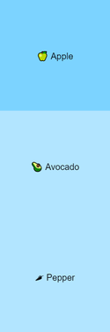
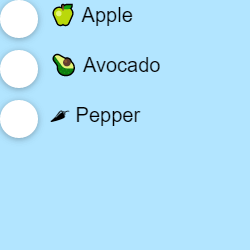
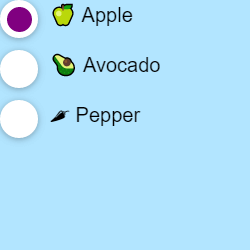
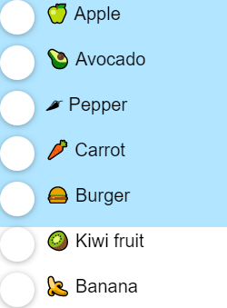

import CoursePost from '../../../../../new-components/CoursePost'
import CourseVideoLink from '../../../../../new-components/CourseVideoLink'
export default CoursePost

# Overview

What you'll learn:

- DRY principle
- Accessing children of tags
- Nested circles
- External Radio Group data

<CourseVideoLink to={props.pageContext.frontmatter.video} />

# Optimizing the Radio Group

The multi-cursor feature in the editor makes it easy for us to update our code in multiple places at once. By definition, it makes it easy for us to repeat ourselves.

However, in general, we want to write code once and reuse it in the future. We don’t want to repeat ourselves. This is the **DRY principle** in coding.

**DRY: Do not Repeat Yourself**

I’ll ironically repeat, do not repeat yourself!

Looking at our Frames,

```jsx
<Frame>
  <Frame position="relative">🍏 Apple</Frame>
  <Frame position="relative"> 🥑 Avocado</Frame>
  <Frame position="relative">🌶 Pepper</Frame>
</Frame>
```

Each one is supposed to be an individual radio button that differs only in what’s inside the `<Frame>` tags. The `<Frame>` tag itself and its attributes are all the same.

## `Radio` component

When we notice this kind of repetition, we should extract our code into a separate component.

Let's replace the radio button Frames with `<Radio>`

```jsx
<Frame>
  <Radio>🍏 Apple</Radio>
  <Radio> 🥑 Avocado</Radio>
  <Radio>🌶 Pepper</Radio>
</Frame>
```

Again, were are using the `<Radio>` tag assuming it already exists. It's important to play with different options before implementing them.

For example, we could make our radio label an attribute or a child of the `<Radio>` tag.

However, we'll go ahead and implement `Radio`.

```jsx
function Radio() {
  return <Frame position="relative"></Frame>
}
```

But what do we put inside the `<Frame>` tag?

## `props.children`

Here we put the label of the radio as the child of the `<Radio>` tag. Therefore, unlike our previous modules, our value is not an attribute of the tag.

```jsx
<Frame>
  <Radio>🍏 Apple</Radio>
  <Radio> 🥑 Avocado</Radio>
  <Radio>🌶 Pepper</Radio>
</Frame>
```

However, we can access the children of a tag in a very similar way to accessing the attributes.

```jsx{1,3}
function Radio(props){
  return(
    <Frame position="relative">{props.children}</Frame>
  )
}
```

All the children of the tag are available as `props.children`, but don’t forget to add the pair of curly brackets!

Our preview should look like what we had in the beginning:



## Radio circle

Now, let’s add the circle in front of the label. To save time, we'll paste in some code in the `Radio` component `return`.

```jsx{3-16}
function Radio(props){
  return(
    <Frame
      position="relative"
      size="auto"
      style={{ display: "flex", marginBottom: 10 }}
      background="null"
    >
      <Frame
        size={30}
        shadow="0 1px 5px 0 rgba(0,0,0,0.3)"
        background="white"
        borderRadius={15}
        position="relative"
        style={{ marginRight: 10 }}
      />
      {props.children}
    </Frame>
  )
}
```

We still have our original `Radio` `<Frame>`, but there is extra styling and a new `<Frame>` that resembles a white circle.



## `selected` attribute

Next, we want to show a smaller purple circle inside the white circle to indicate if this radio is selected.

To signal if a `<Radio>` is selected, we can add a `selected` attribute.

```jsx{2}
<Frame>
  <Radio selected>🍏 Apple</Radio>
  <Radio> 🥑 Avocado</Radio>
  <Radio>🌶 Pepper</Radio>
</Frame>
```

However, the `Radio` component has to understand what this `selected` means and what to do.

## Purple, selected circle

Let's add the small purple circle inside the outer white circle. Note that we have to split up the white circle `<Frame />` into `<Frame></Frame>`.

```jsx{16-23}
function Radio(props){
  return(
    <Frame
      position="relative"
      size="auto"
      style={{ display: "flex", marginBottom: 10 }}
      background="null"
    >
      <Frame
        size={30}
        shadow="0 1px 5px 0 rgba(0,0,0,0.3)"
        background="white"
        borderRadius={15}
        position="relative"
        style={{ marginRight: 10 }}
      >
        <Frame
          size={20}
          borderRadius={10}
          background="purple"
          center
        />
      </Frame>
      {props.children}
    </Frame>
  )
}
```

We can now add code into our purple circle to determine whether to show or hide itself according to which radio was `selected`. We'll use the `animate` attribute.

```jsx{9}
<Frame
  ...
>
  <Frame
    size={20}
    borderRadius={10}
    background="purple"
    center
    animate={{scale:1}}
  />
</Frame>
```

If the `scale` is equal to `1`, we will see the purple circle. Otherwise, if scale is equal to `0` it will be hidden. We can use a conditional to set `scale` equal to `1` or `0`.

```jsx{9}
<Frame
  ...
>
  <Frame
    size={20}
    borderRadius={10}
    background="purple"
    center
    animate={{scale: props.selected ? 1 : 0}}
  />
</Frame>
```

Do you remember what this is? It's a **ternary operator**! Essentially, a **ternary operator** is a condensed form of if then else statement.

Our preview should look like this:



## External options with `RadioGroup`

Taking another look at our `RadioGroup` component, we have three **hardcoded** options and there are only three vegetables! It’s not very useful. We want to make it reusable so that we could, for example, list different options.

Let’s say we have the options available as an array in our `App` component.

```jsx{2-10}
function App() {
  let options = [
    "🍏 Apple",
    "🥑 Avocado",
    "🌶 Pepper",
    "🥕 Carrot",
    "🍔 Burger",
    "🥝 Kiwi fruit",
    "🍌 Banana"
  ]
  return (
    <div className="App">
      <RadioGroup />
    </div>
  )
}
```

We want to be able to pass it to RadioGroup component with something like this:

```jsx
function App() {
  let options = [
    '🍏 Apple',
    '🥑 Avocado',
    '🌶 Pepper',
    '🥕 Carrot',
    '🍔 Burger',
    '🥝 Kiwi fruit',
    '🍌 Banana',
  ]
  return (
    <div className="App">
      <RadioGroup choices={options} />
    </div>
  )
}
```

## `map` function

How do we use `options` to populate our `RadioGroup`? You tell me! We've done it before using `map`!

First, we'll add `props` to `RadioGroup`.

```jsx{1,}
function RadioGroup(props) {
  ...
}
```

Second, we'll replace the hardcoded Frames with the `map` function. Don't forget the curly brackets!

```jsx{5}
function RadioGroup(props) {
  return (
    <Frame>
      {
        props.choices.map(choice => <Radio>{choice}</Radio>)
      }
    </Frame>
  )
}
```

Remember, this is an **arrow function**!

## `key` attribute

Finally, don't forget to add the `key` prop to avoid console warnings.

```jsx{5}
function RadioGroup(props) {
  return (
    <Frame>
      {props.choices.map(choice => (
        <Radio key={choice}>{choice}</Radio>
      ))}
    </Frame>
  )
}
```

Our Radio Group should now look like this:



# Conclusion

We now have a reusable `RadioGroup`. We can pass whatever options we want as the choices prop, and they’ll be rendered properly as radio buttons.

In the next post, we will style our Radio Group by passing along `props`.
