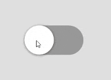
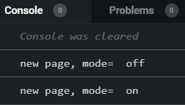

import CoursePost from '../../../../../new-components/CoursePost'
import CourseVideoLink from '../../../../../new-components/CourseVideoLink'
export default CoursePost

# Overview

What you'll learn:

- Foundation of `useCycle`
- Array logic
- Creating custom hooks

<CourseVideoLink to={props.pageContext.frontmatter.video} />

# `useCycle`

Let’s go back to the toggle we built earlier.



To make our toggle functional, we implemented the `useCycle` function imported from Framer.

What is `useCycle``?

It's a React hook due to how it starts with `use` and is a function.

However, let’s dig deeper. Have you wondered how it actually works? When we click on our toggle, how many new pages in our "flipbook" do we get?

Well, we can find it out with `console.log`!

```jsx{3}
function App() {
  let [mode, cycleMode] = useCycle("off", "on")
  console.log("new page, mode=", mode)
  return (
    ...
  )
}
```

It seems like we just get one new page.



## `cycleMode`

```jsx{5}
<div className="App">
  <Frame
    ...
    onTap={function handleTap() {
      cycleMode()
    }}
  >
</div>
```

Now, what is going on with the `cycleMode` function? Why do we get a new page in our flipbook when we call it and what gives a component the ability to actively refresh our browser?

## `useCycle` is `useState`

Well, `useCycle` is actually `useState` in disguise.

In fact, we can build our own `useCycle` with `useState`. Let’s do that!

We'll write a new function called `useCycle2` outside of `App`.

```jsx{1}
function useCycle2(){
  return(
    [currentOption, cycle]
  )
}
```

By returning an array, we can use **array destructuring** when we call it — similar to how we call `useCycle`.

For `useCycle2`, we might want a list of options so let's add a parameter.

```jsx{1}
function useCycle2(options){
  return(
    [currentOption, cycle]
  )
}
```

We can now work on the actual functional component in `useCycle2`. To access the current option we can do as follows: use the input, parameter array and the current index to get `currentOption`.

```jsx{3}
function useCycle2(options){
  let [index, setIndex] = React.useState(0)
  let currentOption = options[index]
  return(
    [currentOption, cycle]
  )
}
```

## Array logic

For our cycle, we'll define a new function inside of `useCycle2`. The `cycle` requires us to change our index, and we can do that using `setIndex` from `useState`.

Inside of `setIndex`, we'll use a ternary operator to change the value of `index`.

Our logic is if our current index is less than the greatest index, we'll add `1` to get the next index. If our current index is equal to or larger than the greatest index, we'll reset our index to our first option.

To get the largest index of an array, we can use its length property and subtract 1. Because array lengths don't abide by the index convention that starts at 0, the array length is always 1 larger than the last index.

```jsx{5}
function useCycle2(options){
  let [index, setIndex] = React.useState(0)
  let currentOption = options[index]
  function cycle() {
    setIndex(index < options.length-1 ? index + 1 : 0)
  }
  return(
    [currentOption, cycle]
  )
}
```

Now we can replace `useCycle` with `useCycle2`,

Remember to make our `useCycle2` input parameter an array.

```jsx{2}
function App() {
  let [mode, cycleMode] = useCycle2(["off", "on"])
  console.log("new page, mode=", mode)
  return (
    ...
  )
}
```

Our toggle works just as before.


## Understanding `useCycle`

You know the "true face" behind `useCycle`. All it is, is a custom hook that implements `useState` as its building block.

Previously, I’ve told you we can only call hooks inside a function component. This is an exception. We can also call hooks inside a custom hook.

Being able to build custom hooks with existing hooks is a big feature of React hooks. You can find many custom hooks online such as [useHooks.com](https://usehooks.com/) that help us add various functionality to our components.

Framer’s [hooks](https://www.framer.com/api/utilities/) are a great example. They make it very easy to build prototypes with animations and gestures.

# Conclusion

We have now covered a fundamental React hook skill that will help us understand and create new hooks.

In the next module, we'll learn how to make an opening and closing padlock animation!
