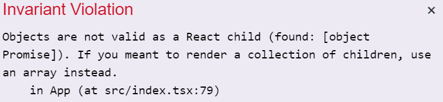

import CoursePost from '../../../../../new-components/CoursePost'
import CourseVideoLink from '../../../../../new-components/CourseVideoLink'
export default CoursePost

# Overview

What you'll learn:

- Custom spring transition
- `delay`
- Embedded `async` function

<CourseVideoLink to={props.pageContext.frontmatter.video} />

# Final Result


See for yourself! [Failed Unlock](https://n52pw.csb.app/).

# Failed Unlock Animation

This animation happens in three stages.

1. Lock shakes

2. Lock shrinks

3. Text is revealed

In the App component, we have a `<Padlock>` and Frames.

```jsx
<Padlock animate={lockAnim} left={45} />
  <Frame
    color="white"
    animate={textAnim}
    background={null}
    style={{ fontSize: 30 }}
    overflow="hidden"
    width={0}
  >
  <Frame background={null} width={400}>
    Swipe up to unlock
  </Frame>
</Frame>
```

Another `<Frame>` holds our `Swipe up to unlock` text.
Notice the `overflow` of the first `<Frame>` is set to `"hidden"` and its `width` is `0`.

```jsx{5-6}
<Frame
    color="white"
    animate={textAnim}
    background={null}
    style={{ fontSize: 30 }}
    overflow="hidden"
    width={0}
>
```

This combination of attributes is a nice trick to implement our reveal effect.

If we comment out `<Padlock>` and change the Frame's width, we'll see more and more of the text.

### `width={200}`


### `width={300}`


### `width={400}`


Therefore, if we animate the width, we’ll get a smooth reveal effect!

Let's uncomment `<Padlock>` and reset the text's `width` to `0`.

We’ve already created `lockAnim` and `textAnim` with `useAnimation` with their corresponding `animate` attributes.

```jsx{2-3,7,10}
function App() {
  const lockAnim = useAnimation()
  const textAnim = useAnimation()

  return (
    <Frame background={null} center>
      <Padlock animate={lockAnim} left={45} />
      <Frame
        color="white"
        animate={textAnim}
        background={null}
        style={{ fontSize: 30 }}
        overflow="hidden"
        width={300}
      >
        ...
      </Frame>
    </Frame>
  )
}
```

We simply need to start the animations at the proper times.

## Shake

Right after our app launches, we want to start the animation.

```jsx{5}
function App() {
  const lockAnim = useAnimation()
  const textAnim = useAnimation()

  lockAnim.start({x:-10})

  return(
    ...
  )
}
```


## Custom transition spring

To add the shake, we don't have to animate the lock back and forth. Instead, we can customize the animation by defining a spring. By adding certain spring properties, the spring will provide the shake effect.

```jsx{5-10,12}
function App() {
  const lockAnim = useAnimation()
  const textAnim = useAnimation()

  const spring = {
      type: "spring",
      stiffness: 500,
      damping: 4,
      restSpeed: 0.5
    }

  lockAnim.start({x:-10, transition: spring})

  return(
    ...
  )
}
```


## Scale

After the lock shakes for a bit, we want to shrink it.

```jsx{5}
function App() {
  ...

  lockAnim.start({x:-10, transition: spring})
  lockAnim.start({scale:0.2})
  return(
    ...
  )
}
```


This scale animation happens a little too early. We can fix this by adding the `delay` property.

```jsx{5}
function App() {
  ...

  lockAnim.start({x:-10, transition: spring})
  lockAnim.start({scale:0.2, transition: {delay: 0.5}})
  return(
    ...
  )
}
```


To make room for our text reveal, we'll set the origin of `<Padlock>` to the left, using `originX="left"`.

```jsx
<Padlock animate={lockAnim} left={45} originX="left" />
```


## Text reveal

Now, after the lock finishes shrinking, we want to reveal the text.

```jsx{6}
function App() {
  ...

  lockAnim.start({x:-10, transition: spring})
  lockAnim.start({scale:0.2, transition: {delay: 0.5}})
  textAnim.start({width:400, transition: { duration: 1.5, ease: "easeOut" }})
  return(
    ...
  )
}
```


## Text reveal

To play the text animation after the scale and to move our lock and text to the left, we have to utilize `await` and `async`!

We learned that to use `await` we have to add `async` before the function name.

```jsx{1,13}
async function App() {
  const lockAnim = useAnimation()
  const textAnim = useAnimation()

  const spring = {
      type: "spring",
      stiffness: 500,
      damping: 4,
      restSpeed: 0.5
    }

  lockAnim.start({x:-10, transition: spring})
  await lockAnim.start({scale:0.2, transition: {delay: 0.5}})
  textAnim.start({width:400, transition: { duration: 1.5, ease: "easeOut" }})
  return(
    ...
  )
}
```

However, we get an error!



## `async` functions inside of components

Unfortunately, we cannot make a React component become an `async` function.

However, the fix is quite simple!

Let's create a function inside of `App` and move our animation code inside it.

```jsx{5,18}
function App() {
  const lockAnim = useAnimation()
  const textAnim = useAnimation()

  async function playAnimation(){
    const spring = {
      type: "spring",
      stiffness: 500,
      damping: 4,
      restSpeed: 0.5
    }

    lockAnim.start({x:-10, transition: spring})
    await lockAnim.start({scale:0.2, transition: {delay: 0.5}})
    textAnim.start({width:400, transition: { duration: 1.5, ease: "easeOut" }})
  }

  playAnimation()

  return(
    ...
  )
}
```

Remember to call the function after defining it!

```jsx{5}
async function playAnimation(){
  ...
}

playAnimation()

return(
  ...
)
```

Everything seems to be working like before!

## Final touches

We can improve the animation by moving the lock and the text to the left a bit.

```jsx{16-17}
function App() {
  const lockAnim = useAnimation()
  const textAnim = useAnimation()

  async function playAnimation(){
    const spring = {
      type: "spring",
      stiffness: 500,
      damping: 4,
      restSpeed: 0.5
    }

    lockAnim.start({x:-10, transition: spring})
    await lockAnim.start({scale:0.2, transition: {delay: 0.5}})
    textAnim.start({width:400, transition: { duration: 1.5, ease: "easeOut" }})
    lockAnim.start({ x: -50 })
    textAnim.start({ x: -40 })
  }

  playAnimation()

  return(
    ...
  )
}
```


# Conclusion

As a recap, to play an animation when our app launches, we write our animation code before the `return` statement in the component function. If we want to use `await` to sequence animations, we need to create an embedded function because the component function is not allowed to be `async`.

Play around with the animation timing and add some new animations!

In the next post, we'll create the floating-action-button animation!
