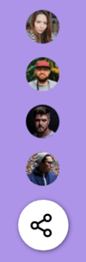
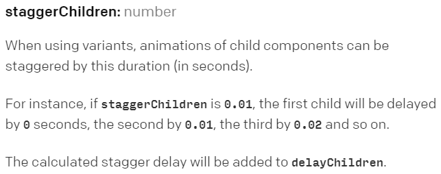
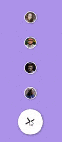
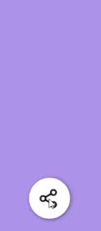
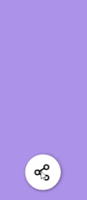

import CoursePost from '../../../../../new-components/CoursePost'
import CourseVideoLink from '../../../../../new-components/CourseVideoLink'
export default CoursePost

# Overview

What you'll learn:

- `staggerChildren`
- `staggerDirection`
- `initial`

<CourseVideoLink to={props.pageContext.frontmatter.video} />

# FAB Part 2

Now, we'll finish our floating action button.

First, let's add these smaller buttons when the FAB is expanded.


See for yourself! [FAB Animation](https://f89r9.csb.app/).

```jsx{1}
function Fab({ buttons, ...props }) {
  const [mode, cycleMode] = useCycle("folded", "expanded")
  return (
    ...
  )
}
```

We’ve got our array of images as a `buttons` prop. Since we're dealing with an array, we can use the `map` function to create a list of tags.

```jsx{6-8}
function Fab({ buttons, ...props }) {
  const [mode, cycleMode] = useCycle("folded", "expanded")
  return (
    <Frame background={null} size="auto" animate={mode} {...props}>
      {buttons.map(button => (
        <Frame size={40} borderRadius="50%" />
      ))}
    </Frame>
    ...
  )
}
```


Our buttons are overlapping because Frames are **absolutely positioned** by default.

Let’s change our white button and our smaller ones to **relative** positioning.

```jsx{3,9}
<Frame background={null} size="auto" animate={mode} {...props}>
  {buttons.map(button => (
    <Frame size={40} borderRadius="50%" position="relative"/>
  ))}
  {/* FAB */}
  <Frame
    size={60}
    borderRadius="50%"
    position="relative"
    backgroundColor="white"
    shadow="1px 1px 5px rgba(0,0,0,0.5)"
    onTap={function() {
      cycleMode()
    }}
  >
  ...
</Frame>
```


## Adding images

To populate our buttons, we'll use the `image` attribute.

```jsx{7}
<Frame background={null} size="auto" animate={mode} {...props}>
  {buttons.map(button => (
    <Frame
    size={40}
    borderRadius="50%"
    position="relative"
    image={button.image}
    />
  ))}
  ...
</Frame>
```


We now want to add spacing between the buttons and center them. We'll use the `style` attribute to add a margin and `center` to align the buttons. However, if you want, you could also use `flexbox` on the parent `<Frame>` to center the buttons.

```jsx{6-7}
<Frame
  size={40}
  borderRadius="50%"
  position="relative"
  image={button.image}
  style={{ marginBottom: 16 }}
  center="x"
/>
```



## Styling our buttons

To make our buttons look nicer, we'll add a border and drop subtle drop shadow.

```jsx{8-9}
<Frame
  size={40}
  borderRadius="50%"
  position="relative"
  image={button.image}
  style={{ marginBottom: 16 }}
  center="x"
  border="2px solid white"
  shadow="1px 1px 5px rgba(0,0,0,0.5)"
/>
```


Did we miss anything? What should we do if we use the `map` function?

The **`key`** attribute!

Don’t forget to add the `key` prop to get rid of the warning associated with using `map`.

```jsx{2}
<Frame
  key={button.image}
  ...
/>
```

## Animation

To animate the small buttons, we can use the `variants` prop with `scale` values.

```jsx{11-14}
<Frame
  key={button.image}
  size={40}
  borderRadius="50%"
  position="relative"
  image={button.image}
  style={{ marginBottom: 16 }}
  center="x"
  border="2px solid white"
  shadow="1px 1px 5px rgba(0,0,0,0.5)"
  variants={{
    folded: { scale: 0 },
    expanded: { scale: 1 }
  }}
/>
```


## Stagger Effect

Now it’s time to add some stagger effect.

We can check out Framer's [documentation](https://www.framer.com/api/animation/#orchestration.staggerchildren) to stagger our animation.

## `staggerChildren`



The property is called `staggerChildren` and, in the example on the right, we see that `staggerChildren` is set in the `transition` property.


`staggerChildren` holds the duration of the delay.

**Note that the `staggerChildren` option only works when used inside a `variant`.**

To illustrate,

```jsx{9}
function Fab({ buttons, ...props }) {
  const [mode, cycleMode] = useCycle("folded", "expanded")
  return (
    <Frame
      background={null}
      size="auto"
      animate={mode}
      {...props}
      transition={{staggerChildren:0.5}}
    >
    ...
  )
}
```

Although we added `staggerChildren`, there is no delay in the expanded state if you try it out.

To fix this, we'll add `variants` to this `<Frame>` and place `staggerChildren` inside of it.

Make sure `transition={{staggerChildren:0.5}}` is converted to object notation!

`{transition:{staggerChildren:0.5}}`

```jsx{10}
function Fab({ buttons, ...props }) {
  const [mode, cycleMode] = useCycle("folded", "expanded")
  return (
    <Frame
      background={null}
      size="auto"
      animate={mode}
      {...props}
      variants={{
        folded: {transition:{staggerChildren:0.5}}
      }}
    >
    ...
  )
}
```



When the mode of the button changes from `expanded` to `folded`, this transition is active and there will be a delay for the animations of all the children of this `<Frame>`.

Since we haven’t defined `staggerChildren` for the `expanded` mode, when the mode does change, all the animations still happen at the same time.

## Expanding stagger

Let's add a stagger to the `expanded` mode.

```jsx{11}
function Fab({ buttons, ...props }) {
  const [mode, cycleMode] = useCycle("folded", "expanded")
  return (
    <Frame
      background={null}
      size="auto"
      animate={mode}
      {...props}
      variants={{
        folded: {transition:{staggerChildren:0.5}},
        expanded: {transition:{staggerChildren:0.5}}
      }}
    >
    ...
  )
}
```



However, now the FAB animation is delayed as well because it is a child of the outer `<Frame>`.

Since we don't want the delay on our FAB, we can move the small buttons and the `variants` into a separate `<Frame>`.

```jsx{6-14}
function Fab({ buttons, ...props }) {
  const [mode, cycleMode] = useCycle("folded", "expanded")
  return (
    <Frame background={null} size="auto" animate={mode} {...props}>
      // new Frame
      <Frame
        background={null}
        size="auto" center="x"
        position="relative"
        variants={{
          folded: {transition:{staggerChildren:0.5}},
          expanded: {transition:{staggerChildren:0.5}}
        }}
      >
        {buttons.map(button => (
          <Frame
            ...
          />
        ))}
      </Frame>
    ...
  )
}
```


We certainly aren't done yet!

## `staggerDirection`

When the FAB is expanded, we want the animation to happen in the opposite direction. This is possible with `staggerDirection`, in which by default is set to `1`.

```jsx{7}
<Frame
  background={null}
  size="auto" center="x"
  position="relative"
  variants={{
    folded: {transition:{staggerChildren:0.5}},
    expanded: {transition:{staggerChildren:0.5, staggerDirection:-1}}
  }}
>
```



Finally, let’s change our delay duration from `0.5` to `0.05`. It is too slow for real use but useful during our development phase so that we can see what’s going on.

### **Flashing image in the next sections**

```jsx{6-7}
<Frame
  background={null}
  size="auto" center="x"
  position="relative"
  variants={{
    folded: {transition:{staggerChildren:0.05}},
    expanded: {transition:{staggerChildren:0.05, staggerDirection:-1}}
  }}
>
```


## Launching bug

Lastly, when the app launches, we can see the small buttons appear shortly.


We can easily fix this by adding an `initial` prop to the root frame.

```jsx{5}
return (
    <Frame
      background={null}
      size="auto"
      initial="folded"
      animate={mode}
      {...props}
    >
     ...
    </Frame>
)
```

## Final Result


# Conclusion

Good job making it here!

We did a lot in this post, and we finished module 7!

To recap, we used `variants` with `transition` properties of `staggerChildren`, and `staggerDirection`. These options make it easy to add a delay to the children of a container `<Frame>`.

I encourage you to check out other options for controlling the timing of animations at Framer's [documentation](https://www.framer.com/api/animation/#orchestration).

In the next module, we'll create those smooth scrolling effects you see in all modern websites!
