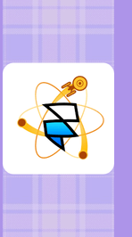
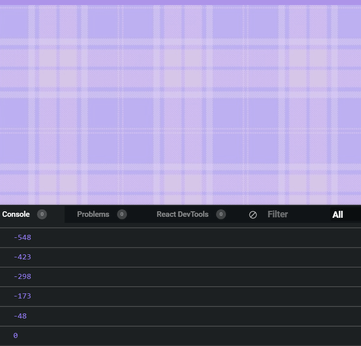
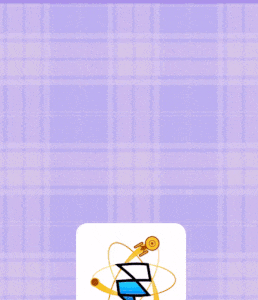
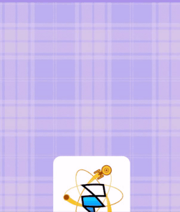

import CoursePost from '../../../../../new-components/CoursePost'
import CourseVideoLink from '../../../../../new-components/CourseVideoLink'
export default CoursePost

# Overview

What you'll learn:

- `contentOffsetY`
- `onChange`
- linking a `MotionValue` to compatible props

<CourseVideoLink to={props.pageContext.frontmatter.video} />

# Final Result


See for yourself! [Scroll Effects](https://o9yeu.csb.app/).

# Scroll Effects Intro

Welcome to the Scroll Parallax module! We’ll build some cool scrolling effects like the one above!

However, before we make advanced scroll interactions, we'll start with a simple example and build on from there.

In your starter code, you should see this on the left side of the preview.



We’ll add multiple effects to this icon while we scroll on this page. Note that, the plaid background is there to simply allow us to easily see our scroll-effects progress.

## `Scroll`

First, we’ll import `Scroll` from the Framer library.

```jsx{3}
import * as React from "react"
import { render } from "react-dom"
import { Frame, Scroll } from "framer"
import "./styles.css"
```

Next, we'll wrap our root `<Frame>` with the `<Scroll>` tag and set the width and height to be `"100%"`.

```jsx{3,7}
function App() {
  return (
    <Scroll width="100%" height="100%">
      <Frame background={null}>
        ...
      </Frame>
    </Scroll>
  )
}
```


As you can see, the scroll will stretch the width of its direct children to 100%.

We want to disable the default scroll of the entire page so that we only get the scrolling behavior from the `Scroll` component.

We can achieve this in our CSS file by using property `overflow`.

```jsx{3}
body {
  background-color: #ad94e9;
  overflow: hidden;
}
```

## Linking `offset` to `opacity`

Now let’s say we want to change the opacity of the icon when scrolling the page up. How would you do it?

It might seem daunting, but you should be confident because that you already know most of it!

To keep track of the scrolling progress, we can use the `useMotionValue` hook.

```jsx{3}
import * as React from "react"
import { render } from "react-dom"
import { Frame, Scroll, useMotionValue } from "framer"
import "./styles.css"
```

In `App`, we'll call `useMotionValue` to initialize an `offset` value.

```jsx{2}
function App() {
  const offset = useMotionValue(0)
  return (
    ...
  )
}
```

In our `<Scroll>` tag, we want to set `offset` to be the Scroll's offset in the `y` direction.

```jsx
function App() {
  const offset = useMotionValue(0)
  return (
    <Scroll width="100%" height="100%" contentOffsetY={offset}>
      ...
    </Scroll>
  )
}
```

Now, we have a `MotionValue` that changes when we scroll the page vertically.

What does the value of `offset` look like when we scroll What do you think we can use to figure that out?

`console.log`!

However, we can't simply print out `offset` in `App` because when we load `App`, our `console.log` will be printed before we could scroll.

## `onChange`

Therefore, we use `console.log` in conjunction with a function available in `MotionValue` called `onChange`.

```jsx{2}
function App() {
  const offset = useMotionValue(0)
  offset.onChange(v => console.log(v))
  return (
    ...
  )
}
```



When we scroll to the very top, `offset` is equal to `0`. In contrast, when we scroll down, `offset` becomes more and more negative.

Remember to remove the `console.log` function call when we are done "investigating" `offset`.

Although `onChange` was good enough for looking at `offset`, we didn't properly call the `onChange` function. As a result, if we leave it there, the functional call might cause some unpleasant bugs, so let's comment it out for now.

## `useTransform`

We can’t directly use a `MotionValue` to set the opacity of the icon.

What do we do?

We can use the `useTransform` hook to convert our `offset` `MotionValue` into another MotionValue that is compatible with `opacity`.

First, we'll import `useTransform`.

```jsx{3}
import * as React from "react"
import { render } from "react-dom"
import { Frame, Scroll, useMotionValue, useTransform } from "framer"
import "./styles.css"
```

We'll now create a new `MotionValue`: `iconOpacity`.

```jsx{3}
function App() {
  const offset = useMotionValue(0)
  const iconOpacity = useTransform(offset, [0, -500], [1, 0])
  // offset.onChange(v => console.log(v))
  return (
    ...
  )
}
```

We can now set our `opacity` attribute on our icon `<Frame>`.

```jsx{2}
<Frame
  opacity={iconOpacity}
  backgroundColor="white"
  size={200}
  top={400}
  borderRadius={20}
  center="x"
  image="/starship.png"
/>
```



The opacity of our icon is now directly mapped to our page-scrolling progress.

## Linking `offset` to `borderRadius`

Similar to `iconOpacity`, we can map `offset` to other, new MotionValues.

```jsx{4}
function App() {
  const offset = useMotionValue(0)
  const iconOpacity = useTransform(offset, [0, -500], [1, 0])
  const iconBorderRadius = useTransform(offset, [0, -500], [20, 100])
  // offset.onChange(v => console.log(v))
  return (
    ...
  )
}
```

Here, we affecting the `borderRadius` of our icon!

```jsx{6}
<Frame
  opacity={iconOpacity}
  backgroundColor="white"
  size={200}
  top={400}
  borderRadius={iconBorderRadius}
  center="x"
  image="/starship.png"
/>
```



As long as the prop value accepts a `MotionValue`, we can make it work.

Remember that when you set up the ranges in `useTransform`, the value of the offset is negative. It starts with `0` and when you scroll further, the offset becomes more negative.

# Conclusion

This simple opacity animation is used in an incredible amount of websites, and now you know how to create it!

In the next post, we'll make the icon "sticky" at a certain point.
