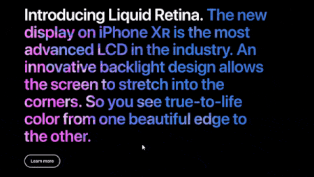
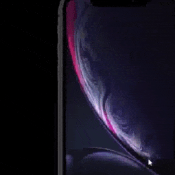
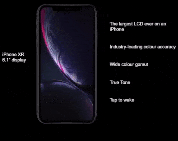

import CoursePost from '../../../../../new-components/CoursePost'
import CourseVideoLink from '../../../../../new-components/CourseVideoLink'
export default CoursePost

# Overview

What you'll learn:

- Title fade
- Image scale and stick
- Reveal effect

<CourseVideoLink to={props.pageContext.frontmatter.video} />

# Apple Scroll Effects

Let me walk you through the solution of assignment 8.2!



Different parts of this page are animated along with the scrolling.

## Title Fade

How do we make this title partially fade out?

The answer is to add an overlay on top of it.

The overlay is filled with a gradient which goes from opaque to transparent.

We defined a `MotionValue` here which as an output `opacity` value from `0` to `1` depending on the `pOffsetY`.

```jsx
function App() {
  ...
  // title
  const titleHiderOpacity = useTransform(pOffsetY, [0, 150], [0, 1])
  ...
  return(
    ...
  )
}
```

Our `<Frame>` overlay has a `"linear-gradient(...)"` as its `background` attribute.

```jsx{2,6}
<Frame
  opacity={titleHiderOpacity}
  width="100%"
  height={400}
  top={40}
  background="linear-gradient(0deg, rgba(0, 0, 0, rgba(0,0,0,0))"
/>
```

What's actually happening is a `<Frame>` with a gradient becoming more visible, creating this disappearing effect from bottom to top.

Therefore, we see the gradual background fade when we scroll.


## Phone Scale and Stick

Our phone image has two attributes tied to an offset depending `MotionValue`.

```jsx{2-3}
<PagePart
  scale={phoneScale}
  y={phoneY}
  width={200}
  height={(200 * 654) / 333}
  top={530}
  left={180}
  image="/iphonexr.png"
/>
```

For `phoneScale`, `useTransform` is utilized and for `phoneY`, `useSpeed` is employed.

The phone initially moves faster than the rest of the page and then becomes sticky. We can see why in our `MotionValue` initializations.

```jsx
const phoneScale = useTransform(pOffsetY, [0, 800], [2, 1])
const phoneY = useSpeed(pOffsetY, [0, 450], 1, [450, 1300], -1)
```

When the speed is greater than `0`, it’ll move faster than the rest of the page. When it’s `-1`, it’ll be sticky.

As a result, we can see the phone stick in place and scale down after scrolling.

We can adjust the initial and final positions of the phone image with the `left` and `top` attributes.

```jsx{6-7}
<PagePart
  scale={phoneScale}
  y={phoneY}
  width={200}
  height={(200 * 654) / 333}
  top={530}
  left={180}
  image="/iphonexr.png"
/>
```

Note, we don't animate `left` or `top` for positioning, only `y`, due to performance reasons.


## Right, Feature list Reveal

We put each line of the text into a container called `<PagePart>` which is really just a `<Frame>`.

```jsx{2-3}
<PagePart
  opacity={featureContainerOpacity}
  y={featureContainerY}
  ....
>
```

Inside, we have more `<PagePart>` tags, holding the text values.

Since our reveal effect applies to all of its children, we animate the larger container.

Everything is initially hidden, and we only show it after we scroll past a certain point.

```jsx
const featureContainerOpacity = useTransform(pOffsetY, [800, 802], [0, 1])
const featureContainerY = useSpeed(pOffsetY, [450, 1300], -0.7)
```

If the offset is less than `800`, the container is hidden. If the offset is greater than `802`, the opacity of the container is 1.

The container is also slower than the rest of the page due to `featureContainerY` and its `-0.7` speed value.

An additional, five MotionValues were created for each line of text.

```jsx
const feature1Opacity = useTransform(pOffsetY, [start, start + gap], [0, 1])
const feature2Opacity = useTransform(pOffsetY, [start, start + gap], [0, 1])
const feature3Opacity = useTransform(pOffsetY, [start, start + gap], [0, 1])
const feature4Opacity = useTransform(pOffsetY, [start, start + gap], [0, 1])
const feature5Opacity = useTransform(pOffsetY, [start, start + gap], [0, 1])
```

## `start` and `gap`

Each of them has a different input range, but they all set the opacity from 0 to 1. These `start` and `gap` variables are used to save me from manually calculating the next set of input range values.

```jsx{1-2}
let start = 750,
  gap = (1200 - start) / 4

const feature1Opacity = useTransform(pOffsetY, [start, start + gap], [0, 1])
start = start + gap
const feature2Opacity = useTransform(pOffsetY, [start, start + gap], [0, 1])
start = start + gap
const feature3Opacity = useTransform(pOffsetY, [start, start + gap], [0, 1])
start = start + gap
const feature4Opacity = useTransform(pOffsetY, [start, start + gap], [0, 1])
start = start + gap
const feature5Opacity = useTransform(pOffsetY, [start, start + gap], [0, 1])
```

After each step, we increase the value of `start` is increased by the value of `gap`, and we continue to use these values as the `opacity` attributes of the feature Frames.


## Left Text Reveal

The last effect involves the text to the left of the phone.

This is an animation triggered when we scroll the page into a range.

```jsx
const displaySizeY = useSticky(pOffsetY, [450, 1300])
const displaySizeAnim = useAnimation()
```

We set `displaySizeAnim` to another `<PagePart>`.

```jsx{3}
<PagePart
  y={displaySizeY}
  animate={displaySizeAnim}
  ...
>
  <div>iPhone XR</div>
  <div>6.1" display</div>
</PagePart>
```

We then applied `useTrigger` to reveal our text.

```jsx
useTrigger(pOffsetY, [1300, 1400], (direction) => {
  displaySizeAnim.start({ opacity: direction < 0 ? 1 : 0 })
})
```

Here, we start a different animation according to the value of `direction`. If it’s negative, we are scrolling up and want to show the text, so the target `opacity` is `1`.

Otherwise, we are scrolling down, we’ll hide the text.



When we scroll past all the defined ranges. Everything will just scroll along with the page.



# Conclusion

Congrats! You made it!

We finished all our introductory modules, and we'll begin using Framer X: a tool made by Framer to easily design and customize our prototypes without any code.

However, with our coding knowledge, we can create unique, intricate customizations and new concepts!
