export const meta = {
  title: 'What is React',
}

import domo from './02-domo-browsera.png'

<!--excerpt-->

This is excerpt

<!--/excerpt-->

React, ReactJS, React.js, React Native... How many times have you heard about these things lately? Are you confused by what they are really for?

If you are a designer in a team that uses (or is considering using) React, or if you are simply curious about this "React" thing, these posts are for you.

In plain English and doodles🌴🎄, I'll explain the terms in React family and dive into what makes React so special. No coding knowledge is required at this point, but we'll roll up the sleeves and get our hands dirty with code soon enough. I want you to get familiar with a few concepts first so you don't feel like you're in the deep end when we get there. You can always come back here if you need to review anything in the future.

Are you ready? Let's get started!

<a name="learning-goals"></a>

# Learning Goals

After reading this post, I'll get you to come back here. Hopefully you'll be able to answer these questions easily:

- What is DOM?
- What is React? Where does it fit in the development of an app?
- How is React different from jQuery?
- What are the core ideas in React?
- Why do we need Virtual DOM?
- What is a reactive UI?
- What are some benefits of components?

# A Couple Of Things About Web

Let's begin with a couple of other terms that you might have heard of for years. The first one, DOM.

## DOM

Well, DOM is the Document Object Model. Simple? It's an object model for the document. Right?

Forget about it. Let's check out the prestigious art studio "Web Browser"! Can you find DOM in the doodle below?

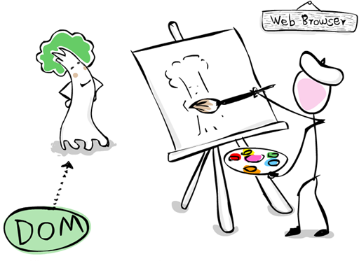


So, DOM is a ... tree? Yup a tree! Oddly enough, a lot of things in your computer look like a tree[^1].

Let's give DOM a nickname... ummm what about Domo? Domo works as a model at the studio "Web Browser". His job is to pose in front of the artist who paints a portrait (or perhaps millions of portraits).

The portraits are what we see in the web browser when visiting a website. A developer's job is like that of a director who tells Domo what to wear and what pose to make. This determines what those portraits look like in the end. jQuery or React are known as libraries and they are the tools a developer uses to communicate with Domo.

## jQuery

jQuery is a JavaScript library that makes it easier for a developer to manipulate the DOM. How does it fit in the story of Domo?

It is a tool that makes it easier for the developer to talk to Domo, just like a phone. You can call him wherever you are, whenever you want. It's a lot more convenient than before (raw JavaScript) -- remember the time when people had to be physically close enough to have a conversation before the invention of telephones?

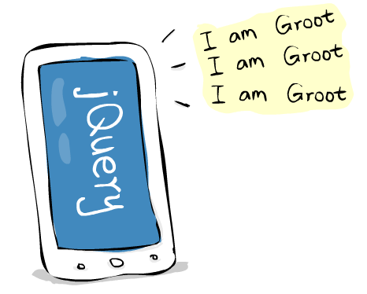

For years we have been using jQuery to directly communicate with Domo. It's handy but not without issues.

# React

Let me introduce you to the new superhero, React:

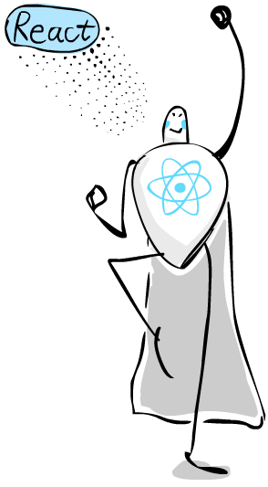

With React, developers no longer directly talk to Domo. React acts as a middleman between a developer and Domo. He smoothes out the communication and streamlines the process of portrait creation.

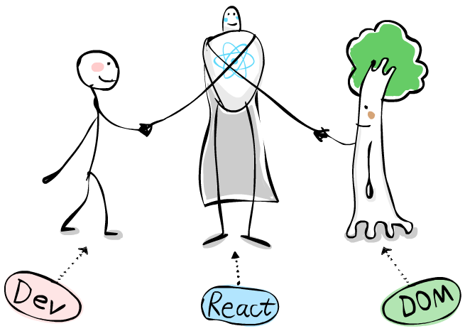

React has a few tricks to address the issues of jQuery and other tools. Here are his three main tricks:

- Reactive UI
- Virtual DOM
- Components

## Reactive UI

To update the DOM with jQuery, you'd have to specify what element to change at the right time, in the right order. This is equivalent to describing to Domo how to position his head, arms and legs step by step, for each and every portrait.

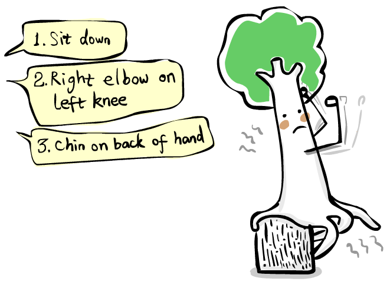

Heck, this sounds tedious and error-prone! Why can't you just tell Domo **what** you want instead of **how** to pose[^2]?

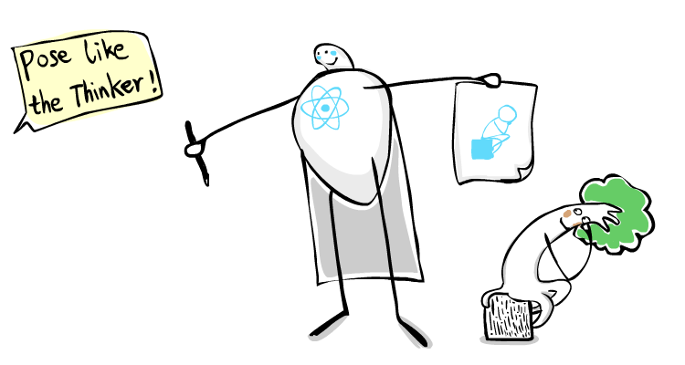

Even cooler, imagine if you can leave placeholders in your request to represent different variations of a same pose. React does that too!

This way, when somebody asks for portraits of Domo wearing a different hat, you don't have to talk to Domo again. You can just sit back and let him change it himself.

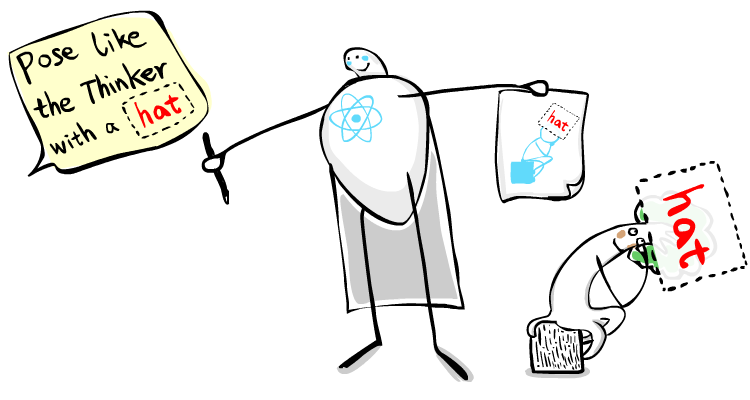

This trick is how React got its name. The UI built with React is **reactive**. As a developer, you just need to write down **what** you want and React figures out **how** to do it. When data change, your UI changes accordingly. You don't need to worry about updating the DOM, React does it for you automatically. The idea of reactive UI greatly simplifies UI development.

I know I said you don't need any coding knowledge but just to help put things in perspective, I've popped this in. Check out this example (try changing Domo's hat):

I'll explain its full code in a future post, but at this point you can just look at this core piece:

```jsx
const ThinkerWithHat = ({ hat }) => (
  <div>
    <Hat type={hat} />
    <Thinker />
  </div>
)
```

Notice that you just need to define what you want (a thinker with a hat), and "wire up" the data ("`type = {hat}`"). When the data change (user selects a hat), the UI updates automatically.

## Virtual DOM

Another issue of jQuery is about the speed.

As a demanding director, you hate waiting. You want the portraits to come out as quickly as possible. However, Domo and the artist are slow. Not really as slow as a sloth, but it takes time for Domo to change clothes and poses, and it takes time for the artist to paint.

Worse, you'd have to wait for the artist to finish a portrait before being able to talk to Domo again. In fact you cannot do anything but wait. What a waste of time!

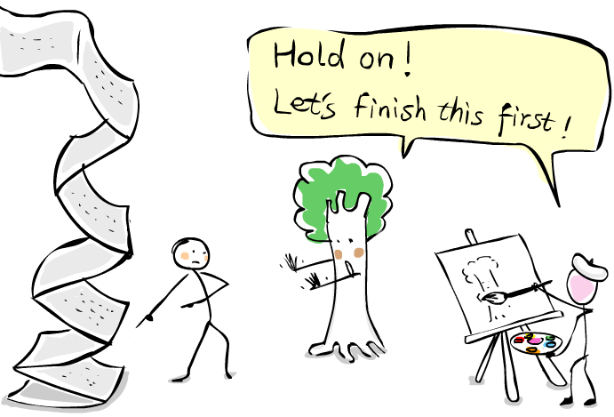

React pulls another trick to fix that. He's very fast at drawing quick sketches. Almost immediately after you tell him your instructions, he's done with a sketch and ready to take the next order. Now no more wait! You can keep telling React about the portraits you want, nonstop. React keeps record of everything with sketches and show it to Domo at the right time.

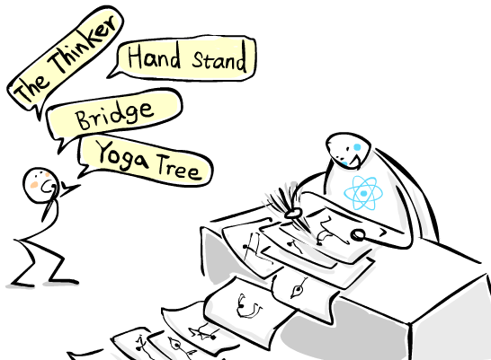

More importantly, React is smart. He can sort through the sketches, remove any duplication and make sure that Domo and the artist do as little work as possible.

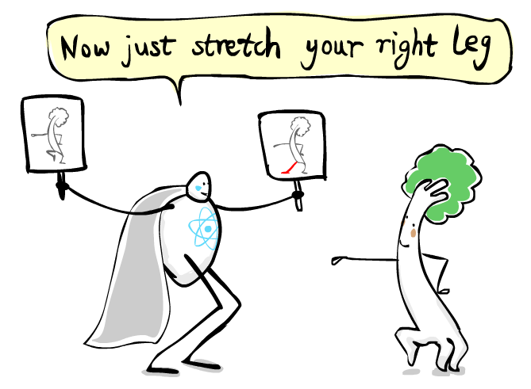

These sketches are called "Virtual DOM". Virtual DOM is much faster to manipulate than DOM. Developers work with Virtual DOM most of the time instead of directly managing DOM. React handles the dirty work of managing the slow DOM.

## Components

The third trick of React is the concept of components.

Components should be straightforward to understand because it's the way how our real world works. Our cars, houses and even our bodies are all made up of identifiable components that are individual, functional units. These components are made up of smaller components which consist of even smaller components, all the way down to atoms.

If you are familiar with Sketch, components are a lot like [symbols](https://www.sketchapp.com/learn/documentation/symbols/). Building an app in React is almost all about working with components: finding the best components for the job, fitting one with another, creating new components from existing ones etc.

Back to our studio "Web Browser", you describe your requirement for portraits as components, React translates it into what Domo understands. This saves you a lot time because you don't have to repeat common parts in your instructions.

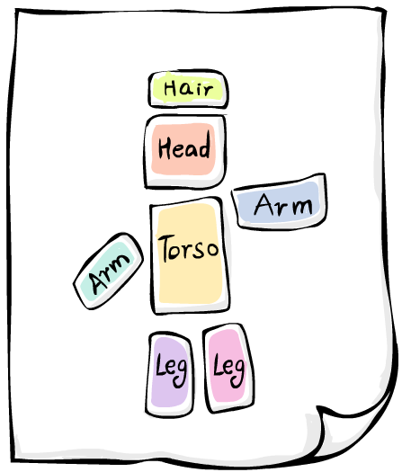

Another cool thing about components is that, if you change a component, everything that includes this component will be updated automatically.

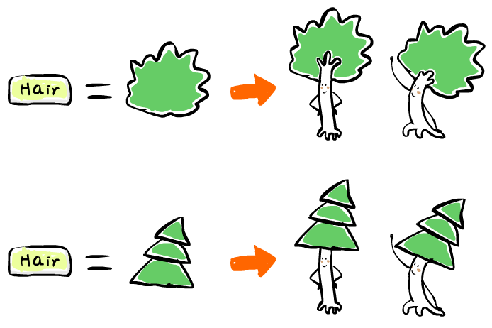

# Conclusion

Alright. Hopefully you've learned a bit about React. It's essentially a tool that helps developers manipulate DOM to build user interfaces. Reactive UI, Virtual DOM and components are the three core ideas that make React special. Of course there are other interesting ideas, such as unidirectional data flow, which I'll unfold in a future post.

In the [next post](/2017/06/20/what-is-react-native/), we'll look at how things like ReactJS, React Native and React Sketch.app relate to and different from each other.

I encourage you to go back to the [Learning Goals](#learning-goals) to see if you can answer all the questions. Let me know if you have any questions or comments!

---

**Want to learn more about React? [Sign up](http://learnreact.design) now and receive exclusive updates!**

---

# Backstage

## Who drew the illustrations?

Many people asked if I did it myself. Well, I wish I could. 😅

<!-- My doodles are like [this](/linton-doodles-2017). -->

These illustrations were generously crafted by [Beebee Ye](https://beebeeye.github.io/) who has also been instrumental in making sure the post is actually understandable.

BTW: Learning to draw is one of my life goals -- hopefully I could show you some better doodles of my own in a few years. 🤔 We'll see...

## My 8 yo

At the beginning, I set a goal that this post must be interesting enough for my 8 year old daughter to read, and easy enough for her to understand a couple of things.

😀 At least she can recall that DOM is a tree and React talks to DOM.

She also contributed a few hats in the interactive example above and watched me putting them into the code. That was golden time! Guess which ones were drawn by her? My daughter wants you to answer in the [comments](#endofpost). 👧🏻

## Special thanks

I feel so lucky that so many of you are interested in this post. I want to thank everyone who has taken the time to read the early drafts, and sent me encouraging words and insightful suggestions.

I want to express my deep gratitude to [Phil Khoo](http://philkhoo.com/) of [DemingFactor](http://demingfactor.com/) who volunteered to be the editor of this post. Man, his suggestions are really what make this post to shine! Thank you again Phil!

---

# Footnotes:

[^1]:

Fair enough, in reality, computers are not compost containers stuffed with tree branches. The tree notion comes from how people organize information in a way that's easy for computers to process. People typically draw charts which remotely resemble upside-down trees, like [this](https://www.w3schools.com/js/pic_htmltree.gif) or [this](https://www.w3.org/TR/DOM-Level-2-Core/images/table.gif).

[^2]:

In fancy tech slang, if the code defines **what** you want, it's called _declarative_; if it defines **how** you want it to be done, it's called _imperative_. Imperative programming emerged from the day when computers were first invented. When the computers were primitive, people had to instruct them in detail: where to store the numbers, how to multiply etc. It was fine at the beginning, but coding this way becomes increasingly unmanageable as the tasks given to computers become more and more complex. People then wrote smart software that convert definition of problems into detailed instructions. Declarative programming was born. Today, more and more programming languages and frameworks, such as React, allow us to code declaratively instead of imperatively.
