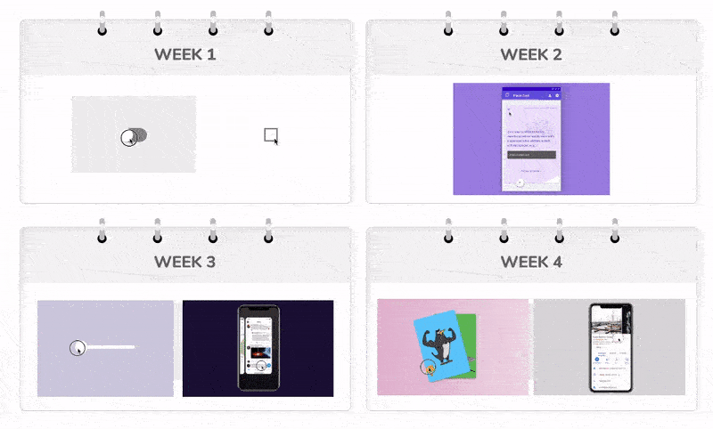

import imgQuotePng from './quote.png'
import img4WeekOverviewGif from './4-week-overview.gif'
import imgWeek1ToggleGif from './week1-toggle.gif'
import imgWeek1CheckboxGif from './week1-checkbox.gif'
import imgFrameTagJpg from './frame-tag.jpg'
import imgAnimateVariantsTransitionJpg from './animate-variants-transition.jpg'
import imgWeek1UseCycleGif from './week1-use-cycle.gif'
import imgWeek2FlashcardGif from './week2-flashcard.gif'
import imgWeek2KeyframesGif from './week2-keyframes.gif'
import imgJsxTrueFaceJpg from './jsx-true-face.jpg'
import imgOverridesTalkJpg from './overrides-talk.jpg'
import imgWeek3SliderGif from './week3-slider.gif'
import imgWeek3IosTaskSwitcherGif from './week3-ios-task-switcher.gif'
import imgWeek3DragGif from './week3-drag.gif'
import imgWeek3UseAnimationGif from './week3-useAnimation.gif'
import imgWeek4CardSwipeGif from './week4-card-swipe.gif'
import imgWeek4BottomsheetGif from './week4-bottomsheet.gif'
import imgWeek4UseMotionValueGif from './week4-useMotionValue.gif'
import imgWeek4UseMotionValueUseAnimationGif from './week4-useMotionValue-useAnimation.gif'
import imgSurprise from './busy-designers-surprise.png'

export const meta = {
  tags: ['framer'],
  date: '2020-01-09',
  title: "Busy Designers' Guide to Framer: A 4-Week Plan",
  tocHeadings: ['h2'],
  surprise: {
    actor: imgSurprise,
    animationVariants: {
      hidden: { x: 0, rotate: 0 },
      revealed: { x: -120, rotate: -20 },
    },
  },
}

<!--excerpt-->

Code is the real power of Framer. But like any advanced tool, it requires a lot of learning and practice to master. How would you successfully learn Framer when you are busy?

<!--/excerpt-->

Code is the true power of Framer. It’s the ultimate tool that we can use to express and communicate our creative ideas. But like any advanced tool, it requires a lot of learning and practice to master.

How would you successfully learn Framer when you are busy?

I've been thinking about this question a lot. I want to find the most efficient and effective path for you. Ideally, you would learn only what's necessary. You would get productive and start prototyping real work as soon as possible. You wouldn't have to block off days or worry about running behind in the rest of your work.

With these goals in mind, I prepared a 4-week learning plan for you.

For a month, you would spend 1-2 hours per day or up to 10 hours per week. You would study tutorials, write code and build prototypes. Take a break from Netflix (or video games, Youtube spirals or social media), my friend. It's good for you.

Ready to dive in?

<!--  -->

## Overview

There are perhaps a million things to learn in JavaScript, React and Framer. But the truth is that you don't have to know all of it to do useful work. Instead, learn a little bit and try to apply it to your work as soon as possible.

I recommend you to learn the following topics in this order:

1. Try overrides
2. A bit HTML/CSS
3. A bit JS/React
4. `animate`, `variants` and `transition` props
5. `useCycle`
6. Revisit overrides
7. drag gesture
8. `useAnimation`
9. `motionValue`

In this post, I'll spread these topics over a schedule of four weeks so that you can keep a good pace.

To make it easier for you, I created a [course](https://learnreact.design/framer-in-4-weeks). It includes video tutorials and exercises arranged in a 4-week schedule. The course platform remembers your progress and takes you to the right spot whenever you sign in.

Of course, feel free to go over the topics in 2 weeks or 8 weeks or whatever works for you. As long as you take the time to study consistently, your future self will thank you!

## Prerequisites

Here are what you should know before starting the 4-week journey. Feel free to skip this section if you've already done these steps.

**1. Learn Framer's UI**

In terms of learning the UI of Framer (or of any design tool), personally I'd just open it and start exploring. IMHO if the team has done their job, the UI should be automatically intuitive and users would not need a manual. It should just feel familiar.

But if you prefer tutorial videos, check out the official [crash course](https://www.framer.com/learn/course/crash-course/).

**2. See an overview of Framer's advanced features**

Head over to [Framer's official site](https://www.framer.com/) to get a high-level overview of Framer's key features.

**3. Try overrides**

Overrides are a defining feature of Framer. It's good to get a first impression early on. Typically you'd need to write code to use overrides. Fortunately, to try it out, you can just point and select some examples.

- Add a Frame
- Add an "override" from properties panel
- Preview it
- Click "Edit code"; Relax if the code looks scary
- Change some values and see how it affects the result.

You can think of the code editor as an enlarged, fancy property control. I find this to be a useful mental model.

**4. Learn some HTML and CSS**

Remember, you don't need to be an expert. Knowing below is enough to get started:

- What do HTML and CSS do?
- The format of HTML tags
- The parent/children relationship of HTML tags
- inline styles
- common CSS properties

If you are not sure any of the above, sign up for [my free email course](https://learnreact.design/re4d-prerequisites) and finish the first two emails. There's also a [book](https://www.sketchingwithcss.com/) (paid) written for designers. Here's the [table of contents](https://www.sketchingwithcss.com/static/TOC.pdf).

---

## Week 1

### What will you be able to build after this week?

### 1. Assignment 0

Start your journey by imagining what you want to achieve by the end of the month. What prototype do you want to build? What kind of interactions would it include? It could be for your work or a personal project. The closer it is to your real work, the better. If you need inspiration, check out [this page of showcases](https://learnreact.design/prototyping-with-react-framer/showcase).

Build a static version of the prototype in Framer. Perhaps try Page, Scroll, Link or some components from Framer Store to make it interactive.

After you learn something later on, come back and see if you could apply it to this prototype. This is going to be the motivation you need to finish the program.

### 2. Learn a bit of JavaScript and React

Do you want to make the best of Framer? You need to know both JavaScript and React. This can be daunting, I know.

But don't panic! You only need to learn _a little bit_ at a time to get going:

- JS: variables, objects, arrays, functions, array destructuring
- React: JSX, components, props (no need to learn state yet)

You don't have to learn all of the above before moving on to next steps. Instead, do it on-demand. Always look at your goals and go backwards to learn what you need. You also want to see the visual result right after you write some code. Faster feedback loop means more effective, engaging learning.

Learn the code in isolation. Use [CodeSandbox](https://codesandbox.io) for exercises to prevent distraction from the design tools. Bonus: later you'd be able to prototype with just React!

The easiest way would be the [course](https://learnreact.design/framer-in-4-weeks) I built with exactly these ideas in mind.

### 3. Get to know `Frame`

`Frame` is just a glorified `div`. It includes default settings for quick prototyping. E.g. It's a blue square positioned absolutely. We can position a `Frame` by setting its `left`/`top` or `x`/`y` props. The latter is often used for animation. Try various props to change its look.

### 4. Incredibly useful props: `animate`, `variants`, `transition`

The `animate` and `variants` props define an animation with the target values of animatable properties. Specify the before and after values. The computer creates what's in between.

The `transition` props allow customization of the generated animation.

### 5. `useCycle`

`useCycle`, when combined with events like `onTap`, makes the animations interactive. We can use it to cycle through animation states defined with `animate` and `variants` props.

A typical use case is a toggle which has "on" and "off" states, but we can do a lot more!

### 6. Additional examples

- A simple [animate and transition example](https://codesandbox.io/s/ykppk6k3wv)
- The [Animated accordion lesson](https://www.framer.com/learn/lesson/build-an-animated-accordion/) on Framer Learn

---

## Week 2

### What will you be able to build after this week?

### 1. keyframes with `animate` and `variants`

When a target value in `animate` and `variants` is an array instead of a number, it defines keyframes.

We can use `times` to control the precise timing of these keyframes. Or use keyframes to coordinate the timing of multiple animations: delay, sequence, stagger etc.

Also try things like `staggerChildren` or `yoyo`

This will take you surprisingly far. You'll be able to create fairly complex interactions.

### 2. The true face of JSX

Dig a little deeper to discover what JSX actually is. This is tremendously useful for understanding overrides.

Hint: it's just JS code.

### 3. Revisit Overrides

Did you realize overrides are just a way to set the props of components on the canvas?

Overrides are a clever idea. It leverages both the convenience of design canvas and the power of code.

We can use overrides on components downloaded from Framer Store too!

### 4. Learn how to let overrides talk to each other (via Data).

This is what makes a prototype live. We want to expand a menu when the button is clicked. Or we want to use the slider to dim the background.

Overrides/Data are Framer-specific things. It's different from how to do similar things in React.

### 5. Challenge yourself to build more!

What else can you build with `animate`, `variants`, `useCycle` and Overrides? Can you add some interactions to the static design you created in Assignment 0?

### 6. More tutorials

- [Control pages via overrides](https://www.framer.com/learn/lesson/control-a-page-component-with-overrides/)
- [Forms, sign-in page](https://www.framer.com/learn/course/create-a-sign-in-page/)

---

## Week 3

### What will you be able to build after this week?

### 1. Learn a bit more JavaScript and React

After building quite a few stuff, it's good time to pick up a bit more JavaScript and React. Here are some topics you'll find useful when building more advanced prototypes:

- Scope of variables
- events
- `if` `else` statement
- ES6: Object destructuring
- Creating React components
- Communication between components
- An overview of React Hooks

Again, the [course](https://learnreact.design/framer-in-4-weeks) is perhaps the easiest path. I broke down these topics into short videos and introduce them to you in a just-in-time manner.

### 2. drag gesture

It's incredibly easy to add drag gesture to a `Frame`: just add the [`drag` prop](https://www.framer.com/api/motion/gestures/#drag). You can also customize the gesture:

- One-dimension drag: `drag="x"` or `drag="y"`
- Add bounds: `dragConstraints`
- Tweak movement: `dragElastic` and `dragMomentum`
- Add custom behavior: `onDrag` event

### 3. useAnimation

`useAnimation` is another hook that Framer provides. We can use it to create "animationControls" that allows us to start/pause/stop an animation at specific times. It's usually used together with events.

If you are coming from Framer Classic or jQuery, this way of creating animations should feel familiar. `useAnimation` is "imperative" whereas `animate`/`variants` props are "declarative".

### 4. Use `drag` or `useAnimation` in Overrides

Don't forget that most of what you are doing here is setting props of a React component. What does this mean? You can use these in Overrides too!

This means you can draw things visually on the canvas, and add animation and logic with code. Use the right tool to do the right thing.

### 5. Challenge yourself to build more!

What else can you build with `drag` and `useAnimation`? Can you add some interactions to the static design you created in Assignment 0?

---

## Week 4

### What will you be able to build after this week?

### 1. motionValue and `useTransform`

"Set it and forget it". All we need is to define how to transform values and set it via props.

When combined with gestures such as drag or scroll, we can create advanced interactions such as card swiping, parallax.

We can uses these in overrides too!

### 2. `useMotionValue` vs. `useAnimation`

We’ve used two different hooks to create animations: `useAnimation` and `useMotionValue`. What’s the difference between them? When to use which one? As designers, it’s important to understand the pros and cons of the tools we have and choose them wisely.

At a high level, useAnimation offers a lot of flexibility. We can customize the animation with the `transition` configuration. We can easily make a sequence of animations. On the other hand, `useMotionValue` combined with `useTransform` is most likely useful when there’s a logical link between different values, such as the `x` offset of the card and its rotation angle.

In fact, it’s interesting and common to combine the two approaches in real world use cases.

### 3. A bit more JavaScript and React

- JavaScript
  - Template string
  - Arrow functions
  - Ternary operator
  - Array.map
- React
  - Conditional rendering
  - Rendering an array

### 4. Challenge yourself to build more!

What else can you build with `useMotionValue` and `useAnimation`? Can you complete the prototype you started in Assignment 0?

---

## Conclusion

So here you go! If you are a busy designer, and if you are familiar with HTML/CSS but new to JavaScript or React, this is the plan for you to learn the core of Framer. In about 4 weeks!

What you've seen is obviously just a small subset of what Framer is capable of. There's always more to learn. But the good news is that, by going through this 4-week program, you'd have:

1. learned enough to do useful, compelling work and,
2. built a solid foundation.

Armed with the principles you've learned, you'll go far and beyond!

Send [me](https://twitter.com/lintonye) what you build, I'd be extremely thrilled to see!

Don't forget to check out the [course](https://learnreact.design/framer-in-4-weeks) I prepared for you that should save you even more time!
