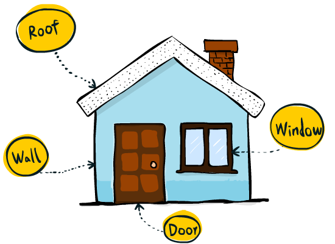

_Blog series: React terms explained in plain English and doodles_

- _[What is React?](/2017/06/08/what-is-react/)_
- _[What is React Native?](/2017/06/20/what-is-react-native)_
- _[Components, Props and State](/2017/08/16/components-props-and-state) (this post)_
- _[Props and State Re-explained](/2018/01/15/props-and-state-re-explained)_
- _[React Native vs. Cordova, PhoneGap, Ionic etc.](/2018/02/14/react-native-vs-cordova-phone-gap-ionic-etc)_

---

Today let's study the three most important concepts in React: components, props and state, and the differences between props and state.

As in previous posts, I'll attempt to use plain English to explain the concepts. So, no JavaScript knowledge is required to read this post.

In fact, you won't find any JavaScript code here at all. Instead, I'll use a simple notation [^1] to help you understand the main ideas first before diving into JavaScript (in future posts). I believe this spoon-feeding 🥄 approach is an effective way to learn React (or any technologies) especially if you don't have much programming experience -- mixing React concepts and JavaScript subtleties can be quite overwhelming!

<a name="learning-goals"></a>

# Learning Goals

After reading this post, I'll get you to come back here. Hopefully you'll be able to answer these questions easily:

- What is a prop?
- What is state?
- When to use props and when to use state?
- How to make the window openable?
- Can you write the pseudocode for [Domo's hat](/2017/06/08/what-is-react/#domo-hat)?

# Let's build a house

To understand what these concepts are and how to use them, let's build a simple example. What about a house? (Try clicking the door)

<iframe
  height="460"
  scrolling="no"
  title="React House"
  src="//codepen.io/focuser/embed/EXBOpx/?height=460&theme-id=light&default-tab=result&embed-version=2"
  frameborder="no"
  allowtransparency="true"
  allowfullscreen="true"
  style={{ width: '100%' }}
>
  See the Pen <a href="https://codepen.io/focuser/pen/EXBOpx/">React House</a>{' '}
  by focuser (<a href="https://codepen.io/focuser">@focuser</a>) on{' '}
  <a href="https://codepen.io">CodePen</a>.
</iframe>

# Components

If you remember what we've discussed in an [early post](/2017/06/08/what-is-react/), components are one of the three pillars of React. Building an app in React is almost all about working with components.

The very first step is to break down the UI into various components. For example, we can break down our house this way:



Now let's code it!

```html
House:

<div>
  <Roof />
  <Wall />
  <Window />
  <Door />
</div>
```

Wait a second, isn't that some sort of HTML? That's right! Some parts of React code look very similar to HTML, and that, by design, is to make it easy for web designers to understand and write the code. How nice is that!

So, in the code above, we have the `<div>` container which is pretty much the same as in HTML. Things like `Roof` and `Wall` are custom tags/components that we are going to define soon.

Remind you, the above isn't exactly real React code -- there's no JavaScript at all. For now, let me just use loose syntax and plain English to explain what's in there. Once you understand the ideas behind the scene, the next step is to learn the nitty gritty of JavaScript and convert the ideas into real code.

To make things easier to understand, I'll use another simplification: instead of using images as you saw at the beginning of this post, for now let's make a super simple web app that displays plain text for everything.

The roof is just a div with some plain text:

```html
Roof:

<div>roof</div>
```

Other components are the same -- they are just plain text inside a HTML div. Let's look at the complete, React-ish code for our house:

```html
House:

<div>
  <Roof />
  <Wall />
  <Window />
  <Door />
</div>

Roof:

<div>roof</div>

Wall:

<div>wall</div>

Window:

<div>window</div>

Door:

<div>door</div>
```

This is not hard to understand, right? House is made up of Roof, Wall, Window and Door, which are all made up of plain text.

In the end, React will generate HTML like this:

```html
<div>
  <div>roof</div>
  <div>wall</div>
  <div>windows</div>
  <div>door</div>
</div>
```

# Configure roof color with Props

Imagine that we send a sheet of specification to a factory where all the individual parts are built. In the specification, we can tell the factory about the intrinsic properties of the parts: the color of the roof, the shape of the door etc. After the roof and the door are built according to our request, those properties will stay the same. So the roof remains blue, and the door remains a rectangle. They won’t change at all.

In React, we call these properties _Props_ which is basically short for properties. Remember two things about props: first, we determine the value of a prop and use it as part of the blueprint BEFORE a component is built. Second, the value of a prop will never change.

So how does a prop look like in the code? In the House component, if we want our roof to be blue, we can simply add a prop “color” to the Roof tag. This is like specifying the color in the specification to be sent to the factory.

It looks very similiar to HTML tags where you can add attributes:

```html
House:
<div>
  <Roof color="blue" />
  ...
</div>
```

How is the roof actually built? Let’s write the code for it.

```html
Roof:

<div>{props.color} roof</div>
```

That's it? Right! There are a few things worth mentioning here:

- The HTML-ish code that defines a component is a **template**, not just a single HTML tag. This means we can put _placeholders_ in it to output variations of HTML content without repeating ourselves. (Remember [Domo's hat](/2017/06/08/what-is-react/#domo-hat)? That's the idea of placeholders!) In this example, for `<Roof color="blue" />`, we'll get `<div>blue roof<div>`; for `<Roof color="red" />`, we'll get `<div>red roof</div>`, so on and so forth.
- The curly brackets used in the template tells React that we are gonna use a placeholder here, instead of plain content.
- `props` can be think of as a container of all the prop values set in the `Roof` tag. So suppose we have `<Roof color="blue" material="wood" />`, we can then use both `props.color` and `props.material` in the definition of the `Roof` component.

# Open the door with State

## Add state to a component

Another thing that a component can have is called _state_. What is a state? It’s something that can change AFTER a component is built.

For example, the door can be either open or closed. We say the status of the door is a state because its value can change even after the door is built. This is different from a prop like the shape of the door which does not change once the door is created.

The change of a state value is often caused by some external event. For a web app, it’s usually user input, or data from a server or the passage of time that’d change the state of a component.

Let's add the state to the door:

```html
Door: State: status // "open" or "closed"
<div>Door is {state.status}</div>
```

Very similar to `props`, `state` is a container of all the state values in the component. Therefore, we can use `state.[something]` inside the template in the component definition.

## Change the state on user input

Next, let's make the door interactive by adding some "code" that handles user input.

```html
Door: State: status // "open" or "closed"

<div>Door is {state.status}</div>
// Handle user input when the door is pulled change state.status to "open" when
the door is pushed change state.status to "closed"
```

The key thing here is that the state of a component changes from time to time. The output of the template, i.e. the generated HTML, changes accordingly and automatically.

BTW: Don't forget that the above isn't real React code. Don't copy and paste it into your project! Things will get ugly... 💣

## State is private

The state is private to a component. Whether the door is open or closed is only the door’s business. It has nothing to do with the house, or other components. In fact we can just take the door out of the house, it can still be open or closed on its own.

Therefore, the door's state is only visible inside the Door component. Within the Door component, we can only read or change its own state.

```html
House:
<div>
  <Door />
  ...
  <!-- This is WRONG -->
  <div>The door is {Door.state.status}</div>
</div>

Window: ...
<!-- This is WRONG -->
change Door.state.status to 'open' Door: ...
<!-- Man, this is WRONG too! -->
if House.state.isForSale make the door openable by the realtor
```

# Conclusion

Here we go, that’s props and state. Props are configuration of a component whose values are determined before the component is created. Just like the shape of the door, or the color of the roof, props always stay the same. On the other hand, state is a component’s private data that’s available only after the component is created. Just like whether the door is open or closed, state changes from time to time. Usually it’s a response to user input, or something that happens on the server, or the passage of time.

But, but, we haven't built anything real, right? Plus, how useful is it to create an app that just displays plain text? I know, at least you want to see how to build the house that you see at the beginning of the post -- something colorful that you can click on, right?

Not surprisingly, that requires JavaScript coding which would make this post too long. I'll leave it to future posts. If you don't want to wait, sign up for [my course](/react-101) where things are taught in videos.

---

# Footnotes:

[^1]:

In techie terms, the notation that describes the main ideas but not real code is called _pseudocode_. It's not meant for computers to execute. It's a tool for us humans to formalize thoughts and communicate with others. Remember, pseudocode won't work on a computer, it's fairly [pseudo](https://encrypted.google.com/search?q=define:pseudo&hl=en).

<a name="endofpost"></a>
