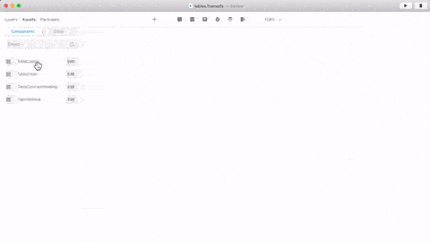
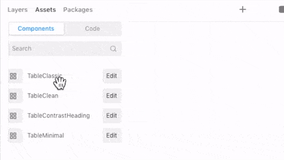
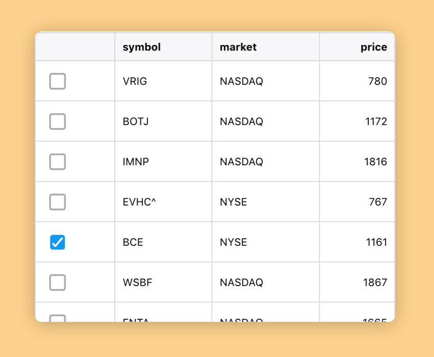
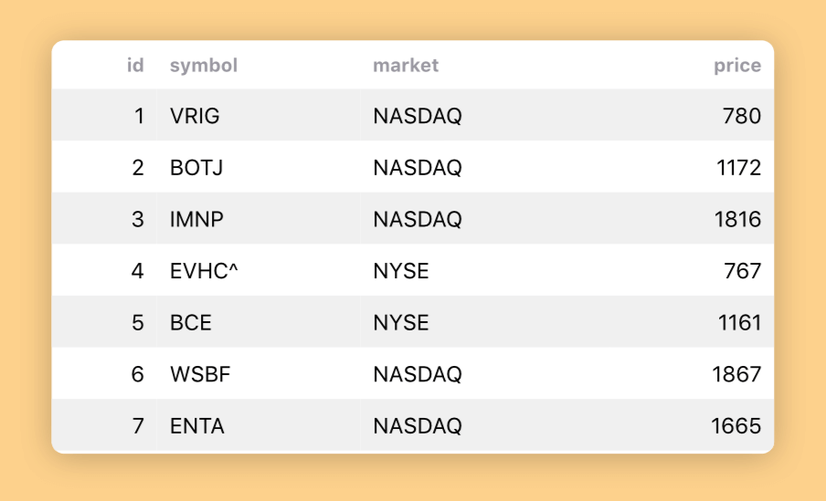

You are designing a new dashboard. You need to create a data table. You want custom styles on the titles and cells. You want precise control of the divider lines and paddings. You also want to fill it with real data, not just some misleading placeholders.

How would you do it? Is the experience like this?


You see, even the tiniest change would require lots of tedious clicking around and re-arrangement of elements. What if we want to insert a row? What if we want to delete a column? What if we need to swap out the data that we've just laboriously entered into each cell?

I know, things are probably not that bad. Nowadays design tools offer features such as Auto Layout and components that make things a lot easier. We could use a column component, a row component, or a [cell component](https://setproduct.com/blog/figma-tables-data-grid-design) to save time. We event have [table](<(https://www.figma.com/c/plugin/735922920471082658/Table-Generator)>) [generators](<(https://whoisryosuke.com/blog/2019/sketch-table-components/)>). These approaches definitely help. However, fundamentally, as long as we still create fake tables by drawing rectangles and lines, it's an illusion which may break one way or another.

Why can't we just design with a real table? A real HTML `<table>` that we can configure and style as a whole. What if we can design a table this way:



This is the Framer X package that I want to show you today: [Data Table](https://packages.framer.com/package/lintonye/data-grid-table). I believe it'll save us a lot of time and foster new opportunities.

Data Table empowers us to:

- Style the entire table, not just individual cells
- Import real data (JSON and CSV are currently supported). When we swap data, the table automatically updates.
- Add interactions: Pagination, hover actions, expandable rows etc.

This (and [next](/2020/02/21/design-data-tables-with-real-tables-part-2)) post is a complete guide of Data Table. I'll show you the possibilities, how-tos, tips and tricks. I'll also show you some details under the hood to give you an impression of what could be done in the future.

Ready for some fun on the table (pun intended)? 🎉👇

_Prerequisites: To enjoy basic styling and data import capabilities of Data Table, you don't need to code. However, the second half of this post, Advanced styling, assumes that you are familiar with the basics of React and overrides in Framer X. If you are new to these concepts, check out [my course](/prototyping-with-react-framer) to build a solid foundation first, before you can harness the superpowers!_

# Basic styling

How to get started with Data Table? Just drop a preset or two onto the canvas and pick your favorite:



These presets are just a starting point. From there, you can tweak the styles, but in terms of the styles of the table, not individual cells one by one. I'd say that's a big time saver. What do you think?

Here's a complete list of properties that can be adjusted right from the properties panel.

| Prop               | Type    | Description                                    |
| ------------------ | ------- | ---------------------------------------------- | ----------- | ---------------------------------------------------------------- |
| fill               | Color   | The background color of the table              |             |
| fontSize           | number  | Font size                                      |
| color              | Color   |                                                |
| header             | boolean | Whether to display table header                |
| headerFontSize     | number  |                                                |
| headerColor        | Color   |                                                |
| headerBgColor      | Color   |                                                |
| headerDividerWidth | number  | The width of the divider line below the header |
| headerDividerColor | Color   | The color of the divider line below the header |
| borderWidth        | number  | The width of the lines of the border rectangle |
| borderColor        | number  | The color of the lines of the border rectangle |
| dividerType        | `'both' | 'horizontal'                                   | 'vertical'` | The type of divider lines, which do not include the border lines |
| dividerWidth       | number  |                                                |
| dividerColor       | Color   |
| padding            | number  | Padding of each cell                           |
| gap                | number  | Margin of each cell                            |
| cellBorderRadius   | number  | The border radius of each cell                 |

# BYOD (Bring Your Own Data)

A table design isn't really useful unless it's populated with real data. I've taken this into account from Day One. With Data Table, we can import JSON or CSV files with just a couple of clicks.


## JSON

The JSON file is expected to be an array of objects. All objects should have the same keys. The keys will be used as the labels in the column header (customizable, see "Advanced styling"). Example:

```json
[
  { "symbol": "TSLA", "price": 906 },
  { "symbol": "AAPL", "price": 219 }
]
```

## CSV

The CSV file is expected to have a header row. The fields in the header row will be used as the labels in the column header. Example:

```csv
symbol,price
TSLA,906
AAPL,219
```

# Advanced styling

I hear you. The styles in the properties panel are useful and convenient, but they can only take you so far. What if we want something more complex or fancier?

For example, adding a checkbox in front of every row:



Or rows with a zebra stripe pattern (well this style is old school, but definitely more complex than the basic configuration we could set so far):



Or a cell that can be dynamically adjusted on the canvas:


That's the fun part I'm going to show you!

## Style with overrides

For more advanced control of Data Table, we need to use code. In particular, we're gonna use Code Overrides in exactly the same way as how we would use them for prototyping in the preview window. There's only one exception: the code override on a table works on the canvas too! (thanks for the help to get my weird hacks working, [Tisho](https://twitter.com/tisho)!)

We'd write a code override, in the same way as how we would write it normally, and select it on the properties panel.


Why code overrides?

Or do you want another 50 properties on the properties panel? Believe it or not, in many cases, code is actually the easiest and most convenient way despite its learning curve.

So, [learn to code](/prototyping-with-react-framer) to take advantage of this convenience (not to mention other superpowers)!

## Customize `columns`

The most popular prop that we can override is `columns`. It allows us to customize the columns of the table.

The value of `columns` prop is expected to be an array of objects. Each object represents a column of the table.

### Customize column header

For example, we could customize the header of a column like so:

```jsx
export function Table(props): Override {
  return {
    columns: [{ accessor: 'firstName', Header: 'First Name' }],
  }
}
```

Note the first letter of `Header` is capitalized. We could also use a React element as its value.

```jsx
  { accessor: "firstName", Header: <h1>First Name</h1> },
```

### Customize column order / hide columns

When `showDefaultColumns` is set to `false`, only columns specified in `columns` property will be displayed. The order is the same as how it appears in the `columns` array.

```jsx
export function Table(props): Override {
  return {
    showDefaultColumns: false,
    columns: [
      { accessor: 'market' },
      { accessor: 'symbol' },
      { accessor: 'price' },
    ],
  }
}
```

There are other things that can be used here, but let's save it for a later section.

## Customize rows

Another useful prop to override is `rowProps`. It gives us an opportunity to customize the props of the container of each row.

For example, the override below gives us that old-school zebra stripe pattern.

```jsx
export function TablePattern(props): Override {
  return {
    rowProps: (row) => ({
      style: {
        background: row.index % 2 === 1 ? 'transparent' : '#f0f0f0',
      },
    }),
  }
}
```

It's worth noting that the container is a framer motion element. This means that we can use [framer motion props](https://www.framer.com/api/motion/component/) to add animations in the preview. For example:

```jsx{4}
export function TablePattern(props): Override {
  return {
    rowProps: (row) => ({
      whileHover: { backgroundColor: "#F1FFFE" },
      style: {
        background: row.index % 2 === 1 ? "transparent" : "#f0f0f0"
      }
    })
  }
}
```

## Customize individual cells

Finally, the most powerful customization of all, we could customize individual cells with code overrides.

The secret is actually in the `columns` prop I mentioned earlier. For example, this is how we could add checkboxes in a column:

```jsx{6}
export function TableCheckboxes(props): Override {
  return {
    columns: [
      {
        accessor: "id",
        Cell: () => <input type="checkbox" />,
      }
    ]
  }
}
```

You see, we can use a custom React element to render the cells. Note that capitalized `Cell`.

What if we want some of the check boxes checked? We just need to add a parameter to retrieve some more information:

```jsx
Cell: ({ row: { index } }) => <input type="checkbox" checked={index === 5} />
```

Or we could even pick up the raw table data and render accordingly:

```jsx
Cell: ({
  row: {
    original: { age },
  },
}) => <input type="checkbox" checked={age > 20} />
```

These abilities enable a particularly interesting use case:


How is this done? Design components in Framer X!

```jsx
import { AvatarCell } from './canvas'
export function TableAvatar(props): Override {
  return {
    columns: [
      {
        id: 'names',
        Header: 'Who',
        Cell: ({
          row: {
            original: { firstName, lastName, avatar, age, gender },
          },
        }) => (
          <AvatarCell
            firstName={firstName + ' ' + lastName}
            avatar={avatar}
            age={age + ''}
            gender={gender === 'Male' ? '♂' : '♀'}
            position="relative"
          />
        ),
      },
    ],
  }
}
```

# Conclusion

Designing a data table is a surprisingly difficult task with common design tools. I believe [Data Table](https://packages.framer.com/package/lintonye/data-grid-table) in Framer X is a promising solution. Its allows us to import data and style the entire table, rather than just individual cells. I think these two features alone already make it worth trying. The advanced styling options give us fine control of individual cells, and it is backed by the underlying table data. When combined with design components in Framer X, we get the best of the two worlds: design on canvas and work with data in code.

In the [next post](/2020/02/21/design-data-tables-with-real-tables-part-2), I'll cover how to prototype interactions within Data Table. This includes hover actions, pagination, expandable rows and more!

Are you convinced yet? Will you use it for your next project? Give it a [try](https://packages.framer.com/package/lintonye/data-grid-table) and [let me know](https://twitter.com/lintonye)!

<!--
# Interaction
Now what if you want to create a prototype for user testing? Don't forget that you are in Framer X! High-fidelity prototyping is the forte of Framer X.

## Pagination
## Hover actions
## Expandable rows

# Implementation notes
React Table
HTML table

# Conclusion & Future possibilities
## More interactions
## Export to code!


- Motivation
- features
- TODO: Figma: table generator
- TODO: Sketch: generator tool?
- TODO: UXPin table support?
- TODO: other tool table support? -->
