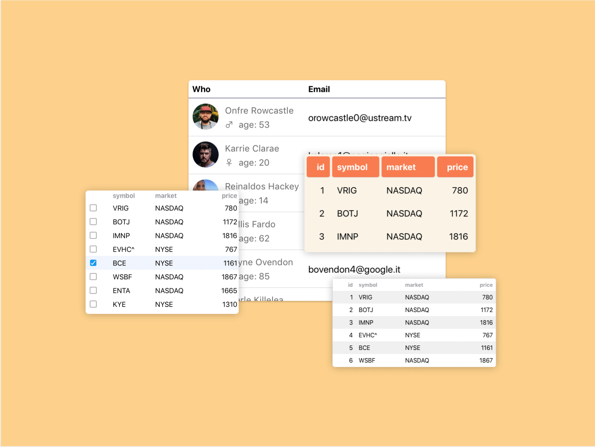
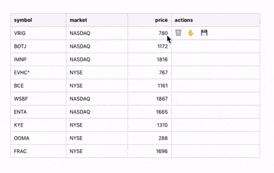
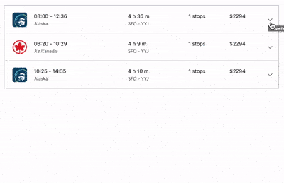
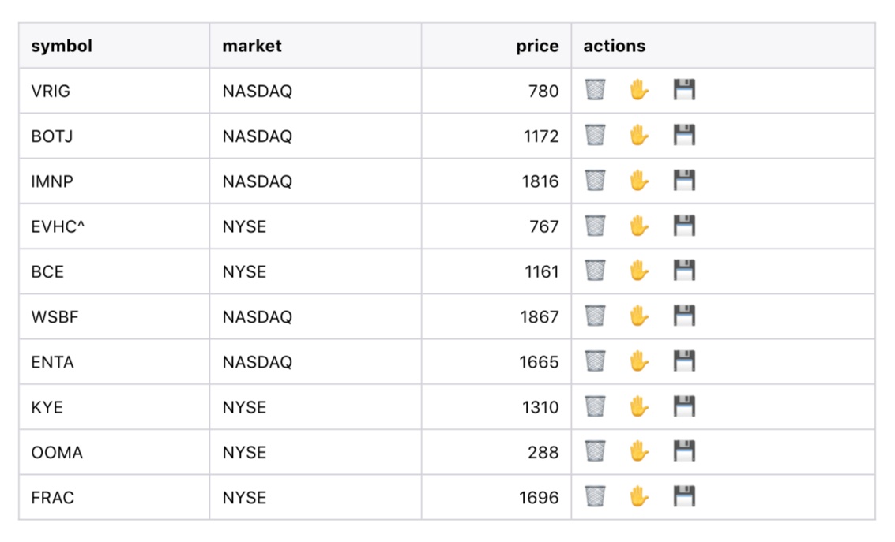
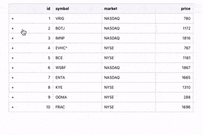

In the [last post](/2020/02/08/design-data-tables-with-real-tables-part-1), I showed you how to design a table with the [Data Table](https://packages.framer.com/package/lintonye/data-grid-table) package in Framer X. Have you tried it yet? If not, do it now and come back. I'll wait for you.

...

Alright, now that your table looks good and it's even filled with real data. The next step is to put it inside a prototype to do some user testing, or present it to the customer or executives. How would you usually make a table prototype? Stitch together some mock pictures? Wait for the developer to implement it?

Let's roll our sleeves and build one ourselves! What about a real, fully interactive table? Prototyping is the forte of Framer X. It's what Data Table does well, too.

In this post, I'll show you some examples of what we could build. I hope these would give you inspiration and motivation to try more. There are so many possibilities with the power of code in your hands!

<!--
I'll also show you some details under the hood to give you an impression of what could be done in the future.  -->

Here are some GIFs for your viewing pleasure:

## Hover action



## Add / remove rows


## Pagination


## Expandable rows



# Prerequisite

To take full advantage of this post, you should know [overrides](https://school.learnreact.design/courses/780181/lectures/14156273) and [how overrides communicate](https://school.learnreact.design/courses/780181/lectures/14156276).

Overrides are a powerful idea in Framer X. It gives you the best of both worlds: design visually on the canvas, add logic and process data with code.

If you are not familiar with overrides (or even coding), take a look at [this course](/framer-in-4-weeks/) I prepared for you.

# Hover Actions

Guess what the override below will give us?

```tsx
export function TableHoverActions(): Override {
  return {
    showDefaultColumns: false,
    columns: [
      { accessor: 'symbol' },
      { accessor: 'market' },
      { accessor: 'price' },
      {
        accessor: 'actions',
        Cell: () => (
          <div style={{ width: 80 }}>
            <div
              style={{
                width: '100%',
                display: 'flex',
                justifyContent: 'space-between',
                cursor: 'pointer',
              }}
            >
              <span>🗑</span>
              <span>✋</span>
              <span>💾</span>
            </div>
          </div>
        ),
      },
    ],
  }
}
```

You should be able to work it out if you've read the [last post](/2020/02/08/design-data-tables-with-real-tables-part-1), right? It'd be a 4-column table. The last column would include custom cells for each row:



How would we make it interactive? How would we only show the actions for the row that the user is hovering the mouse on?

In another word, we need to know which row the mouse is currently on. We'd use that to determine whether to show the actions or not.

We could use `rowProps` to add the `onMouseEnter` event handler to the row div:

```tsx
export function TableHoverActions(): Override {
  return {
    ...
    rowProps: ({ index }) => ({
      onMouseEnter: () => { console.log(index) }
    })
  }
}
```

Then, save the row index into a `Data` object:

```tsx{1,2,7}
import { Override, Data } from "framer"
const hoverData = Data({ hoveredIndex: -1 })
export function TableHoverActions(): Override {
  return {
    ...
    rowProps: ({ index }) => ({
      onMouseEnter: () => (hoverData.hoveredIndex = index)
    })
  }
}
```

Finally, we'd be able to determine whether to show the actions by comparing the indices:

```tsx{9}
export function TableHoverActions(): Override {
  return {
    columns: [
        ...
        {
          accessor: "actions",
          Cell: ({ row: { index } }) => (
            <div style={{ width: 80 }}>
              {index === hoverData.hoveredIndex && (
                <div
                    style={{
                        width: "100%",
                        display: "flex",
                        justifyContent: "space-between",
                        cursor: "pointer",
                    }}
                >
                    <span>🗑</span>
                    <span>✋</span>
                    <span>💾</span>
                </div>
              )}
            </div>
          ),
        },
    ],
    ...
  }
}
```

## Full source code

The full source code can be found [here](https://github.com/lintonye/tables/blob/master/demos.framerfx/code/HoverActions.tsx).

Note: as an alternative, we could use React state for this prototype, instead of `Data`.

# Add / remove rows


To update the rows in the table, we'd use the `data` prop of the component. The rest is some usual Override/JS fu.

Note: the `data` prop takes precedence over the "Data" property on the properties panel.

```tsx
const appState = Data({
  rows: [{ symbol: 'MSFT', market: 'NASDAQ', price: 180 }],
})

export function Table(props): Override {
  return {
    data: appState.rows,
  }
}

export function Add(props): Override {
  return {
    onTap() {
      appState.rows = [
        ...appState.rows,
        { symbol: 'TSLA', market: 'NASDAQ', price: 870 },
      ]
    },
  }
}

export function Remove(props): Override {
  return {
    onTap() {
      appState.rows = appState.rows.slice(0, appState.rows.length - 1)
    },
  }
}
```

## Full source code

The full source code can be found [here](https://github.com/lintonye/tables/blob/master/demos.framerfx/code/AddRemoveRows.tsx).

# Pagination


To support pagination, we need to override two props: `pageSize` and `pageIndex`.

```tsx
export function TablePaged(props): Override {
  return {
    pageSize: 10,
    pageIndex: 2,
  }
}
```

How would we add buttons to flip pages? The answer is `Data`:

```tsx
const data = Data({
  pageSize: 10,
  pageIndex: 0,
})

export function TablePaged(props): Override {
  return {
    pageSize: data.pageSize,
    pageIndex: data.pageIndex,
  }
}
```

Then, we can change `data` from the buttons:

```tsx
export function NextPage(props): Override {
  return {
    onTap: () => {
      data.pageIndex = data.pageIndex + 1
    },
  }
}

export function PreviousPage(props): Override {
  return {
    onTap: () => {
      data.pageIndex = data.pageIndex - 1
    },
  }
}

export function PageSize(props): Override {
  return {
    onChange: (v) => {
      data.pageSize = Number.parseInt(v)
    },
  }
}
```

In addition, the `onPageChange` prop allows us to extract key information about the page, such as `pageCount`.

```tsx
export function TablePaged(props): Override {
  return {
    ...
    onPageChange: ({ pageCount }) => {
      data.pageCount = pageCount
    }
  }
}
```

With `onPageChange`, we can display page information like so:

```tsx
export function PageInfo(props): Override {
  return {
    text: `Page ${data.pageIndex + 1} of ${data.pageCount}`,
  }
}
```

## Full source code

The full source code can be found [here](https://github.com/lintonye/tables/blob/master/demos.framerfx/code/Paging.tsx).

# Expandable Rows



Typically we'd have a column to let user expand or collapse a row. We could use `row.getExpandedToggleProps()` to make an element clickable. Behind the scene, it adds event handlers and styles to the element and toggles the internal state of the row.

```tsx{9}
export function Table(props): Override {
  return {
    columns: [
      ...
      {
        accessor: "expander",
        Header: "",
        Cell: ({ row }) => (
          <div {...row.getExpandedToggleProps()}>
              +
          </div>
        ),
      },
    ],
    ...
  }
}
```

Next, we use `row.isExpanded` to retrieve the internal state of the row, and display accordingly.

```tsx{4}
...
        Cell: ({ row }) => (
          <div {...row.getExpandedToggleProps()}>
              {row.isExpanded ? "-" : "+"}
          </div>
        ),
...
```

Finally, we override the `subRow` prop to show the content of the expanded row:

```tsx{8,9,14}
export function Table(props): Override {
  return {
    ...
    subRow: row => <div>Detailed info for {row.original.symbol}</div>,
  }
}
```

## Full source code

- [The simple example discussed in this section](https://github.com/lintonye/tables/blob/master/demos.framerfx/code/SimpleExpandableRows.tsx)
- [Google Flights example](https://github.com/lintonye/tables/blob/master/demos.framerfx/code/ExpandableRow.tsx) (with bells and whistles such as animations)

<!-- # Under the hood
- React Table
- HTML table -->

# Future possibilities

Under the hood, Data Table is powered by the wonderful [react-table](https://github.com/tannerlinsley/react-table) package (Thanks [Tanner](https://twitter.com/tannerlinsley)!). Since react-table is a fully featured library for production usage, we can see a lot of exciting possibilities for future improvement. What about filtering, sorting, re-ordering columns, or resizable columns? [Tell me](https://twitter.com/lintonye) what you want to build, and I'll see if I can add it in!

# Wrapping up

Alright! This post is all about creating interactive data tables with a little bit of code. With what's covered in the [last post](/2020/02/08/design-data-tables-with-real-tables-part-1), I hope you find Data Table a useful tool in your arsenal.

Here a few key techniques used in this post:

- Use a combination of `columns`/`Cell` and `rowProps` to achieve hover actions
- Use `data` prop to customize the rows in the table
- Use `pageSize`, `pageIndex` and `onPageChange` props to achieve pagination
- Use `row.getExpandedToggleProps`, `row.isExpanded` and `subRow` prop to achieve expandable rows
- Use overrides and `Data` as the glue to combine different items on the canvas and achieve interactivity

As I mentioned, these are just some example of what's possible. If you know how to harness the power of code, even just a little bit of code, you'll go far and beyond. I can't wait to see what you'll create!
