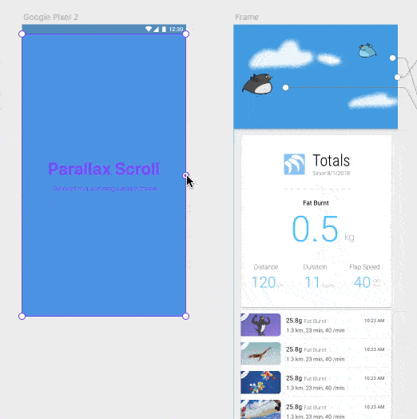
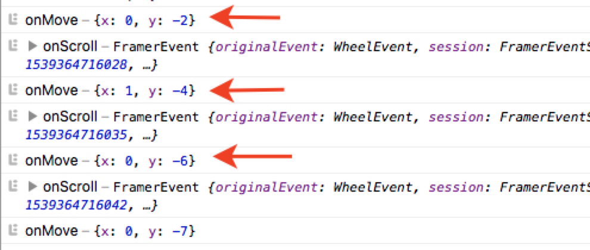

On [day 2](https://twitter.com/lintonye/status/1025197705755152384) of Framer X Beta, I built a proof of concept of a [parallax component](https://store.framer.com/package/lintonye/parallax) to explore the capability of the platform. Over the next couple of months, I've done some spontaneous updates whenever I got bored (or stressed out) of writing scripts or recording videos for [Framer X + React](/framerx-react). :)

In this and next post, I want to share some of my key findings along the way. Hope you find them useful. This is a technical drill down that requires experience in JavaScript and React. If you are a beginner, take your time to [learn the fundamentals](/framerx-react) first, build some simpler things and come back. I'm sure you'll be ready soon!

Here are some key points that will be covered:

- this post:
  - how to debug in Framer X
  - how to reuse property controls of an existing component, such as Scroll
  - how to add a connector to a component, just like the one Scroll has
  - how to monitor the scrolling position
- [next post](/2018/10/29/inside-parallax-my-first-framer-x-component-part-2):
  - how to recursively walk through a children tree and make changes
  - how to use Animatable to avoid cloning the children tree on every render
  - how to use the Context API in React to avoid cloning the children tree

# A high-level picture

<iframe width="560" height="315" src="https://www.youtube.com/embed/xFI8BPxB5TA?rel=0" frameBorder="0" allow="autoplay; encrypted-media" allowFullScreen></iframe>

There are two React components in the Parallax package: `Parallax` and `ParallaxFrame`. They should really be called `ParallaxScroll` and `ParallaxLayer`. But I don't want to break other people's prototypes. Hopefully [`displayName`](https://reactjs.org/docs/react-component.html#displayname) will be supported soon and things will be all good. In this post, I'll call them `ParallaxScroll` and `ParallaxLayer`.

It's straightforward to use Parallax. First you use `ParallaxScroll` in the same way as `Scroll`: drag it onto the canvas and connect it to a longer content frame. Second, in the scrolling content, add as many `ParallaxLayer`s as you want, and connect them to corresponding content frames. These layers will move at a different speed from the rest of the frame when scrolling. Third, configure the direction and speed of each `ParallaxLayer`, and profit!

## How does this thing work?

`ParallaxScroll` monitors how much the page has been scrolled, finds out all `ParallaxLayer`s in the `children`, calculates their positions based on their `speed` props and the current scroll position, and update their positions.

How to access `ParallaxLayer`s in the `children` and update them? I've gone through three major approaches:

1. Clone the entire `children` tree. Along the way, whenever seeing a `ParallaxLayer`, calculate and replace its position. This requires re-rendering whenever the scroll position is updated. (Slooooow!)
2. Clone the entire `children` tree. But only use it to find out all `ParallaxLayer`s, and replace their positions with `Animatable`s. When scrolling, instead of re-rendering and cloning the entire tree, we can just update these `Animatable`s. (Much better!)
3. No cloning at all! Instead, "register" a `ParallaxLayer` and its position `Animatable`s whenever it's mounted. When scrolling, just update the `Animatable`s. (Awesome!)

Apparently the third approach is the best, but it'd be interesting to see the implementation evolve. Hopefully we could learn something useful from each step.

Before diving into the clone-or-no-clone story, however, let's iron out some basics: how to debug in Framer X, how to make an identical Scroll and how to monitor scrolling position.

# How to debug in Framer X

As long as we are building something non-trivial, we are gonna need to debug our code. How to debug components in Framer X?

Fundamentally, Framer X is a modified web browser. What's running inside is just a web app. So in theory we'd be able to use regular web dev tools to debug code in Framer X.

In fact, in Preview, there's an inspect option that allows us to do exactly that!


Once the Web Inspector is open, we'll be at home! We can inspect the DOM elements of individual items on the preview. We can put `console.log` in our code and look at the result in the console. We can monitor the network traffic. We can even put breakpoints in the code.

When I was building Parallax, a few `console.log` went a long way to help me find what I needed. For example, I simply printed out the children tree and found how to identify an item by its `componentIdentifier`, a custom prop that Framer uses.

If Web Inspector is not enough, it's even possible to enable React Developer Tools. I haven't explored this myself, but apparently the prolific Dan Abramov has [proved](https://twitter.com/dan_abramov/status/1025816235798343682) that it's possible.

# Make an identical `Scroll`

Let's first look at how to make a component that behaves exactly the same as `Scroll`. This includes three aspects:

- 1.  In preview, it should apparently allow scrolling.
- 2.  On the canvas, it should have a connector interface for us to connect it to the content frame.



- 3.  On the properties panel, it should have the same properties as `Scroll`.


The easiest way is of course to reuse the `Scroll` component:

```jsx
import { Scroll } from 'framer'
```

Then, in the `render` method, we'll get the the connector interface if we do this:

```jsx
<Scroll>{this.props.children}</Scroll>
```

In fact, if we use the `children` prop almost anywhere in our component, we'll get the connector interface. Pretty cool, huh? Try it yourself! BTW: they've also added the ability to connect to multiple children, check out [this tip](https://learnreact.design/tips/children-connectors/).

How to add things on the properties panel? You know how to insert individual controls there, right? If you don't, check out Ben's [post](https://blog.framer.com/property-controls-in-framer-x-bdd550b5010c).

But it'd be foolish if we manually duplicate things from `Scroll`. Can't we just reuse the options in `Scroll`?

Of course!

```jsx
export class ParallaxScroll extends Component {
  static defaultProps = Scroll.defaultProps;
  static propertyControls = Scroll.propertyControls;
  ...
}
```

Actually I prefer the following since I'd be able to customize the property controls if I want:

```jsx
export class ParallaxScroll extends Component {
  static defaultProps = { ...Scroll.defaultProps };
  static propertyControls = { ...Scroll.propertyControls };
  ...
}
```

In fact the real code for the `propertyControls` is like this:

```jsx
export class ParallaxScroll extends Component {
  static propertyControls = {
    ...Scroll.propertyControls,
    direction: {
      title: "direction",
      type: ControlType.SegmentedEnum,
      options: ["horizontal", "vertical"]
    },
    directionLock: {} // Remove the directionLock property
  };
  ...
}
```

You see, I've copied everything from `Scroll.propertyControls`, but updated the `direction` property and removed `directionLock`.

Don't forget to propagate all the props to `Scroll`. Otherwise the settings on the properties panel would have no effect.

```jsx
<Scroll {...this.props}>{this.props.children}</Scroll>
```

For those who are not familiar with ES6, this `...` syntax is called [spread operator](https://developer.mozilla.org/en-US/docs/Web/JavaScript/Reference/Operators/Spread_syntax#Spread_in_object_literals). It allows us to easily duplicate an object and optionally make modifications when constructing a new object. I'll leave you to read the docs for details since it's not the focus of this post.

# Monitor scroll position

Now that we have a `ParallaxScroll` component that works exactly the same as `Scroll`. It's time to make it a bit more interesting. We want to monitor the scroll position and do something about it. Right?

`Scroll` provides a few related events that we can hook into:

```ts
export interface ScrollEvents {
  onScrollStart: ScrollEventHandler
  onScroll: ScrollEventHandler
  onScrollEnd: ScrollEventHandler
  onScrollSessionStart: ScrollEventHandler
  onScrollSessionEnd: ScrollEventHandler
}
```

These events all look very promising. However, as soon as I dug deeper, I realized they were actually not what I wanted.

Check out this console output:


It looks like `onScroll` does not provide the current scrolling position. What it gives us is just a delta since the last scroll event. This might be useful in other scenarios but in `Parallax` we need the actual scroll positions.

On the other hand, there's an `onMove` event that gives us exactly what we want:



So our `ParallaxScroll` component would look something like this:

```jsx
export class ParallaxScroll extends Component {
  ...
  handleScroll = ({x, y}) => {
    // update positions of ParallaxLayers
  }
  render() {
    return (
      <Scroll {...this.props} onMove={this.handleScroll}>
        {this.props.children}
      </Scroll>
    );
  }
}
```

# Wrap up for now

Alright! I've just shown you how to debug in Framer X, how to make an identical `Scroll` and how to monitor scroll position. But the fun has just begun! In the [next post](/2018/10/29/inside-parallax-my-first-framer-x-component-part-2), I'll show you how to recursively walk through a children tree and make changes, and an better alternative to that with the Context API in React.

<!--

## Traverse and update children tree
In `ParallaxScroll`, it's important


```jsx
const cloneAndUpdateProps = (getUpdatePropsFun, node) => {
  if (!React.isValidElement(node)) return node;
  const updateProps = getUpdatePropsFun(node);
  const clonedChildren = React.Children.map(node.props.children, c =>
    cloneAndUpdateProps(getUpdatePropsFun, c)
  );
  return React.cloneElement(node, updateProps, clonedChildren);
};
```

points to cover:

- how to debug / find out undocumented things
  - primitive inspect/console method
  - react developer tools
- reuse property controls of Scroll
- children connector
- recursively walk through the children tree and made modifications
- Scroll + onMove
- how to move an item off its original position

- intro
- high-level picture
- technical drill-down
- future plan
  - support for horizontal scroll
- reflection
  - hard to rename a component -- other people's prototype will be broken
  - what if I loose the framerx file?
-->
