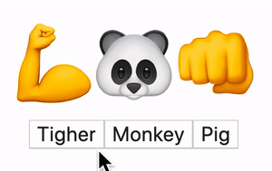

import imgHole1Png from './hole1.png'
import imgHole2Png from './hole2.png'
import imgSetWhoPng from './setWho.png'
import imgKnowledgeTreePng from './knowledge-tree.png'
import videoExercise from './quiz-result.mp4'
import { KungfuPanda } from '@/components/react-mental-model-cut-holes-in-html-template/KungfuPanda'
import { Video } from '@/components/Video'
// import ConvertKitForm from '@/components/legacy-design-system/ConvertKitForm'

export const meta = {
  tags: [],
  date: '2020-03-23',
  title: 'React Mental Models: Cutting Holes In HTML',
}

<!--excerpt-->

<!--/excerpt-->

## The mental model


What is the comic above about?

It's my mental model [^1] for building a UI with React:

- Step 1: Write some HTML
- Step 2: Cut some holes

Cutting holes???

Yup, I'd cut some holes so that we'll see what's behind, like so:


In all seriousness, it's how I see it when I make the UI work -- making it dynamic and interactive.

Of course we cannot physically cut holes in our code. And it's not exactly how React works. But I find this mental model very useful especially if you are new to React.

Bear with me, let me explain.

<!-- *BTW: Stuck at home? Why don't you join our [new challenge](/challenges/bored-at-home-react)? Come learn React, meet like-minded people (with guaranteed social distance), build something cool and win prizes! * -->

## An example

Let's start with the simplest React app possible. Let's say we want to display this emoji Kungfu Panda (well, if you squint):

```jsx
💪🐼👊
```

In React, we'll write a component like this:

```jsx
function App() {
  return <div>💪🐼👊</div>
}
```

It's a function that returns an HTML tag. I'll expand on this HTML tag topic in another post, but for now just remember: we can use all the standard HTML tags after this `return`. If we surround the HTML with some JavaScript stuff, we get a React component.

## Make it dynamic

Of course this app doesn't do much (if you are willing to call it an app anyways). We should make it interactive, right? How about adding a few buttons to switch the character? We want Kungfu Monkey, Kungfu Tiger and maybe Kungfu Pig too (try it below!).

<!--  -->

<KungfuPanda />

So far what we've built with the HTML tag is like the drawing on the cardboard. It'll stay the same forever. It doesn't change.

How would we change the character in the picture? We'd cut a hole on the cardboard like so:

```jsx
function App() {
  return <div>💪{}👊</div>
}
```

Again, squint. Doesn't that `{ }` look like a hole?

We'll then ask that panda/monkey/tiger/pig to stick its head out of that hole.

```jsx
function App() {
  const who = '🐼'
  return <div>💪{who}👊</div>
}
```

Now if we want Kungfu Tiger, we just need to change the value of `who` in the code above.

Next let's add in a button to allow the user to do that.

```jsx
function App() {
  const who = '🐼'
  return (
    <div>
      <div>💪{who}👊</div>
      <button
        onClick={function () {
          // TODO change "who" to 🐯
        }}
      >
        Tiger
      </button>
    </div>
  )
}
```

How would we change the value of `who`?

You'd probably do it this way:

```jsx
who = '🐯'
```

Unfortunately that doesn't work. In React, we need a special way to change the data:

```jsx{2,8}
function App() {
  const [who, setWho] = React.useState('🐼')
  return (
    <div>
      <div>💪{ who }👊</div>
      <button onClick={
        function() {
          setWho('🐯')
        }
      }>Tiger</button>
    </div>
  )
}
```

I know, the first highlighted line might seem alien. What are we doing there? Why do we need `[]`? It's actually equivalent to this:

```jsx
const result = React.useState('🐼')
const who = result[0]
const setWho = result[1]
```

The reason we write `[who, setWho]` is because we expect the result of `React.useState('🐼')` to be an array [^2].

So, we defined both `who` and `setWho` here. `setWho` is a function that we can call to change the value of `who` [^3], as we did in `onClick`. `setWho('🐯')` can be read as "set the value of `who` to 🐯".

Back to the hole-on-cardboard analogy, this `setWho` chooses the person behind the cardboard.


BTW, as you might have noticed, we have `React.useState` in the code. We just used _state_ in our component!

## Separate data from UI

The hole-on-cardboard analogy tells us an important idea about React. There are two separate things:

- the overall structure (which tends to be static),
- and the data (which change from time to time).

<!--  -->

When we want to change the UI, we almost always reach out to the data. We DO NOT directly access the UI elements (DOM nodes). Instead, we change the data and the UI elements update automatically.

This may sound strange at first, especially if you are already familiar with older tools such as jQuery. In jQuery, for example, to change the text in a `div`, we directly "grab" that `div` and set its content:

```js
$('div#who').text('🐯')
```

In contrast, we change the data instead in React:

```jsx
setWho('🐯')
```

See, in the line above, there's no mentioning of `div` or any other things about a DOM node. We just change the data. The `div` DOM element automatically updates because we've done some preparation elsewhere. We've cut a hole which reveals the data behind:

```jsx
<div>💪{who}👊</div>
```

<!-- Some people call this idea *data binding* in that we have these two different things, data and UI. We *bind* them together to keep them in sync. However, this term isn't used in the official docs.

I don't know about you, but I still prefer cutting holes on a cardboard. :) -->

There are many benefits of separating the data from the UI. But to avoid talking too much about "theories" in one shot, I'll cover it in a future post.

<!-- For now, let's look at some new examples to complete our mental model. -->

## Recap

Alright! I hope you have remembered a few things:

1. We'd write HTML to define the static structure of a UI
2. To make the UI dynamic, we'd cut "holes" in this structure with `{}`, and put the data in it.
3. We'd use a function such as `setWho` to change the data. It's like switching the person behind the cardboard. Typically we'd call the `set` function in an event handler such as `onClick` of a button. This makes the UI interactive.
4. We just used _React state_!

Let me reiterate. React does not work by cutting holes in HTML. But this is a useful mental model when you are just getting started.

The important idea here is that we separate the data from the UI. We almost always work with the data instead of accessing the DOM nodes. We'll dive deeper and see more examples of this idea in the [next post](/2020/03/31/react-mental-models-working-with-input).

<!-- [next post](/2020/03/19/react-mental-models-data-binding-part-2-2). -->

<!-- *Don't forget to check out the [March 31st workshop](/workshops/react-mental-models-1)!* -->

## Quiz time!

It's time to flex your muscles (or at least Panda's)! Write a component to help Panda and his pupils:

<Video src={videoExercise} width="100%" />

Are you ready? Give it a try with this [starter project](https://codesandbox.io/s/blog-quiz-1-change-action-starter-qv0pd).

<!-- When you are done, paste the URL of your sandbox below to win a surprise gift! Remember to save your file **before** copying the URL.

<ConvertKitForm subscribeButtonTitle="SUBMIT" formId='465988' customFields={[{id:"databinding1_answer", title:'Sandbox URL'}]} successMessage='Bravo!'/> -->

When you are done, [tweet](https://twitter.com/intent/tweet?text=Just%20read%20React%20Mental%20Models%20post%20by%20%40lintonye%0Ahttps%3A//learnreact.design/2020/03/23/react-mental-models-cutting-holes-in-html%0AHere's%20my%20answer%20to%20%23ReactMentalModelsQuiz%3A%20%5Binsert%20sandbox%20URL%5D%0A) the URL of your sandbox to win a surprise gift! Remember to save your file **before** copying the URL.

_Got stuck? Here's the [solution](https://codesandbox.io/s/blog-quiz-1-change-action-solution-bimtc). Promise me, don't peek until you've tried your very best!_

See you soon! 👊

## Footnotes

[^1]: This and the following posts will cover my mental models of working with React. This switch of focus is inspired by Dan Abramov's [Just JavaScript](https://justjavascript.com/). It's such an whimsical way to learn JavaScript. Whether you are experienced in JS or not, I highly recommend you to check it out!
[^2]: This is [_array destructuring_](https://developer.mozilla.org/en-US/docs/Web/JavaScript/Reference/Operators/Destructuring_assignment) in ES6.
[^3]: Strictly speaking, `who` is a constant whose value cannot be changed. What `setWho` does is to inform React to call the `App` function again with a new value for `who`. I'll cover this in a later post.

<!-- # The tree of all React knowledge
I'd like to imagine all React knowledge (in fact all knowledge) as a tree.


<!-- 💪🐼👊

🤛🐼🤜
👈🐼👊
✋🐼🤜
💪🐼🦶


👶🐶🐼💀🐵🐷🐶🐯 -->
