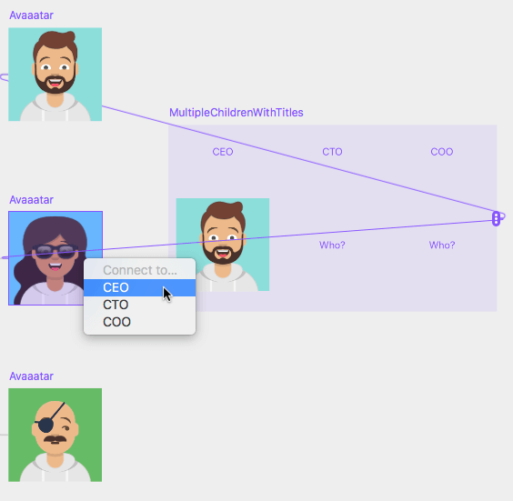

# Overview

In our own code components, we can add the single-child connector as the one Scroll has, or the multi-children connector as the one Page has.

# Single-child connector

Just need to use `props.children` in the component. For example:

```jsx
export function SingleChild(props) {
  ...
  return (
    <div>
      {props.children}
    </div>
  )
}
```

# Multi-children connector

In addition to the above, add this to `propertyControls`:

```jsx
import { addPropertyControls } from "framer"
export function MultipleChildren(props) {
  ...
}
addPropertyControls(MultipleChildren, {
  children: {
    type: ControlType.Array,
    title: "Content",
    propertyControl: {
      type: ControlType.ComponentInstance,
      title: "Page"
    }
  }
})
```

**Note**: The prop name here actually doesn't have to be `children`, it can be any valid prop name. As long as the control type is `Array` and its inner property control is `ControlType.ComponentInstance`, we'll get a multi-connector.

# Multi-connector with titles

In fact, we can label each connected item with a title and access them as respective props:



```jsx
export function MultipleChildrenWithTitles(props) {
  ...
}
addPropertyControls(MultipleChildrenWithTitles, {
  ceo: {
    type: ControlType.ComponentInstance,
    title: "CEO"
  },
  cto: {
    type: ControlType.ComponentInstance,
    title: "CTO"
  },
  coo: {
    type: ControlType.ComponentInstance,
    title: "COO"
  }
})
```

After this, we'll be able to access the linked React elements via props:

```jsx
const { ceo, cto, coo } = props
```

One thing to note is that the value of these props are arrays. If it's connected to something, it'll be an array that contains one React element, otherwise it'll be an empty array.

So in the example above, `ceo[0]` will the actual React element that we can clone or put in the JSX.
