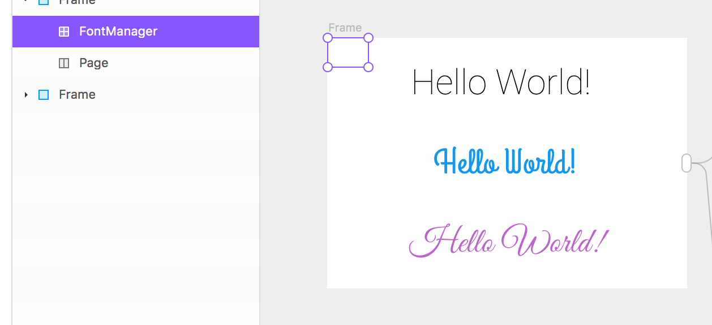

# Overview

The text tool in Framer X doesn't yet support custom fonts. We could install the fonts as system fonts, but they wouldn't show up properly in mobile preview, or when we [export](/tips/export-web-preview) the prototype.

We could write a code component that imports the fonts via the `@font-face` CSS rule.

# Key steps

## 1. Create a code component and install styled-components

```bash
yarn add styled-components
```

## 2. Put font files into `container` folder

Optionally we can create a `fonts` sub-folder inside.

## 3. Create a global style to import the font files

```jsx
const GlobalStyle = createGlobalStyle`
  @font-face {
    font-family: Grand-Hotel;
    src: url(${url('fonts/GrandHotel-Regular.otf')}) format("opentype");
  }
`
```

Notice here `url` is imported from `framer`:

```js
import { url } from 'framer/resource'
```

See [this tip](/tips/local-resources) for more details.

### 4. Put `<Container />` in render method

```jsx
<Container {...this.props}>
  ...
  <GlobalStyle />
</Container>
```

### 5. Use the new font family and profit!

```css
font-family: Grand-Hotel;
```

### 6. Performance considerations

If we put everything above inside a single component, say `CustomFontText`, we'll see the text flickering on the canvas when we move things around. This is perhaps because the `@font-face` elements are frequently removed and added back when there's an update to the `CustomFontText` component.

A workaround is to install the fonts in a separate `FontManager` component and drop the component once on the frame.

It's an invisible component like this:



This way, when we update the `CustomFontText` component, the `@font-face` elements remain there. This is apparently a hacky solution. I'll update this post if I find a better one. Comment below if you have any idea!

# Conclusion

For better browser support and more details about the `@font-face` rule, see [this page](https://css-tricks.com/snippets/css/using-font-face/). But at the very least, we can now send previews to clients without worrying about missing fonts!
