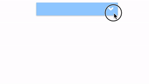
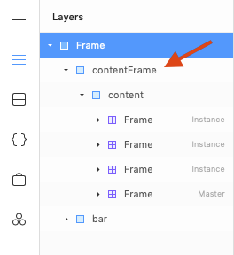

# Overview

Use Framer X overrides to quickly prototype a dropdown menu animation.

# Solution

## Use `animate` and `variant` props to animate between different states

```jsx
export function Icon(props): Override {
  return {
    animate: appState.menuMode,
    variants: {
      open: { rotate: 180 },
      closed: { rotate: 0 },
    },
  }
}

export function MenuContentFrame(props): Override {
  const { scaleY } = useInvertedScale()
  return {
    animate: appState.menuMode,
    originY: 0,
    variants: {
      open: { scaleY: 1 },
      closed: { scaleY: 0 },
    },
  }
}
```

## Use `Data` to communicate between overrides

```jsx
import { Data } from 'framer'

const appState = Data({
  menuMode: 'closed',
})

export function MenuBar(props): Override {
  return {
    onTap: () => {
      appState.menuMode = appState.menuMode === 'open' ? 'closed' : 'open'
    },
  }
}
```

## Use `useInvertedScale` to prevent distortion

For performance reasons, it's recommended to animate `scale` instead of `width` or `height`. However, the content inside might be distorted.



The solution is to use the `useInvertedScale` hook.

### 1. Separate the content and the "frame" of the menu



### 2. `useInvertedScale` hook

```jsx
import { useInvertedScale } from 'framer'
export function MenuContent(props): Override {
  const { scaleY } = useInvertedScale()
  return {
    scaleY,
  }
}
```

### 3. Set the `overflow` of the `contentFrame` to `hidden`

Don't forget this step, or else the menu will look strange.
