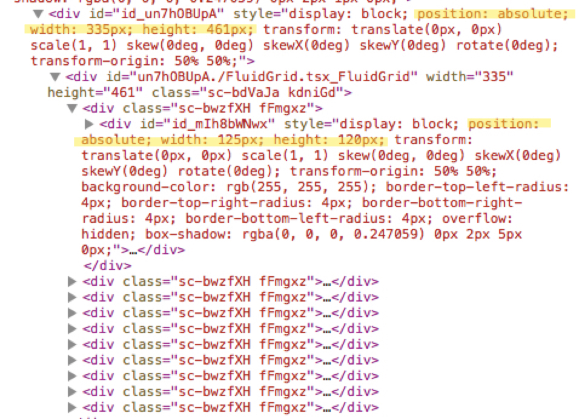

# Overview

Use CSS grid to create a fluid grid that automatically adjust the number of columns and cell width according to the container width.

This is the same technique used in the [Framer X tips grid](/tips). In order to get it working in Framer X, though, we need some special arrangement.

# CSS Grid

```css
display: grid;
grid-template-columns: repeat(auto-fit, minmax(100px, 1fr));
```

This is the CSS rule needed to create the fluid grid.

- `repeat(auto-fit, ...)` gives us the dynamic number of columns based on container width.
- `minmax(100px, 1fr)` makes sure the cell is at least `100px` wide and equally shares the available space.

# Framer X specifics

We need to create a container to wrap the `children`:

```jsx
<Item>{this.props.children}</Item>
```

And override the `position`, `width` and `height` of the item's child `div`:

```jsx
const Item = styled.div`
  div {
    position: relative !important;
    width: 100% !important;
    height: 100% !important;
  }
`
```

# Notes

The above Framer X specific is needed because, at the time of this writing, Framer makes items on canvas `position: absolute` with fixed width and height. We can verify that by checking out in the Web Inspector:


