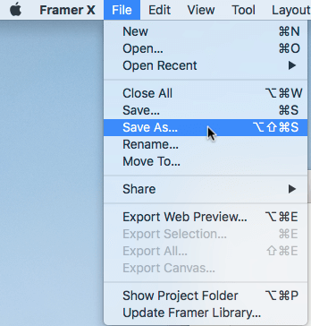
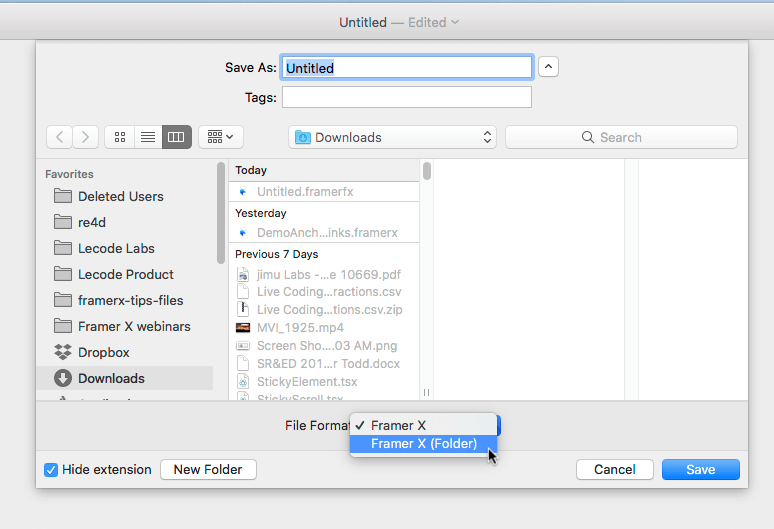
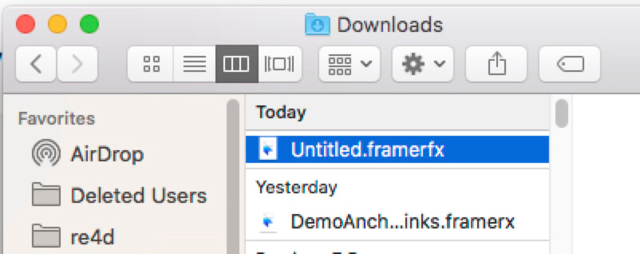

# Overview

From V15, Framer X supports a format called "Framer X (Folder)" that saves everything into a folder, not a single (zip) file.

We can use Git to manage the versions inside this folder.

# Steps

## Activate "Save As"

Open the "File" menu, and hold the _Option_ key. We'll get a new "Save As" menu item there:



## Pick the "Framer X (Folder)" file format



## Use Git

After it's saved, we'll get a new folder with extension `.framerfx`, though it looks like a file in OS X Finder:



Framer X automatically generates a `.gitignore` file inside the folder project.

CD into this folder and use Git to manage the files however you like:

```
cd ~/Downloads/Untitled.framerfx
git init
git add .
git commit -am 'Initial commit'
```

And of course, you can put this directory as a subdirectory in your repo, version-controlling the Framer x project along side the rest of your code.
