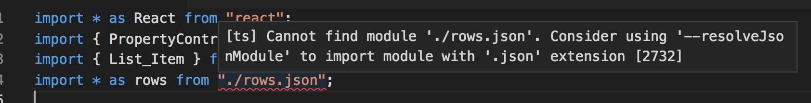

HT [@marciplan](https://twitter.com/marciplan).

In our code components or code overrides, we can import a json file like so:

```js
import * as rows from './rows.json'
```

This works, but we'll get an error in the editor:



To fix it:

1. open the Project Folder
2. open the `tsconfig.json` file
3. add the highlighted line below and restart Visual Studio Code:

```json{8}
{
  "compilerOptions": {
    "target": "es2015",
    "lib": ["es2015", "dom"],
    "module": "commonjs",
    "jsx": "react",
    "outDir": "build",
    "resolveJsonModule": true,
    "sourceMap": false,
    "declaration": false
  },
  "exclude": ["node_modules", "build"]
}
```
