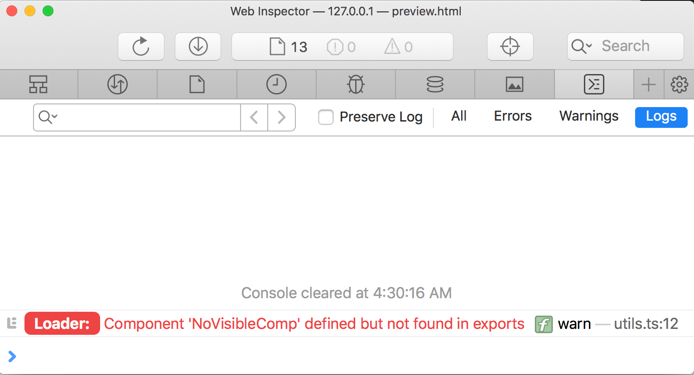

How can we define a code component for internal use only so that it does not appear in the Components panel? I've found two ways so far. Hint: method 2 seems better so far.

# Method 1: Default export

Instead of exporting the component as a "named export", we can make it a "default export", i.e. by adding a keyword `default` after `export`:

```jsx
export default class NoVisibleComp extends React.Component<Props> {
  ...
}
```

When we use this component, we'd need to import it differently. So instead of

```jsx
import { NoVisibleComp } from './NoVisibileComp`
```

we do:

```jsx
import NoVisibleComp from './NoVisibleComp`
```

However, this generates a warning in the console. This seems benign but still annoying.



# Method 2

```jsx
class Comp extends React.Component<Props> {
  ...
}

export const NoVisibleComp = Comp
```

This seems a better way so far. At least it does not generate that warning, and we can continue to import the component as a named import.

```jsx
import { NoVisibleComp } from './NoVisibileComp`
```
