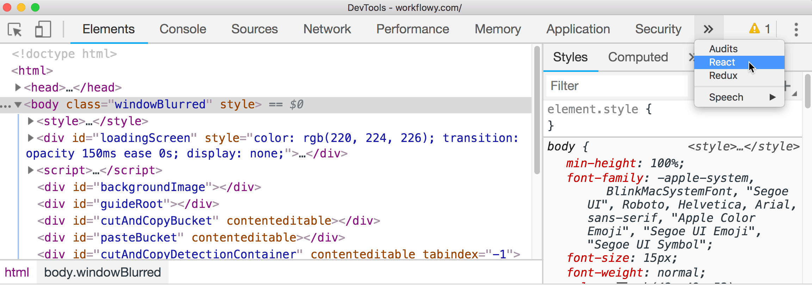

How to check out props and state of components in Framer X like what we do with normal React apps?

# Steps

- Install React Developer Tools in Chrome
- [Open FX preview in Chrome](/tips/preview-in-any-browser)
- Open Chrome DevTools: `View -> Developer -> Developer Tools`
- Open the React tab and profit!

