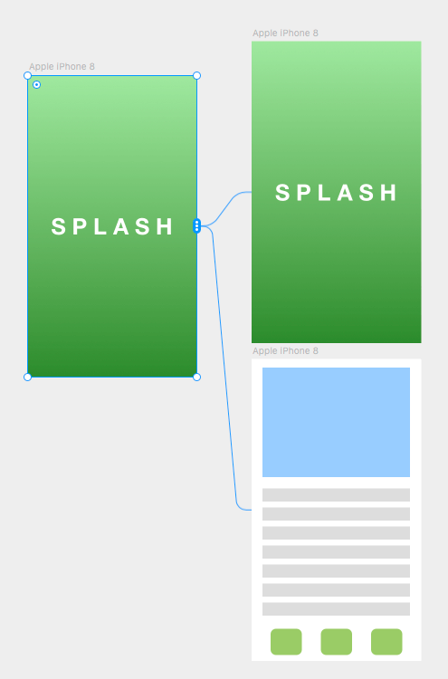

# Overview

Make a splash screen that plays an animation when loaded. When the animation finishes, transition to the next screen.

# Solution

## Step 1: Use the Page component



## Step 2: Start animation when loaded

See [this tip](/tips/animate-onload)

## Step 3: Wait for the animation to finish and switch page

We can override the `currentPage` prop of `Page` to change the currently visible page:

```js
export const Page: Override = () => {
  return {
    currentPage: data.currentPage,
  }
}
```

When the animation finishes, we just need to update `data.currentPage`. However, since the override function can't be async at this point, we'd have to use the promise syntax to wait for the completion of the animation.

So, instead of this:

```jsx{3-4}
export const Splash: Override = async () => {
  data.scale.set(0.6);
  await animate.spring(data.scale, 1).finished;
  data.currentPage = 1;
  return {
    scale: data.scale,
  };
};
```

We'd have to do this:

```jsx{3-5}
export const Splash: Override = () => {
  data.scale.set(0.6);
  animate.spring(data.scale, 1).finished.then(() => {
    data.currentPage = 1;
  });
  return {
    scale: data.scale,
  };
};
```

# Notes

Alternatively, we could put the splash screen in the same frame as the main screen, and animate its `opacity` and `zIndex` to switch to the main screen. This may be useful if we want to build transition effects that are not supported by the `Page` component.
